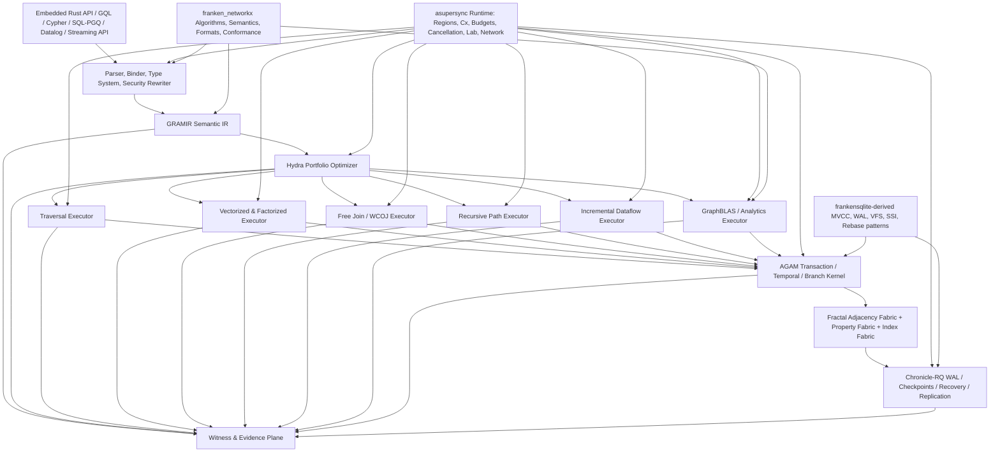

# COMPREHENSIVE PLAN FOR THE DESIGN OF FRANKENGRAPHDB

**Working name:** FrankenGraphDB  
**Language:** Rust 2024 edition or later  
**Safety target:** memory-safe Rust throughout the authoritative database core  
**Dependency target:** `std` plus the Dicklesworthstone-owned Rust ecosystem—principally `asupersync`, `franken_networkx`, and `frankensqlite`—with a CI-enforced default of zero new third-party crates  
**System class:** embedded and server-capable, transactional and analytical, temporal and streaming, single-machine and distributed property-graph database  
**Document date:** 2026-07-15  
**Document status:** bold greenfield architecture and execution program; intentionally not an MVP specification

---

## 0. Declaration of intent

FrankenGraphDB should not be designed as “a Rust Neo4j,” “NetworkX with persistence,” “SQLite pages holding adjacency lists,” or a thin query layer over a conventional key-value store. Those paths would produce competent software and almost certainly miss the opportunity.

The objective is a **leapfrog graph data system** that treats the traditional boundaries between graph OLTP, graph analytics, dynamic graph processing, temporal databases, incremental view maintenance, vector search, and distributed graph computation as historical accidents rather than fixed product categories.

The core thesis is:

> A graph database can simultaneously deliver strict transactional semantics, near-static traversal locality, live analytics on fresh data, first-class history and branching, deterministic reproducibility, self-healing durability, and hardware-aware parallelism—provided that storage representation, MVCC granularity, query execution strategy, and background maintenance are all adaptive **under one formally specified semantic envelope**.

This plan rejects the normal “make a small transactional store, then add analytics later” sequence. It also rejects “build an analytics engine and bolt on weak update semantics.” Every foundational abstraction must be final-form enough to carry the full vision:

- graph-native strict serializability;
- multiple physical graph representations that may coexist and transform online;
- one logical query semantics served by traversal, relational, worst-case-optimal, recursive, incremental, and sparse-linear-algebra execution;
- bitemporal history and branch/merge semantics;
- crash-safe, corruption-repairable durability;
- deterministic scheduling, replay, and evidence artifacts;
- NUMA, distributed, and disaggregated-memory awareness from the type and format level onward;
- a memory-safe authoritative core with no dependency sprawl.

There will be incremental build gates, because large systems require disciplined integration. There will **not** be a throwaway “v1 storage engine,” a toy query language, a weak-isolation placeholder, or a separate prototype architecture that must later be replaced. Early vertical slices must instantiate the final abstractions, even when they initially exercise only part of their state space.

---

## 1. Executive thesis: what FrankenGraphDB should be

FrankenGraphDB should be built as eight mutually reinforcing systems sharing one substrate.

1. **A transactional graph kernel.** Vertices, relationships, properties, indexes, constraints, graph views, and topology changes participate in graph-aware MVCC and serializability certification. The default contract is strict serializability, not merely read committed or unqualified snapshot isolation.

2. **An adaptive dynamic graph store.** There is no universal adjacency representation. Tiny-degree vertices, stable medium-degree neighborhoods, heavily updated hotspots, giant hubs, dense typed subgraphs, and history-heavy regions need different layouts. FrankenGraphDB should move among them online without changing logical identity or snapshot semantics.

3. **A portfolio query engine.** A pattern may be best executed as pointer-style expansion, vectorized joins, factorized joins, a worst-case-optimal multiway intersection, recursive frontier processing, sparse matrix algebra, or an incrementally maintained dataflow. The optimizer should select, combine, race, and switch among these strategies under a proof-preserving IR.

4. **A live graph analytics engine.** `franken_networkx` algorithms should operate directly over consistent database snapshots through low-copy adapters, while a native sparse-algebra layer and specialized frontier engine handle bandwidth-bound analytics. Results can be materialized transactionally or maintained incrementally.

5. **A temporal and branchable graph system.** System time, valid time, named branches, commit DAGs, diffs, change queries, and proof-carrying merges should be native. History is not a secondary audit log; it is queryable graph data.

6. **A self-healing durable database.** WAL groups, checkpoint manifests, catalog records, index artifacts, replication units, and diagnostic traces should combine checksums, hashes, explicit integrity levels, and RaptorQ repair symbols. Corruption should be detected, repaired when within a proven bound, and rejected rather than guessed when outside it.

7. **A structured-concurrency database runtime.** Queries, transactions, compactions, checkpoints, index builds, recovery, replication, rebalancing, and repairs should be region-owned `asupersync` computations with budgets, cancellation protocols, obligations, deterministic lab execution, and bounded finalization.

8. **An evidence-carrying system.** Commits, aborts, semantic rebases, optimizer choices, representation transitions, repairs, and distributed cutovers should be able to emit compact, replayable certificates. Performance heuristics may be adaptive; semantic decisions must be inspectable and deterministic under replay.

The result should feel less like a monolithic database executable and more like a **graph virtual machine with a transactional temporal memory system**.

---

## 2. Research and repository-review provenance

### 2.1 Requested source review

The requested direct shell clones were attempted under `/tmp/frankengraphdb_research`. The execution container could not resolve or reach GitHub or codeload, and the browser-backed route was administratively blocked. The review therefore used the authenticated GitHub source connector against the current default branches and recorded file-level paths and blob SHAs. A local provenance snapshot exists at:

```text
/tmp/frankengraphdb_research/REVIEW_PROVENANCE.md
```

That directory is deliberately labeled as a connector review snapshot, not falsely represented as a complete Git clone. Before implementation begins in the developer environment, all three repositories should be cloned locally, pinned to exact commits, and indexed with `rg`, `cargo metadata`, call graphs, benchmark inventories, and architecture-dependency maps. The conclusions below are based on source-level review of the architectural and hot-path files most relevant to this design.

### 2.2 `asupersync` material reviewed

The review included its workspace manifest, capability context, formal-semantics refinement map, deterministic lab runtime, three-lane scheduler, trace/certificate machinery, and RaptorQ trace journal.

The most consequential reusable ideas are:

- regions own all task lifetimes;
- cancellation is request → acknowledge/drain → finalize, not future destruction;
- obligations make resource release explicit and leak-detectable;
- budgets combine deadlines, poll quotas, cost quotas, and priority;
- effectful operations flow through capability-bearing `Cx` values;
- the deterministic lab supplies virtual time, seeded scheduling, trace replay, chaos injection, temporal oracles, minimized counterexamples, and TLA+ export;
- the scheduler documents its fairness contract and limitations rather than hand-waving them;
- RaptorQ is already treated as a reliability primitive for forensic journals;
- execution can emit progress and scheduling certificates.

### 2.3 `franken_networkx` material reviewed

The review included its core graph class, deterministic graph-semantics engine, runtime policy machinery, read/write formats, durability sidecars, conformance architecture, and proposed architecture.

The most consequential reusable ideas are:

- observable graph behavior is part of the contract;
- deterministic insertion order and tie-breaking are first-class semantics;
- graph algorithms can emit `ComplexityWitness` and Blake3-linked decision paths;
- strict and hardened modes distinguish compatibility from defensive operation;
- ambiguous or drifted semantics fail closed;
- dense integer adjacency and stable node order are valuable snapshot/algorithm ABIs;
- existing readers and writers cover edge lists, adjacency lists, JSON graph forms, GraphML, GEXF, Pajek, and related formats;
- algorithm parity, metamorphic testing, fuzzing, and explicit conformance gates are already cultural norms;
- RaptorQ-protected artifact envelopes and decode drills establish a precedent for repair evidence.

### 2.4 `frankensqlite` material reviewed

The review included workspace architecture, MVCC core types, concurrent transaction setup, page ownership and commit indexing, deterministic rebase, proof-carrying SSI validation, time-travel snapshots, WAL structure, group commit, integrity checking, and RaptorQ WAL-FEC.

The most consequential reusable ideas are:

- chunked version arenas with generation counters defend against stale handles and ABA errors;
- epoch/QSBR-style reclamation permits cheap readers and batched retirement;
- direct atomic fast arrays and sharded fallbacks can coexist;
- immutable commit logs, coherent snapshot triples, flat-combined commit clocks, and exact CAS ownership are effective ingredients;
- deterministic rebase is allowed only when captured reads and structural effects prove replay safety;
- secondary indexes are regenerated from semantic intent rather than blindly patched;
- SSI validation can produce dependency edges, commit proofs, and abort witnesses;
- successful-path evidence can be compact or budgeted while abort evidence stays rich;
- time travel reuses normal MVCC visibility with a synthetic read-only historical snapshot;
- WAL source frames remain authoritative while RaptorQ sidecars carry only repair symbols;
- salts, frame ranges, checksums, source hashes, and object IDs bind repair data to the correct WAL group;
- integrity checking and repair are separate layers: checksums identify damage, FEC repairs it.

### 2.5 Literature and system review scope

The research survey covered the following families rather than only products labeled “graph database”:

- transactional property-graph systems;
- dynamic in-memory graph storage;
- columnar and factorized graph query engines;
- worst-case-optimal and Free Join processing;
- recursive query parallelism;
- temporal and bitemporal graph storage;
- incremental view maintenance and differential dataflow;
- sparse-linear-algebra graph processing;
- distributed graph transactions and refinable ordering;
- serializability certification;
- graph benchmarks and the ISO GQL standard;
- graph-aware fuzzing and deterministic correctness methods;
- NUMA, NVRAM, CXL, GPU, and disaggregated-memory directions.

The bibliography at the end separates published systems work from recent preprints. Recent 2025–2026 papers are treated as research signals, not unquestioned truth.

---

## 3. Design constitution: non-negotiable laws

These are architectural laws, not aspirations to be relaxed when a benchmark is inconvenient.

### Law 1: one logical graph, many physical forms

No query, transaction, or algorithm may depend on a particular adjacency representation. Physical representations may coexist per vertex, edge type, direction, time range, partition, or snapshot. Online transitions must preserve a formally specified snapshot equivalence relation.

### Law 2: strict semantics by default

The default transactional mode is strict serializability. Weaker modes may exist for explicit use cases, but they must be named, typed, observable, and impossible to confuse with the default. “ACID” without an isolation statement is not an acceptable contract.

### Law 3: graph predicates are concurrency objects

A read of “all `TRANSFER` edges from this account whose amount exceeds X,” a path frontier, a neighbor-ID range, or a label population is not reducible to a bag of page reads. The concurrency layer must represent graph predicates and their phantom space directly.

### Law 4: semantic intent outranks byte patches

Transactions should preserve update expressions and structural intent long enough to support deterministic validation, index regeneration, semantic merge, audit, and replay. Physical deltas are an execution artifact; semantic intent is the conflict-resolution substrate.

### Law 5: background work is structured work

Compaction, checkpointing, index construction, scrubbing, replication, rebalancing, statistics refresh, and repair are not daemon threads detached from correctness. They are region-owned computations with obligations, budgets, cancellation, and explicit publish points.

### Law 6: no silent nondeterminism

Any result-affecting tie-break, plan switch, parallel merge order, floating-point reduction order, victim selection, or branch-merge rule must be deterministic under a declared policy or recorded in an execution certificate sufficient for exact replay.

### Law 7: no silent corruption

Every durable object has versioned framing and integrity metadata. Recovery either proves a valid object, repairs it and proves the repaired hash, rebuilds a derived object from authoritative data, or fails closed. “Best effort parsing” is forbidden for authoritative state.

### Law 8: no orphan resources

Snapshot pins, adjacency guards, buffer reservations, locks, WAL reservations, replication acknowledgments, temporary files, and result channels are obligations. Region closure requires their resolution.

### Law 9: memory safety is an architectural constraint

The authoritative core should use `#![forbid(unsafe_code)]`. New unsafe data structures are not accepted as the price of performance. Where OS or C ABI interaction is unavoidable, reuse an already-audited narrow boundary from the owned ecosystem and keep it outside the semantic core. No logical invariant may rely on unchecked aliasing.

### Law 10: the dependency firewall is real

Default workspace policy: no new crates from crates.io or Git repositories. Direct dependencies are the standard library, workspace crates, and pinned revisions of the three owned projects. A CI job inspects `cargo metadata` and fails on an unapproved package source. If a capability is missing, implement it in the owned workspace or expose a provider boundary rather than casually importing a crate.

### Law 11: hardware locality is data

NUMA node, cache behavior, segment temperature, remote-memory tier, compressed size, and contention are optimizer-visible properties. Hardware topology is not hidden under a generic allocator abstraction.

### Law 12: evidence is a first-class product

The system should be able to answer not only “what happened?” but “why was this plan, abort, merge, repair, or representation chosen?” Evidence detail can be budgeted; semantic accountability cannot be absent.

### Law 13: final abstractions from the first committed line

Early code may implement only a subset of operators or formats, but it must use the final snapshot, capability, witness, segment, WAL, and certificate abstractions. No prototype-only transaction model, storage identity, or query AST is allowed into the mainline.

---

## 4. What should be inherited, adapted, and deliberately not inherited

### 4.1 `asupersync`: the execution and correctness substrate

#### Inherit directly

- `Cx`-mediated capabilities and budget propagation.
- region/task ownership and quiescence semantics.
- cancellation checkpoints, masked finalizers, and loser draining.
- obligation ledgers and leak oracles.
- deterministic lab runtime, trace capture, replay, and chaos injection.
- logical clocks, vector clocks, and distributed trace support.
- channels, I/O, timers, networking, blocking-pool integration, and structured observability.
- RaptorQ implementation and durable journal framing.
- progress certificates, scheduling evidence, and state-machine discipline.

#### Adapt for database use

Create narrow wrappers rather than passing unrestricted runtime contexts:

```rust
pub struct QueryCx<'a> { inner: &'a asupersync::Cx<QueryCaps> }
pub struct TxnCx<'a> { inner: &'a asupersync::Cx<TxnCaps> }
pub struct CommitCx<'a> { inner: &'a asupersync::Cx<CommitCaps> }
pub struct MaintenanceCx<'a> { inner: &'a asupersync::Cx<MaintenanceCaps> }
pub struct ReplicationCx<'a> { inner: &'a asupersync::Cx<ReplicationCaps> }
```

The wrappers should expose database-semantic operations such as `pin_snapshot`, `reserve_wal`, `open_segment`, `publish_index`, and `send_replication_frame`, each of which creates or consumes explicit obligations.

The three-lane scheduler should remain the runtime scheduling substrate, but FrankenGraphDB must not assume global strict priority across workers because `asupersync` explicitly documents that work stealing weakens that guarantee. Database-level placement, separate worker groups, deadlines, and admission control must enforce latency classes without pretending the underlying scheduler promises more than it does.

#### Do not inherit blindly

Do not make every tiny graph operation an async task. Hot scans and joins should be tight synchronous kernels executed inside budget-aware tasks. Structured concurrency should govern ownership and cancellation boundaries, not inject scheduler overhead into every edge visit.

### 4.2 `franken_networkx`: semantic and algorithmic authority

#### Inherit directly

- graph algorithm implementations and graph types where their semantics fit.
- deterministic node/edge ordering and tie-break policies.
- strict/hardened behavior modes.
- CGSE policy IDs, decision-path hashing, and complexity witnesses.
- format readers/writers and parser hardening.
- conformance gates, fuzzing patterns, and differential tests against NetworkX.
- durability envelopes for non-database artifacts.

#### Adapt for database use

`franken_networkx::Graph` should be treated as an **algorithm and snapshot ABI**, not the live transactional storage engine. FrankenGraphDB should provide three integration levels:

1. **Direct neighbor-source adapters** for algorithms expressible over iterators and property accessors.
2. **Pinned dense snapshots** that expose stable dense integer node indices and packed adjacency without copying properties unnecessarily.
3. **Materialized FNX graphs** for exact compatibility, export, Python interoperability, or algorithms that require mutable FNX-owned state.

A `GraphSnapshotAdapter` trait should define deterministic order, snapshot identity, direction, multigraph semantics, edge identity, and property projection. Every adapter should be able to emit a `SnapshotMaterializationCertificate` containing the source snapshot, remapping digest, ordering policy, omitted-property policy, and content digest.

CGSE should be generalized from algorithm tie-breaks into a system-wide deterministic policy engine for:

- transaction victim choice;
- semantic merge ordering;
- optimizer candidate tie-breaks;
- parallel reduction order;
- representation-transition selection;
- distributed conflict arbitration;
- recovery rebuild order.

#### Do not inherit blindly

The current dense `Vec<Vec<usize>>` adjacency is excellent for many algorithms but cannot be the only dynamic transactional representation. Likewise, string node identifiers and `BTreeMap` property maps should not dictate the database’s hot-path storage. Preserve their behavior at API boundaries while using compact internal IDs and typed columns.

### 4.3 `frankensqlite`: transactional and durability design language

#### Inherit directly or extract into owned reusable crates

- versioned arenas with generation-counted handles;
- epoch/QSBR retirement patterns;
- direct atomic fast paths with sharded fallback tables;
- commit-log, snapshot, and time-travel patterns;
- flat-combined commit clock and group commit;
- SSI dependency tracking, commit proofs, and abort witnesses;
- deterministic rebase eligibility and index regeneration;
- WAL framing, checksums, chain validation, torn-write handling, checkpoint planning, and recovery metrics;
- VFS abstraction where required;
- RaptorQ WAL repair sidecars and decode-proof discipline.

#### Adapt for graph use

A SQLite page is a storage implementation unit. A graph conflict or visibility unit may instead be:

- a vertex record;
- an edge record;
- a typed adjacency segment;
- a neighbor-ID range within a high-degree vertex;
- a property-column chunk;
- an index key range;
- a path-frontier predicate;
- a graph schema or constraint epoch;
- a branch head or topology epoch.

The key adaptation is therefore **multi-granularity graph MVCC**. FrankenGraphDB should borrow the implementation techniques while replacing page identity with a typed `GraphAtomKey` and a refinable witness lattice.

Deterministic rebase should become semantic graph rebase: replay pure update expressions against a new base, re-evaluate constraints, regenerate all affected indexes, recompute adjacency summaries, and produce a proof. Structural operations are eligible only when their graph footprint proves independence or a declared algebraic merge rule applies.

WAL-FEC should be generalized from page frames to graph commit groups. Source data remains in the authoritative WAL; repair symbols live in append-only sidecars bound to commit IDs, segment IDs, hashes, and topology epochs.

#### Do not inherit blindly

Do not force graph data into SQLite B-tree pages merely to reuse the pager. Do not preserve SQL row/page conflict granularity where graph structure can express a more precise predicate. Do not make SQLite compatibility a core requirement unless a separate catalog or SQL/PGQ bridge benefits from a narrowly reused component.

---

## 5. State-of-the-art synthesis and the gap FrankenGraphDB should attack

The literature does not reveal one winning architecture. It reveals a set of local optima, each obtained by sacrificing another dimension. FrankenGraphDB’s opportunity is to make those trade-offs **adaptive and semantics-preserving** rather than globally fixed.

### 5.1 Transactional property-graph systems

Mature products such as Neo4j demonstrate the value of a coherent property-graph model, declarative pattern language, operational ecosystem, and index-backed traversals. Current Neo4j documentation still describes default read-committed behavior and lock-based protection whose exact graph-predicate coverage requires care. Memgraph demonstrates that delta-based in-memory graph storage, WAL/snapshots, and streaming-oriented operation can be commercially useful. TigerGraph demonstrates the value of graph-native MPP execution. NebulaGraph demonstrates separation of query, storage, and metadata services. Dgraph, JanusGraph, TuGraph, ArangoDB, and others contribute lessons about distribution, schema, and multi-model interfaces.

**Lesson:** product completeness matters, but no existing system should define FrankenGraphDB’s semantic ceiling. In particular, strict serializability, time travel, analytics freshness, and deterministic evidence should not be add-ons.

### 5.2 Embedded columnar graph databases

Kùzu’s archived codebase remains an important architectural reference: columnar disk storage, CSR adjacency/join indexes, vectorized and factorized execution, hybrid join strategies, parallel query processing, and serializable transactions in an embedded engine. DuckPGQ and SQL/PGQ work show the value of graph-relational convergence.

**Lesson:** property graphs benefit from relational techniques—late materialization, vectorization, factorization, and cost-based joins—but a static CSR-centric design alone does not solve highly dynamic transactional graphs.

### 5.3 Dynamic graph storage

LiveGraph’s transactional edge log shows that sequential adjacency scans can coexist with transactions when edge versions are arranged carefully. Aspen’s compressed purely functional C-trees show that lightweight snapshots and batch updates can approach static locality. Teseo, Sortledton, LLAMA, GTX, LSMGraph, and related work explore packed-memory arrays, sorted blocks, delta chains, multilevel CSR, and adaptive concurrency.

A 2025 comparative study is especially important because it challenges optimistic assumptions: existing dynamic stores can consume several times CSR memory; per-neighbor MVCC creates expensive checks and metadata; and high-degree vertices become severe contention points.

**Lesson:** do not choose between “static CSR” and “fully fine-grained dynamic versions.” Version metadata and representation granularity must adapt to degree, churn, contention, and query shape. High-degree vertices need range striping and independent publication, not one lock or one version per edge.

### 5.4 Subgraph and pattern-query processing

Graphflow’s hybrid binary/WCOJ optimizer shows that cyclic query regions can favor multiway intersections while acyclic regions often favor conventional joins. Leapfrog Triejoin supplies a practical worst-case-optimal foundation. Free Join unifies traditional and worst-case-optimal plans through a common plan and data-structure framework. Factorized databases show that intermediate and final results should preserve shared structure rather than duplicate repeated bindings.

**Lesson:** no single join family wins. FrankenGraphDB needs a physical plan algebra broad enough to mix binary, factorized, trie/intersection, and traversal operators in one plan—and to adapt during execution.

### 5.5 Recursive and path-query execution

Recent Kùzu work on recursive parallelism shows that source-level, frontier-level, hybrid, and multi-source morsel policies occupy one design space. Regular path-query systems emphasize automata/product-graph evaluation. Graph query-language research distinguishes walk, trail, simple-path, acyclic-path, shortest, cheapest, all-shortest, and bounded semantics, each with different complexity and duplicate behavior.

**Lesson:** “expand until done” is not a sufficient path engine. Path semantics must be explicit in the logical IR, and the physical engine must choose among frontier traversal, automata, bidirectional search, landmark/index acceleration, sparse algebra, and join-based evaluation.

### 5.6 Incremental and continuous computation

DBToaster’s higher-order deltas, differential dataflow, incremental Leapfrog Triejoin, Delta-BiGJoin, Seraph, and recent incremental Datalog work show that a continuously changing graph need not force complete recomputation. The difficulty is not only additions; deletions, recursive derivations, provenance, and consistency with transactions are central.

**Lesson:** continuous queries and maintained graph views should share the transaction log and semantic IR rather than live in a separate streaming product. Each commit is already a delta; the system should exploit it.

### 5.7 Temporal graph systems

AeonG, bitemporal property-graph models, PETGraphDB, and the 2026 TVA preprint show the value of separating version metadata from values, using anchor-plus-delta history, temporal tables, skip structures, and current/history storage separation.

**Lesson:** FrankenGraphDB should factor visibility metadata, current values, historical values, and temporal adjacency so scans do not repeatedly pay random metadata lookups. System time and valid time must both be native, and branchable history should build on the same machinery.

### 5.8 Graph analytics systems

Ligra, GAP, GBBS, GraphIt, Gunrock, GraphBLAS, SuiteSparse:GraphBLAS, and FalkorDB illustrate complementary abstractions: frontier-based processing, algorithm/schedule separation, sparse matrix semirings, push/pull switching, and masked operations.

**Lesson:** the database needs both graph-native neighbor iteration and an internal GraphBLAS-like algebra. Graph algorithms should be able to choose representations and schedules without exporting the entire database into a second engine.

### 5.9 Distributed graph transactions

Weaver’s refinable timestamps avoid paying an ordering oracle on every request. G-Tran shows graph-native distributed MV-OCC with RDMA. Other distributed graph systems show the importance of locality, partitioning, and batched remote access.

**Lesson:** distributed strict serializability need not imply a single global timestamp bottleneck. FrankenGraphDB should combine versioned topology, single-cell fast paths, coarse logical ordering, and refinement only when dependency ambiguity requires it.

### 5.10 Serializable certification

Serializable Snapshot Isolation and Serial Safety Net show that a high-performance MVCC substrate can be certified by tracking dependencies rather than pessimistically locking every read. Recent work continues refining certification conditions.

**Lesson:** use an underlying mechanism suited to the local workload—optimistic MVCC, range ownership, deterministic batching, or locks—but require all modes to pass a shared graph-serializability certifier or a formally equivalent protocol.

### 5.11 Standards and benchmarks

ISO/IEC 39075:2024 gives GQL an international standard baseline for property graphs. LDBC SNB Interactive v2 includes complex reads, updates, deletes, and cheapest-path behavior; SNB BI stresses large joins and aggregation; FinBench stresses financial graph workloads; Graphalytics stresses whole-graph algorithms.

**Lesson:** language and benchmark conformance must be designed in, not retrofitted after a proprietary syntax and cherry-picked microbenchmarks harden.

### 5.12 The unoccupied design point

No reviewed system combines all of the following as a single architectural contract:

- adaptive per-neighborhood physical representation;
- graph-predicate strict serializability;
- proof-carrying semantic rebase and branch merge;
- traversal, factorized, WCOJ, recursive, incremental, and sparse-algebra execution under one IR;
- consistent live analytics without ETL projection;
- system-time, valid-time, and branch history;
- RaptorQ-protected WAL/checkpoint/evidence artifacts;
- structured concurrency and deterministic replay for every background subsystem;
- memory-safe Rust core with an owned dependency perimeter;
- execution and maintenance certificates as first-class artifacts.

That is the target.

---

## 6. Named architectural innovations

Names are useful because they force ideas to become reviewable components rather than diffuse aspirations.

### 6.1 Fractal Adjacency Fabric (FAF)

An adaptive storage fabric in which each logical adjacency group may use a different physical representation and may transition online among representations. “Fractal” means the graph is decomposed recursively by vertex, direction, edge type, neighbor range, temporal range, and storage tier until each fragment has a workload-appropriate layout.

### 6.2 Adaptive Graph-Atom MVCC (AGAM)

A multi-granularity MVCC system whose version/conflict atoms include entities, property chunks, adjacency segments, neighbor ranges, indexes, predicates, path frontiers, schemas, and topology epochs. Granularity can refine under conflict without changing isolation semantics.

### 6.3 Refinable Predicate Witnesses (RPW)

Compact read/write witnesses begin coarse enough to be cheap. When a possible conflict appears, the system uses captured execution evidence to refine overlap to exact ranges, edge types, labels, predicate domains, or automaton frontiers. False negatives are forbidden; false positives trigger refinement before abort whenever the budget permits.

### 6.4 Proof-Carrying Semantic Rebase (PCSR)

Instead of aborting every transaction whose physical base changed, replay eligible pure graph intents against the newest committed base, regenerate indexes and summaries, enforce constraints, and emit a merge proof containing the algebraic rule, footprints, input hashes, and output hash.

### 6.5 Hydra Plan Portfolio

The optimizer produces a bounded family of semantically equivalent plans spanning traversal, binary joins, Free Join/WCOJ, factorized execution, recursion, sparse algebra, and maintained views. It may probe or race candidates in `asupersync` subregions, cancel and drain losers, and switch at certified checkpoints.

### 6.6 Graph Relational Algebra and Machine IR (GRAMIR)

A typed intermediate representation that preserves graph path semantics, relational multiplicities, factorization, temporal selectors, update intent, witness behavior, and sparse-algebra operations. All front ends and all execution engines meet at this boundary.

### 6.7 Janus Temporal Commit Graph

A bitemporal, branchable commit DAG in which graph state, schema state, topology state, and derived-view state have explicit parents and content hashes. Named branches, diffs, merges, and historical queries are native database operations.

### 6.8 Chronicle-RQ Durability Plane

A family of versioned WAL, checkpoint, catalog, index, replication, and evidence formats in which checksums identify damage, content hashes establish identity, and RaptorQ repair symbols permit bounded recovery across torn or missing frames.

### 6.9 Evidence-Carrying Graph Execution (ECGE)

A compact certificate model for queries, commits, aborts, rebase, compaction, representation transition, repair, replication, and reconfiguration. Evidence is deterministic, budgetable, content-addressed, and replay-compatible.

### 6.10 Graph-as-Control-Plane introspection

The database’s own transactions, waits, plans, partitions, indexes, tasks, obligations, and incidents are exposed as a protected temporal system graph. Operators can query the wait-for graph, plan-dependency graph, replication graph, and storage-temperature graph using the same language and analytics engine.

---

## 7. High-level architecture



### 7.1 Layering rule

The semantic kernel must not depend on a server, file format, or particular executor. The storage kernel must not parse GQL. The WAL must not understand query syntax. Executors may request snapshots and emit witnesses but may not publish commits directly. Only the transaction kernel crosses from semantic intent to durable publication.

### 7.2 Authority rule

Derived structures—secondary indexes, path indexes, matrix projections, maintained views, statistics, vector indexes, caches—are never more authoritative than the commit log and immutable base/delta segments from which they can be rebuilt. Their own manifests and update cursors are transactional, but recovery may discard and rebuild them if validation fails.

### 7.3 Embedded and server mode

The same core should support:

- an embedded, in-process Rust database;
- a local server with multiplexed clients;
- a distributed cluster of graph cells;
- read-only analytical replicas;
- external accelerator workers.

No server-only global singleton should leak into the core. Handles carry an explicit database/tenant/branch identity and `Cx` capability context.

---

## 8. Canonical data model

### 8.1 Typed attributed incidence graph

The internal logical model should be a **typed attributed incidence graph**, with the binary property graph as an aggressively optimized specialization.

First-class logical objects:

- graph and graph collection;
- vertex;
- binary directed or undirected relationship;
- optional n-ary relationship/hyperedge;
- label and relationship type;
- property key and typed value;
- schema/constraint object;
- named graph view;
- branch and commit;
- valid-time interval and system-time interval;
- provenance reference;
- derived/index object.

Native hyperedges are ambitious but strategically useful for knowledge graphs, events involving several entities, and provenance. They should not penalize binary edges: the physical engine uses a compact binary edge record and only invokes incidence storage for n-ary relationships. Standards-facing GQL behavior remains property-graph compatible.

### 8.2 Identity model

Expose stable logical IDs but use compact snapshot-local aliases on hot paths.

```rust
pub struct GraphId(u128);
pub struct VertexId(u128);
pub struct EdgeId(u128);
pub struct HyperEdgeId(u128);
pub struct BranchId(u128);
pub struct CommitId(u128);

pub struct DenseVertex(u32);
pub struct DenseEdge(u32);
```

A logical ID should encode or derive:

- object kind;
- tenant/database namespace;
- origin cell or allocation epoch;
- monotonically unique local component;
- generation or anti-reuse protection.

Exact bit allocation must be benchmarked. IDs must never expose raw memory addresses. A stable ID may route through a versioned indirection table after repartitioning. Snapshot-local dense IDs enable compact arrays, FNX compatibility, bitmaps, and matrix projections.

### 8.3 Edge semantics

Support all of the following without ambiguity:

- directed and undirected graphs;
- self-loops;
- parallel edges/multigraphs;
- edge identity independent of endpoints;
- typed relationships;
- edge properties;
- optional uniqueness constraints over endpoint/type/property combinations;
- order-preserving or order-independent adjacency views under declared policies.

An undirected edge is one logical edge with symmetric incidence, not two unrelated directed records. Physical adjacency may store two incidence entries, bound by one edge ID and commit atom.

### 8.4 Value system

Define an owned `FgValue` rather than letting either `CgseValue` or SQLite scalar affinity become the database’s permanent ceiling.

```rust
pub enum FgValue {
    Null,
    Bool(bool),
    I64(i64),
    U64(u64),
    F64(CanonicalF64),
    Decimal(Decimal128),
    Utf8(FgString),
    Bytes(FgBytes),
    Date(Date),
    Time(TimeOfDay),
    Timestamp(Timestamp),
    Duration(DurationValue),
    Interval(IntervalValue),
    List(ValueListId),
    Map(ValueMapId),
    Struct(StructValueId),
    Vector(VectorValueId),
    Vertex(VertexId),
    Edge(EdgeId),
    Path(PathValueId),
    Graph(GraphId),
}
```

Important rules:

- floating-point NaN, signed zero, total ordering, and aggregation order are explicitly specified;
- decimal is implemented in an owned crate, not delegated to platform floating point;
- strings are UTF-8 with deterministic collation identifiers;
- large values are referenced through immutable value arenas;
- list/map/struct values have canonical encodings for hashing and equality;
- vector values have declared element type, dimension, distance semantics, and normalization state;
- user-visible values are independent of physical dictionary IDs.

### 8.5 Schema-flexible but schema-aware

FrankenGraphDB should allow schemaless ingestion while rewarding declared schema.

- Labels and edge types may declare required/optional properties, types, defaults, uniqueness, checks, endpoint constraints, and valid-time rules.
- Stable properties are promoted into typed columns.
- Rare or undeclared properties live in compact overflow structures.
- The optimizer sees confidence levels for inferred schema.
- A `SchemaEpoch` participates in every snapshot and semantic rebase.
- Online schema changes create new epochs and migration plans; old snapshots retain their original interpretation.
- A hardened mode rejects ambiguous coercions and schema drift; a compatibility mode can reproduce imported-system behavior when explicitly selected.

### 8.6 Graph views as first-class values

A graph view is a declarative, snapshot-bound graph expression, not merely a list of IDs. Views may filter vertices/edges, project properties, orient edges, contract structures, or combine graphs. A view can be:

- ephemeral and lazily executed;
- pinned to a snapshot;
- materialized transactionally;
- incrementally maintained;
- exported through an FNX adapter;
- used as the input to GraphBLAS or algorithms.

View identity includes the normalized semantic IR hash, security context hash, source snapshot/branch, and parameter bindings.

---

## 9. Fractal Adjacency Fabric: storage architecture

### 9.1 The fundamental storage key

The primary neighborhood unit is not “a vertex” but an adjacency group:

```rust
pub struct AdjacencyGroupKey {
    pub graph: GraphId,
    pub vertex: VertexId,
    pub direction: Direction,
    pub edge_type: EdgeTypeId,
    pub branch: BranchId,
}
```

The directory for a group points to a versioned representation descriptor. A group may be subdivided by neighbor-ID range, temporal range, hash stripe, or property partition.

```rust
pub struct AdjacencyDescriptor {
    pub descriptor_id: DescriptorId,
    pub born_at: CommitSeq,
    pub retired_at: Option<CommitSeq>,
    pub representation: AdjacencyRepresentation,
    pub fragments: FragmentDirectory,
    pub stats: AdjacencyStats,
    pub content_digest: Digest,
    pub policy_epoch: PolicyEpoch,
}
```

A transaction resolves the descriptor visible to its snapshot, then resolves visible base fragments and delta ribbons. Descriptor publication is atomic, so representation changes never expose half-converted neighborhoods.

### 9.2 Representation family

The initial final-form family should include all of these, even if optimization matures over time.

#### A. Inline micro-adjacency

For degree zero through a small tuned bound—likely 4, 8, or 12 incidences—store sorted or insertion-ordered neighbor/edge references directly in the vertex’s adjacency header.

Properties:

- zero extra pointer chase;
- compact snapshot resolution;
- cheap copy-on-write;
- ideal for the majority of vertices in many power-law graphs;
- transitions automatically when capacity or update profile changes.

#### B. Packed sorted vector

A contiguous immutable block of neighbor IDs, edge IDs, and compact visibility/property references. Use delta-coded neighbor IDs when beneficial, block-level skip points, and separate edge-ID lanes when edge identity is not derivable.

Properties:

- memory-bandwidth-efficient scans;
- binary/galloping lookup;
- ideal for stable low/medium-degree groups;
- vectorized intersection-friendly;
- snapshots share the base and overlay small deltas.

#### C. Chunked persistent search structure

A safe-Rust, compressed, C-tree-inspired structure whose internal nodes index immutable packed leaves. Updates create new paths or batch-rebuilt leaves while snapshots share unchanged chunks.

Properties:

- lightweight snapshots;
- efficient batch updates;
- deterministic sorted iteration;
- bounded rewrite amplification;
- better update behavior than one giant vector.

Do not copy Aspen mechanically. The node fanout, leaf encoding, allocator, version factoring, and branch sharing should be designed around FrankenGraphDB’s IDs, temporal metadata, and safe arena handles.

#### D. Transactional edge log

A per-group append-oriented edge/delta log inspired by LiveGraph. Entries for insert, delete, property-reference change, and version boundaries are laid out so a visible scan remains predominantly sequential.

Properties:

- excellent write throughput under churn;
- no random pointer per edge version;
- quick append/group commit;
- periodic consolidation into packed or chunked bases;
- useful for temporal replay and CDC.

#### E. Striped high-degree adjacency

A logical adjacency group is split into independently versioned fragments by neighbor-ID range, learned range boundary, edge-property partition, or stable hash.

Properties:

- avoids a single giant-vertex lock/version head;
- permits parallel scans and updates;
- witness granularity is a stripe or range, not the whole hub;
- hot ranges can stay in edge-log form while cold ranges compact;
- range boundaries can adapt using sampled access and skew evidence.

Every stripe belongs to one descriptor generation so a snapshot cannot mix incompatible layouts.

#### F. Bitmap and dense-tile projection

For dense neighborhoods or frequently intersected label/type subgraphs, maintain a bitmap or sparse/dense matrix tile projection keyed by snapshot range.

Properties:

- extremely fast set intersection and membership;
- direct GraphBLAS input;
- optional because edge IDs and properties still require side references;
- maintained as a derived but transactionally cursor-aligned structure;
- representation selected by density, universe size, and query frequency.

#### G. Temporal adjacency table

For history-heavy groups, separate version metadata from incidence payload. A temporal table maps time intervals and commit ranges to payload references, with skip pointers or block summaries that avoid per-edge history scans.

Properties:

- efficient `AS OF`, interval, and change queries;
- current scans bypass most history metadata;
- valid-time and system-time selectors can share index structure while retaining distinct semantics;
- supports anchor-plus-delta history compaction.

#### H. Remote/disaggregated immutable segment

Cold packed fragments may live on another NUMA node, another process, object storage cache, or CXL/disaggregated memory tier. Their local descriptor contains prefetch units, checksums, digest, and replica locations. Hot deltas remain local.

### 9.3 Base segments plus delta ribbons

Each visible adjacency is conceptually:

```text
visible_adjacency(snapshot)
  = merge(base_segments_visible_at(snapshot),
          committed_delta_ribbons_visible_at(snapshot),
          transaction_private_intents)
```

A **delta ribbon** is a compact append-only sequence attached to a group or fragment. It is larger-grained and more scan-friendly than one heap object per edge version.

A ribbon record contains:

- operation kind: insert, delete, replace property reference, move valid-time interval;
- neighbor ID and edge ID;
- commit sequence or private transaction token;
- optional prior-version reference;
- valid-time interval delta;
- property row/chunk reference;
- compact flags and integrity bits.

Ribbons are sorted or indexed in short epochs. The merge iterator uses base skip points and ribbon min/max summaries. When ribbon cost crosses a policy boundary, a background region constructs a replacement base.

### 9.4 Version factoring

Per-neighbor MVCC is expensive. FrankenGraphDB should factor common version information upward.

- A base segment has one `born_at` and optional `retired_at` interval.
- Most entries inherit the segment interval.
- Exceptions—deletions, late corrections, branch divergence, valid-time changes—live in compact exception tables or ribbons.
- A committed ribbon run shares a commit sequence in its run header.
- Property chunks share visibility metadata until an individual value diverges.
- Index delta blocks share commit and branch metadata.

This reduces metadata bytes and snapshot checks while retaining exact history. The factorization boundary is adaptive: a churn-heavy segment may eventually use finer metadata; a frozen segment collapses it.

### 9.5 Edge table and adjacency consistency

Adjacency entries are incidence indexes; the edge table is the logical edge authority. A binary edge record contains:

```rust
pub struct EdgeRecord {
    pub id: EdgeId,
    pub graph: GraphId,
    pub edge_type: EdgeTypeId,
    pub source: VertexId,
    pub target: VertexId,
    pub orientation: EdgeOrientation,
    pub property_row: PropertyRowId,
    pub valid_time: ValidTime,
    pub version: VersionStamp,
}
```

A commit that creates or removes an edge atomically changes:

- edge-record visibility;
- source outgoing adjacency;
- target incoming adjacency;
- the symmetric incidence for an undirected edge;
- property indexes;
- label/type counts and statistics deltas;
- constraints and maintained views;
- change-stream records.

These physical writes may land in different segments, but one commit record binds them. Recovery never accepts an adjacency incidence without a matching edge record unless it is explicitly a rebuildable derived projection.

### 9.6 Vertex table

The vertex table should be columnar and segmented. A compact vertex header contains:

- stable ID and generation;
- label-set reference;
- property-row reference;
- incoming/outgoing descriptor references or directory root;
- validity and version stamps;
- flags for tombstone, high-degree routing, hyperedge incidence, and migration state.

Dense snapshot aliases are generated from visible vertex segments and may be cached by snapshot family.

### 9.7 Segment arena and safe handles

Adapt FrankenSQLite’s generation-counted arena pattern:

```rust
pub struct SegmentHandle {
    pub arena: ArenaId,
    pub chunk: u32,
    pub offset: u32,
    pub generation: u32,
}
```

Rules:

- handles are validated on dereference;
- retirement increments generation;
- slots are not reused until all relevant snapshot/epoch guards have quiesced;
- readers hold safe guards, not raw pointers;
- immutable segment contents are shared through safe ownership and arena indexing;
- high-water, free-list, retire-queue, and generation-wrap metrics are observable.

### 9.8 Online representation transitions

A transition is a database state machine, not a memory-management trick.

```text
Stable
  -> ShadowBuilding
  -> CatchingUp
  -> Validating
  -> PublishReserved
  -> Published
  -> RetiringOld
  -> Reclaimed
```

Protocol:

1. Pin a source descriptor and choose a target representation under a `PolicyEpoch`.
2. Build shadow fragments from a consistent snapshot.
3. Subscribe to commit deltas affecting the source group.
4. Catch up shadow state to a declared cut sequence.
5. Validate logical equivalence: counts, sorted hashes, edge-ID hashes, property-reference hashes, temporal summaries, and selected full scans.
6. Reserve publication in the transaction/commit coordinator.
7. Atomically publish a new descriptor version.
8. Keep old fragments visible to old snapshots.
9. Retire old fragments after epoch and retention constraints permit.
10. Emit a `RepresentationTransitionCertificate`.

Cancellation before publication deletes shadow artifacts through obligations. Cancellation after publication completes bounded finalization and retirement registration; it cannot roll the descriptor back casually.

### 9.9 Representation policy

The policy should consume:

- degree and degree distribution;
- update rate and burstiness;
- delete ratio;
- scan frequency and scan selectivity;
- lookup/intersection frequency;
- temporal-query frequency;
- branch divergence;
- contention and abort rate;
- bytes per edge;
- cache misses, prefetch efficiency, and NUMA traffic;
- ribbon merge cost;
- compaction debt;
- index coverage;
- storage-tier latency.

The output is not merely a representation name. It is a decision card with expected cost intervals, risk, hysteresis threshold, and minimum residency time. Policy churn is itself a failure mode; transitions require evidence that expected benefit exceeds conversion cost plus uncertainty.

A deterministic fallback policy must exist for lab replay and for environments where adaptive telemetry is disabled.

### 9.10 Physical-order semantics

Physical order must never leak accidentally. The logical query layer declares one of:

- unordered multiset semantics;
- deterministic ID order;
- insertion/commit order;
- user-specified property order;
- compatibility order matching an imported API;
- path-specific order and tie-break policy.

Every representation implements canonical iteration for declared order. If canonical order is expensive, the optimizer accounts for sorting or selects a representation/index that already supplies it.

---

## 10. Property Fabric

### 10.1 Hybrid typed-column and sparse-overflow design

For each stable label or edge type, frequently used properties live in typed column groups. Sparse, rare, or undeclared properties live in an overflow map keyed by property ID.

A logical property read resolves:

1. schema epoch and property ID;
2. entity property-row ID;
3. typed column chunk or overflow block;
4. version visible at the transaction snapshot and valid-time selector.

Promotion from overflow to a typed column is online and transactional. Old snapshots continue resolving the old schema epoch.

### 10.2 Column chunk design

A chunk should contain:

- entity-row range or row-ID map;
- value encoding kind;
- null/validity bitmap;
- common visibility interval;
- exception/version table;
- min/max and optional distribution summary;
- content checksum and digest;
- compression metadata;
- branch/temporal anchors.

Candidate owned encodings:

- plain fixed width;
- bit packed integers;
- frame-of-reference;
- delta and delta-of-delta;
- run-length encoding;
- dictionary encoding;
- prefix-compressed strings;
- Gorilla-like timestamp/value encoding where justified;
- sparse position/value arrays;
- list offsets plus value arena;
- vector blocks with quantized secondary representation.

Encoding selection is adaptive but deterministic under policy epochs. Values always have a canonical logical encoding independent of physical compression.

### 10.3 Late materialization

Pattern matching should carry entity IDs, dense aliases, and compact binding vectors as long as possible. Property columns are fetched only when required for filters, ordering, projection, grouping, security, or output. Factorized results may hold one property reference shared by many path bindings.

### 10.4 Large values

Large strings, byte arrays, lists, maps, paths, vectors, and graph values live in immutable content-addressed value segments. Property rows carry safe handles. Deduplication is optional and policy-controlled; hash collision handling compares canonical bytes before reuse.

### 10.5 Property mutation

Transaction intent distinguishes:

- overwrite with captured value;
- compare-and-set;
- numeric add/subtract;
- min/max;
- set insertion/removal;
- list append/prepend under declared ordering;
- map-field update;
- valid-time correction;
- pure expression of existing properties.

Preserving operation kind enables semantic rebase and incremental index maintenance. A blind final-byte replacement discards too much information.

### 10.6 Property evolution

A property may evolve through compatible types under an explicit migration rule. Reads under older schema epochs see old interpretation. New queries bind against the current schema. Migration jobs create new chunks and catch up deltas using the same shadow-publish protocol as adjacency transitions.

### 10.7 Full-text, spatial, and vector values

These are first-class targets, not necessarily part of the first integrated benchmark gate.

- Full-text terms should reference canonical string values and maintain versioned postings blocks.
- Spatial values should use owned geometry encodings and versioned R-tree or space-filling-curve indexes.
- Vector values should support exact distance scans, HNSW-like auxiliary graph indexes, IVF, and product-quantized derived blocks.

Do not import a large search stack. Implement owned index crates or use external accelerator processes through a capability-limited protocol. Approximate results must declare approximation, index version, recall policy, and snapshot staleness.

---

## 11. Adaptive Graph-Atom MVCC

### 11.1 Snapshot identity

A snapshot must carry enough state to make graph, schema, branch, topology, and temporal interpretation coherent.

```rust
pub struct Snapshot {
    pub database: DatabaseId,
    pub branch: BranchId,
    pub high: CommitSeq,
    pub schema_epoch: SchemaEpoch,
    pub topology_epoch: TopologyEpoch,
    pub catalog_epoch: CatalogEpoch,
    pub valid_time: ValidTimeSelector,
    pub retention_lease: RetentionLeaseId,
}
```

Snapshot creation is logically O(1): capture coherent epoch/sequence state and register a lease/guard. Materializing dense aliases or graph views is separate.

### 11.2 Version stamps

```rust
pub struct VersionStamp {
    pub born: CommitSeq,
    pub retired: Option<CommitSeq>,
    pub branch: BranchId,
    pub schema_epoch: SchemaEpoch,
}
```

Visibility is defined centrally. No executor invents a shortcut that bypasses branch or epoch rules.

### 11.3 Graph atoms

```rust
pub enum GraphAtomKey {
    Vertex(VertexId),
    Edge(EdgeId),
    HyperEdge(HyperEdgeId),
    AdjacencyGroup(AdjacencyGroupKey),
    AdjacencyRange(AdjacencyRangeKey),
    PropertyChunk(PropertyChunkId),
    PropertyCell(EntityId, PropertyKeyId),
    IndexRange(IndexRangeKey),
    LabelPopulation(LabelId),
    EdgeTypePopulation(EdgeTypeId),
    Constraint(ConstraintId),
    SchemaEpoch,
    BranchHead(BranchId),
    TopologyMap(TopologyEpoch),
    DerivedView(ViewId),
}
```

The atom is a conflict/version namespace, not necessarily an allocation. An adjacency range may map to one fragment or a slice of a fragment.

### 11.4 Transaction state

```rust
pub struct Transaction {
    pub token: TxnToken,
    pub snapshot: Snapshot,
    pub isolation: IsolationLevel,
    pub intents: IntentLog,
    pub reads: ReadWitnessSet,
    pub writes: WriteWitnessSet,
    pub structural_effects: StructuralEffectSet,
    pub ssi: SsiState,
    pub obligations: TxnObligations,
    pub evidence: EvidenceBuilder,
    pub state: TxnState,
}
```

State machine:

```text
New
 -> Active
 -> Preparing
 -> Validating
 -> {DirectCommit | SemanticRebase | CertifiedMerge | Abort}
 -> CommitReserved
 -> WalEncoding
 -> WalDurable
 -> Published
 -> Finalizing
 -> Committed
```

Any error before `WalDurable` can abort through bounded cleanup. After the durable commit marker, cancellation is masked until publication/finalization reaches a recoverable state.

### 11.5 Isolation levels

Provide explicit types:

- `StrictSerializable` — default; real-time order plus serializable history.
- `Serializable` — serializable without external real-time ordering where a deployment explicitly chooses it.
- `SnapshotIsolation` — explicit weaker mode.
- `ReadCommitted` — compatibility/ingest mode, never implied by “default.”
- `ReadOnlyHistorical` — pinned historical snapshot.
- `CausalBranch` — optional branch-local collaborative mode with declared merge semantics.

Clients can require a minimum isolation contract, and the server rejects configuration that cannot satisfy it.

### 11.6 Underlying concurrency mechanisms

One correctness envelope may use several mechanisms per atom/workload:

- optimistic MVCC with first-committer-wins;
- exact CAS ownership for short writes;
- short-lived range locks for hot adjacency stripes;
- deterministic ordered batches for extreme contention;
- seqlock/RCU-style coherent read state;
- flat-combined commit clock and group publication;
- SSN or SSI certification over resulting dependencies;
- distributed 2PC/consensus for cross-cell commits.

The choice is policy-driven, but a transaction cannot mix mechanisms in a way that escapes certification.

### 11.7 Read-only fast path

A read-only transaction should:

- capture a snapshot and lease;
- traverse immutable descriptors, segments, columns, and visible ribbons;
- register witnesses only if serializability, a later write, or a maintained-view dependency requires them;
- avoid global locks;
- use epoch guards and generation-checked handles;
- release all pins on region finalization.

Long analytics should not block writers. Retention pressure may request cancellation or spill/copy a snapshot, but it may not silently shift the snapshot forward.

### 11.8 Commit sequence and publication

Use a flat-combined or sharded reservation protocol inspired by FrankenSQLite:

1. transaction performs expensive expression evaluation, graph traversal, rebase, constraint checks, and index-delta construction outside the serialized commit section;
2. validation discovers conflicts and dependency edges;
3. a compact commit bundle enters the coordinator;
4. coordinator assigns commit sequence and wall/logical time, orders required publications, and forms a group-commit batch;
5. WAL group is encoded, checksummed, and made durable;
6. atom version heads and branch head are published with release ordering;
7. commit proof/evidence becomes visible;
8. waiters are awakened.

The serialized section must never perform unbounded graph traversal or index search.

### 11.9 Reclamation

Adapt EBR/QSBR to `asupersync` tasks and snapshot leases:

- workers publish quiescent epochs;
- long-lived snapshots register explicit leases, not invisible pins;
- retired descriptors, segments, ribbons, property chunks, and index nodes enter typed retire queues;
- reclamation requires both epoch safety and retention/branch safety;
- generation counters invalidate stale handles;
- pressure governors can request snapshot cancellation according to policy but must emit evidence and respect non-cancellable administrative leases.

---

## 12. Refinable Predicate Witnesses and graph serializability

### 12.1 Why page/record read sets are insufficient

A transaction may read no specific edge that another transaction later inserts, yet the insertion can invalidate the transaction’s predicate. Examples:

- “there are no outgoing `APPROVED_BY` edges” followed by adding one;
- “all neighbors with risk score above 80” followed by creating a matching neighbor;
- “there is no path from A to B of type pattern P” followed by adding an edge that creates such a path;
- “the account has fewer than five active devices” followed by a disjoint insertion;
- “choose the cheapest path” followed by an edge whose lower weight changes the winner;
- uniqueness or endpoint constraints over a label/type population.

FrankenGraphDB must track the **space of possible matching graph changes**, not only returned entities.

### 12.2 Witness lattice

```rust
pub enum ReadWitness {
    Entity(EntityId),
    Property {
        entity: EntityId,
        key: PropertyKeyId,
        version: VersionStamp,
    },
    AdjacencyPoint {
        group: AdjacencyGroupKey,
        neighbor: VertexId,
        edge: Option<EdgeId>,
    },
    AdjacencyRange {
        group: AdjacencyGroupKey,
        neighbor_low: Bound<VertexId>,
        neighbor_high: Bound<VertexId>,
        edge_predicate: PredicateDigest,
    },
    AdjacencyPopulation {
        group: AdjacencyGroupKey,
        predicate: PredicateDigest,
    },
    PropertyIndexRange {
        index: IndexId,
        low: EncodedBound,
        high: EncodedBound,
    },
    LabelPopulation {
        label: LabelId,
        predicate: PredicateDigest,
    },
    PathFrontier {
        automaton: AutomatonId,
        source_set: SetDigest,
        target_set: SetDigest,
        frontier: FrontierWitness,
        depth_or_cost_bound: PathBound,
    },
    AggregateDomain {
        source: DomainDigest,
        aggregate: AggregateKind,
        grouping: GroupingDigest,
    },
    Schema(SchemaEpoch),
    Topology(TopologyEpoch),
    View(ViewId, ViewEpoch),
}
```

Write witnesses parallel this lattice and include created/deleted membership domains.

### 12.3 Exactness strategy

Witnesses should have three forms:

1. **Exact small form:** inline IDs, ranges, or keys.
2. **Compressed exact form:** sorted runs, radix-compressed ranges, deterministic bitmaps, automaton-frontier blocks.
3. **Conservative summary form:** a larger domain guaranteed to contain the exact footprint, plus a refinement handle to captured execution evidence.

A summary may cause a possible conflict but never hide one. Before aborting on a coarse overlap, validation may refine:

- an adjacency population to touched neighbor ranges;
- a property predicate to index key intervals;
- a path frontier to the exact product-graph states visited;
- a label population to the dense-ID blocks scanned;
- an aggregate domain to contributing groups.

Refinement is budgeted. If the budget expires, strict serializability permits a conservative abort, and the abort witness records that refinement was skipped or incomplete.

### 12.4 Captured execution evidence

Executors already know what they scan. They should emit a compact `WitnessTrace` side channel:

- descriptor and fragment IDs;
- min/max neighbor touched;
- skipped blocks and reasons;
- index ranges probed;
- automaton states and frontier blocks;
- property chunks filtered;
- early-stop conditions;
- plan checkpoints.

This data supports conflict refinement, replay, optimizer feedback, and debugging. It should be encoded once and consumed by multiple subsystems.

### 12.5 Graph SSI

Adapt FrankenSQLite’s SSI state and proof model:

- discover rw-antidependencies when a writer overlaps prior readers’ witnesses or when a reader observes versions preceding an active writer;
- publish `DependencyEdge` artifacts with witness-key basis and compact overlap summaries;
- detect dangerous structures at commit;
- apply deterministic victim policy under CGSE;
- distinguish active and committed pivots;
- retain rich abort witnesses and budgeted commit proofs;
- garbage-collect dependency state after all overlapping snapshots pass.

The overlap relation is defined by the witness lattice, not `HashSet<PageNumber>`.

### 12.6 Phantom protection examples

#### Edge insertion

A read of all `FOLLOWS` neighbors in `[1000, 2000)` emits an adjacency-range witness. Inserting neighbor `1500` overlaps; inserting `9000` does not.

#### Predicate on neighbor property

A query that expands `OWNS` edges then filters device `status='active'` may use an index-assisted witness combining the adjacency group and a property-index key. A write that activates an already owned device must overlap even without adjacency change.

#### Cheapest path

The witness records the explored cost frontier and lower bounds. A new edge outside all potentially improving frontier states need not conflict; an edge capable of lowering the settled target distance does. Initial implementations may conservatively witness broader frontiers, then refine as evidence structures mature.

#### Negative pattern

`NOT EXISTS` requires witnessing the domain in which a matching edge/path could appear. The binder/optimizer annotates anti-pattern operators with witness-generation rules; they cannot be optimized into a form that loses phantom coverage.

### 12.7 Deterministic victim policy

Victim choice should account for:

- whether a pivot is already committed;
- transaction priority and deadline;
- work performed and remaining;
- number and age of held obligations;
- retry count and starvation score;
- semantic rebase eligibility;
- write criticality;
- branch/topology operation class.

The policy outputs a CGSE decision card and bounded explanation. Adaptive policy can optimize abort cost, but ties and replay use a deterministic seed and stable transaction ordering.

### 12.8 Serializable certification modes

Support several certifiers behind one trait:

```rust
pub trait SerializabilityCertifier {
    fn observe_read(&self, txn: TxnToken, witness: &ReadWitness);
    fn observe_write(&self, txn: TxnToken, witness: &WriteWitness);
    fn validate(&self, bundle: &PreparedCommit) -> CertifyResult;
}
```

Implementations:

- graph SSI;
- graph SSN/ESSN research implementation;
- deterministic serial batch proof;
- strict 2PL proof for selected administrative operations;
- distributed dependency certification.

Conformance histories must prove equivalent user-visible serializability across implementations.

---

## 13. Proof-Carrying Semantic Rebase and merge

### 13.1 Objective

Physical write-write overlap should not force an abort when the semantic operations commute, are disjoint at a finer granularity, or can be deterministically replayed against the new base without invalidating reads or constraints.

### 13.2 Intent taxonomy

```rust
pub enum GraphIntent {
    CreateVertex(CreateVertexIntent),
    DeleteVertex(DeleteVertexIntent),
    CreateEdge(CreateEdgeIntent),
    DeleteEdge(DeleteEdgeIntent),
    SetProperty(SetPropertyIntent),
    UpdateExpression(UpdateExpressionIntent),
    AddNumeric(AddNumericIntent),
    SetInsert(SetElementIntent),
    SetRemove(SetElementIntent),
    MinAssign(MinMaxIntent),
    MaxAssign(MinMaxIntent),
    CompareAndSet(CompareAndSetIntent),
    MoveValidTime(MoveValidTimeIntent),
    AddLabel(LabelIntent),
    RemoveLabel(LabelIntent),
    SchemaChange(SchemaIntent),
    BranchMerge(BranchMergeIntent),
}
```

Each intent includes:

- schema epoch;
- pure expression representation or captured values;
- exact and conservative read/write footprints;
- structural effect bits;
- constraint dependencies;
- derived-index regeneration recipe;
- nondeterministic inputs captured as values;
- original base digest.

### 13.3 Rebase eligibility

A graph intent is replayable only when all relevant conditions hold:

- every read used by the expression is captured and remains valid or is explicitly re-evaluated under the rule;
- no unmodeled external effect occurred;
- schema and constraint epochs are compatible;
- topology routing remains resolvable;
- structural effects are absent or governed by an approved merge rule;
- target entities still exist with compatible identity/generation;
- valid-time changes do not create forbidden interval overlap;
- regenerated indexes and maintained views can be recomputed before commit reservation;
- deterministic evaluation is guaranteed.

`Cx` capabilities help here: a rebaseable expression evaluator receives no clock, entropy, network, file, or arbitrary procedure capability. If the original expression used such input, its result must have been captured in the intent.

### 13.4 Merge rule registry

Rules are versioned and identified:

| Rule | Preconditions | Result |
|---|---|---|
| `DISJOINT_PROPERTY_KEYS` | Same entity, distinct keys, no cross-key constraint | combine updates |
| `COMMUTATIVE_NUMERIC_ADD` | same numeric property, exact type/overflow rule | add deltas in canonical order |
| `IDEMPOTENT_SET_INSERT` | set semantics, same element | one insertion |
| `DISJOINT_EDGE_IDS` | same adjacency fragment, distinct edge IDs, no uniqueness conflict | combine incidences |
| `MONOTONE_MAX` | declared monotone property | max of candidates |
| `REPLAY_PURE_EXPRESSION` | reads captured/revalidated, no structural effects | evaluate on latest base |
| `VALID_TIME_SPLIT` | compatible interval correction | normalized non-overlapping intervals |
| `BRANCH_THREE_WAY` | common ancestor and rule-resolvable changes | merged branch commit |

Rules must specify associativity, commutativity, idempotence, order dependence, overflow, null behavior, and constraint interaction. They are code-reviewed semantic laws, not ad hoc conflict callbacks.

### 13.5 Merge certificate

```rust
pub struct MergeCertificate {
    pub rule_id: MergeRuleId,
    pub rule_version: u32,
    pub transaction: TxnToken,
    pub original_snapshot: SnapshotDigest,
    pub original_base: Digest,
    pub current_base: Digest,
    pub intent_digest: Digest,
    pub refined_read_footprint: WitnessDigest,
    pub refined_write_footprint: WitnessDigest,
    pub constraint_epoch: SchemaEpoch,
    pub regenerated_indexes: Vec<IndexDeltaDigest>,
    pub maintained_view_deltas: Vec<ViewDeltaDigest>,
    pub result_digest: Digest,
    pub decision_path: DecisionPathDigest,
}
```

A verifier can re-execute the rule from referenced canonical inputs. Full inputs need not be copied into every certificate; content-addressed evidence references are sufficient.

### 13.6 Safe merge ladder

At commit, attempt in this order:

1. direct commit with no conflicting version change;
2. conflict refinement to prove physical overlap is logically disjoint;
3. same-base commutative merge;
4. deterministic pure-expression rebase;
5. branch/structural merge rule;
6. certifier-approved wait or ordering refinement;
7. abort with rich witness.

Each step has an explicit budget. No step runs unbounded graph traversal inside the commit coordinator.

### 13.7 Constraint regeneration

After rebase/merge:

- re-evaluate endpoint/type constraints;
- verify vertex/edge uniqueness;
- enforce degree/cardinality constraints;
- enforce valid-time non-overlap where declared;
- regenerate property index removals/additions;
- regenerate label/type bitmaps;
- regenerate adjacency summaries and counts;
- produce maintained-view deltas;
- update vector/full-text/spatial indexes or mark their transactional catch-up cursor.

A commit cannot publish with an authoritative index reflecting the pre-rebase value.

### 13.8 Branch merge

Branch merge uses the same machinery with a common ancestor:

- derive semantic intent deltas from ancestor → left and ancestor → right;
- classify disjoint, commutative, replayable, and irreconcilable operations;
- apply stable rule order;
- run graph constraints on the merged candidate;
- emit conflict objects as graph data when human resolution is required;
- publish a two-parent commit only after WAL durability.

No text-line merge analogy should leak into graph identity. Edge and vertex IDs make many changes easier to classify than line-oriented diffs.

---

## 14. Janus Temporal Commit Graph

### 14.1 Two time dimensions

- **System time:** when a fact version was committed to the database.
- **Valid time:** when the fact is asserted to hold in the modeled world.

Every temporal query specifies or inherits both selectors. A normal current query means current branch head at current system snapshot with application-defined current valid time.

### 14.2 Commit DAG

A commit record contains:

- commit ID and branch-local sequence;
- one parent for normal commits, multiple parents for merges;
- database, branch, schema, catalog, and topology epochs;
- logical/wall time with monotonic correction;
- intent bundle digest;
- physical delta manifest digest;
- constraint and serializability proof digests;
- derived-view cursor updates;
- author/security context digest;
- optional user metadata;
- WAL group coordinates and integrity digest.

Branch heads are versioned graph atoms. A branch head can point only to a fully durable, fully published commit.

### 14.3 Temporal storage tiers

1. **Current hot tier:** current bases plus recent ribbons; optimized for present-time transactions.
2. **Recent history tier:** version metadata and delta blocks close to current segments.
3. **Anchor tier:** periodic content-addressed full anchors plus compressed deltas.
4. **Cold archival tier:** immutable historical segments, possibly remote/disaggregated, with RaptorQ-protected manifests.

Retention is per graph/label/type/property/branch and may distinguish system and valid time.

### 14.4 Version metadata separation

For history-heavy data, maintain a temporal table:

```rust
pub struct TemporalVersionEntry {
    pub entity: EntityId,
    pub system_from: CommitSeq,
    pub system_to: Option<CommitSeq>,
    pub valid_from: ValidInstant,
    pub valid_to: Option<ValidInstant>,
    pub payload: ValueOrIncidenceRef,
    pub flags: TemporalFlags,
}
```

Entries are block-organized by entity and time, with skip summaries. Payload may be shared across adjacent versions when unchanged. Current scans resolve a fast current pointer; historical scans use the temporal table.

### 14.5 Temporal query surface

Target syntax and API concepts:

```text
FOR SYSTEM_TIME AS OF COMMIT <id>
FOR SYSTEM_TIME AS OF TIMESTAMP <ts>
FOR VALID_TIME AS OF <ts>
FOR VALID_TIME BETWEEN <a> AND <b>
CHANGES BETWEEN COMMIT <a> AND <b>
DIFF GRAPH <branch_a> AGAINST <branch_b>
ON BRANCH <name>
MATCH ... DURING ...
```

Support temporal paths where edge/vertex validity intervals must overlap, and evolving-path queries where traversal may advance through time under explicit semantics.

### 14.6 O(1) branch and snapshot creation

Creating a branch or snapshot should initially create metadata only: parent commit, branch ID, retention lease, policy. Physical segments are shared. Divergent writes create branch-local ribbons and descriptors. Consolidation may later create branch-specialized bases.

### 14.7 Historical garbage collection

History may be reclaimed only when:

- no snapshot/lease requires it;
- no branch references it;
- no merge base needs it under policy;
- replication and backup cursors have advanced;
- audit/legal retention permits;
- anchor/delta reconstruction remains valid.

GC emits a retention proof and advances an explicit horizon. Historical queries below the horizon fail with a precise `HistoryNotRetained` error, as FrankenSQLite’s time-travel design models.

### 14.8 Change streams

The commit graph is the source of CDC. Consumers subscribe by commit cursor, branch, graph, label/type, property, or pattern-derived maintained view. Exactly-once delivery means cursor advancement is transactional on the consumer side or uses an idempotency key; the database does not claim impossible exactly-once semantics across an arbitrary external side effect.

---

## 15. Chronicle-RQ durability plane

### 15.1 Durability goals

- atomic commit publication;
- deterministic recovery;
- torn-write and bit-rot detection;
- bounded repair of missing/corrupt frames;
- parallel recovery without violating commit order;
- self-validating checkpoints;
- repair evidence and fail-closed behavior;
- fast restart with lazy derived-index reconstruction;
- transport-independent replication units.

### 15.2 Store layout

Recommended logical directory layout:

```text
store/
  CURRENT
  manifests/
  catalog/
  segments/
    adjacency/
    vertex/
    edge/
    property/
    temporal/
    value/
  wal/
  wal-fec/
  checkpoints/
  indexes/
  views/
  evidence/
  traces/
  replication/
  temp/
```

`CURRENT` points to a validated manifest generation through an atomic small-file publish. A future single-container format can package the same logical objects without changing object framing.

### 15.3 WAL commit group

A group contains:

1. fixed header with magic, format version, database ID, group ID, first/last provisional commit, salts, and flags;
2. catalog/schema/topology deltas;
3. semantic intent bundles or canonical intent digests plus required replay inputs;
4. physical graph deltas by atom/segment;
5. index and maintained-view deltas/cursors;
6. serializability, merge, and constraint proof summaries;
7. per-section checksums and content hashes;
8. commit markers with assigned sequences/timestamps;
9. group trailer binding frame count, byte count, Merkle root, and fsync boundary.

Every integer encoding, endianness, alignment, maximum length, and forward-compatibility rule is specified. Core formats use hand-written codecs, not implementation-dependent serializer output.

### 15.4 Source frames and repair sidecar

Follow FrankenSQLite’s strongest design decision:

- source frames stay in the WAL;
- the `.wal-fec` stream stores RaptorQ repair symbols and metadata, not a second full copy;
- repair metadata binds to database ID, WAL group ID, source-block number, salts, frame range, source hashes, object transmission information, and topology epoch;
- sidecar frames have header and payload CRCs;
- recovery ignores symbols bound to the wrong group even if structurally valid.

### 15.5 Adaptive FEC policy

Repair overhead should depend on:

- durability class;
- storage medium and observed error rate;
- replication factor;
- group size;
- whether frames are also shipped across failure domains;
- checkpoint proximity;
- tenant policy;
- evidence/trace criticality.

The policy outputs `K`, symbol size, repair count, stripe placement, and encode deadline. Commit durability must not depend on background repair generation unless the selected durability class explicitly requires it. A high-integrity mode can include repair-symbol durability in the commit acknowledgment contract.

### 15.6 Group commit pipeline

Use structured stages:

```text
CollectPreparedBundles
 -> AssignSequences
 -> EncodeSourceFrames
 -> ComputeChecksumsAndMerkle
 -> ScheduleRaptorQ
 -> WriteWALStripes
 -> OptionalWriteRepairStripes
 -> FsyncRequiredDomains
 -> PublishCommitHeads
 -> EmitCommitProofs
 -> FinalizeReservations
```

CPU-heavy RaptorQ encoding can run in `asupersync` blocking regions while the group coordinator tracks an obligation. Cancellation policy depends on stage and durability mode.

### 15.7 Checkpoint protocol

```text
Planning
 -> PinSnapshot
 -> FreezeManifestInputs
 -> WriteImmutableSegments
 -> WriteDerivedArtifactsOrCursors
 -> GenerateFEC
 -> ValidateAllObjects
 -> WriteManifestPrepare
 -> AtomicManifestPublish
 -> AdvanceRecoveryBase
 -> TruncateEligibleWAL
 -> ReleasePins
 -> Complete
```

A checkpoint never mutates published immutable segments. It writes new objects and publishes one manifest generation. Old manifests remain usable until retention/recovery policy retires them.

### 15.8 Recovery protocol

1. Locate the newest `CURRENT` target whose manifest checksum, hash graph, and object inventory validate.
2. Validate required base segments and catalog epochs.
3. Scan WAL frames, stopping or skipping according to versioned framing rules.
4. Identify damaged/missing source symbols through CRC/hash mismatch.
5. Use matching RaptorQ sidecars to reconstruct only when the decoded object matches expected hashes.
6. Establish the last fully durable commit group.
7. Replay independent atom/partition deltas in parallel while preserving per-commit publication semantics.
8. Reconstruct branch heads, topology epochs, and snapshot state.
9. Validate authoritative index cursors; discard/rebuild derived objects that cannot prove alignment.
10. Emit a `RecoveryCertificate` and open the database.

### 15.9 Parallel recovery

Within a durable commit group, deltas can be partitioned by graph cell, adjacency group, property chunk, and index. A dependency manifest declares ordering constraints. Workers apply deltas to shadow version heads; the group becomes visible only after all required tasks finish. Replay tasks are region-owned and deterministic in lab mode.

### 15.10 Scrubbing and decode drills

Background scrub jobs:

- sample or fully validate objects;
- compare source hashes;
- perform bounded packet-loss decode drills;
- prove failure beyond the configured bound fails closed;
- repair and atomically replace damaged artifacts;
- append decode proofs;
- update health graph and metrics.

Diagnostics and crash traces deserve FEC too: the evidence explaining a failure should not be the first artifact destroyed by that failure.

### 15.11 Backup and replication

A backup is a manifest plus reachable immutable objects and WAL tail. Content addressing permits deduplication. RaptorQ can make snapshot transfer robust to packet loss, but it is not a consensus protocol. Replication durability and agreement remain separate concerns.

---

## 16. Query-language strategy

### 16.1 GQL as the semantic north star

ISO/IEC 39075:2024 should be the standards baseline. The implementation should maintain a clause-by-clause conformance matrix covering:

- graph types and graph references;
- vertex and edge patterns;
- labels and property access;
- path patterns and path modes;
- match, optional match, anti-match, and quantification;
- construction and modification;
- grouping, ordering, pagination, and subqueries;
- transactions, session state, and errors;
- schema and catalog operations where standardized;
- null, missing, type, and multiplicity semantics.

The parser and binder should be designed for the full grammar even when individual features land behind conformance gates. No incompatible mini-language should become the internal semantic authority.

### 16.2 Compatibility front ends

Provide separate front ends that lower to the same GRAMIR:

- ISO GQL;
- openCypher/Cypher compatibility mode;
- SQL/PGQ bridge;
- graph Datalog for recursive rules;
- fluent typed Rust API;
- FNX/NetworkX-style algorithm calls;
- GraphBLAS-style algebra API;
- continuous query/subscription syntax;
- administrative and introspection graph queries.

Compatibility differences are represented explicitly in a `SemanticProfile`: null handling, path uniqueness, duplicate behavior, ordering, integer overflow, identifier case, coercion, and tie-break rules. Profiles are versioned and included in plan/result certificates.

### 16.3 Strict and hardened modes

Borrow `franken_networkx`’s distinction:

- **Strict mode:** exact standard or compatibility-profile behavior, including legacy edge cases when requested.
- **Hardened mode:** bounded resource defaults, strict size/depth limits, rejection of ambiguous encodings, explicit approximation labels, and fail-closed behavior on semantic drift.

Hardened mode may reject a valid but explosively expensive simple-path enumeration unless the user supplies an explicit budget or truncation policy. It may not silently substitute walk semantics.

### 16.4 Parser architecture without new dependencies

Implement an owned lexer/parser stack:

- table-driven or hand-written lexer with Unicode identifier policy;
- lossless token stream for diagnostics and formatting;
- recursive-descent/Pratt expression parser;
- deterministic error recovery with bounded lookahead;
- source spans on every AST node;
- parser depth, token, literal-size, and nesting budgets;
- fuzz targets for every token class and grammar production;
- golden conformance corpus generated from standard examples and compatibility suites.

Persistent formats do not serialize parser-internal Rust enums directly. Normalized semantic AST/IR has explicit versioned encoding.

### 16.5 Binder and type system

The binder resolves:

- graph/branch/snapshot context;
- labels, types, property keys, functions, procedures, and indexes;
- variable scopes and correlated subqueries;
- path-variable semantics;
- static and union types;
- nullability and missingness;
- valid-time/system-time selectors;
- security predicates;
- deterministic-function classification;
- update-intent purity and rebaseability;
- required capabilities and budgets.

Binding produces a canonical semantic hash. Equivalent surface spellings should normalize to the same hash when their profile semantics match.

### 16.6 Path semantics are explicit

Every path expression carries:

```rust
pub struct PathSemantics {
    pub mode: PathMode,               // walk, trail, acyclic, simple
    pub selector: PathSelector,       // any, shortest, all shortest, k, cheapest
    pub multiplicity: PathMultiplicity,
    pub max_hops: Option<u32>,
    pub max_cost: Option<CanonicalCost>,
    pub tie_break: TieBreakPolicyId,
    pub temporal_rule: TemporalPathRule,
    pub truncation: TruncationPolicy,
}
```

The binder refuses to lose this information during rewrites. Complexity-sensitive modes produce explicit warnings/cost envelopes and require budgets where result cardinality can explode.

### 16.7 Update language preserves intent

Surface operations lower to semantic intents rather than immediate storage writes. For example:

```text
SET a.balance = a.balance + $delta
```

becomes `AddNumeric` or a pure `UpdateExpression`, not just “write final bytes.” `CREATE` records endpoint/uniqueness intent. `DELETE` records cascade/detach semantics. Temporal corrections preserve interval operations.

### 16.8 Graph-valued queries and composition

Support graph construction and return values:

- construct a graph from a match;
- use a graph-valued subquery as input to another query;
- materialize a named graph view;
- pass a snapshot/view into an FNX algorithm;
- union, intersect, difference, orient, contract, and project graphs;
- attach provenance from source bindings.

The engine should preserve factorized graph construction where possible rather than materializing duplicate records.

### 16.9 Continuous query surface

A continuous query specifies:

- source branch/graph and start cursor;
- event-time or commit-time semantics;
- window/retention policy if applicable;
- output mode: changes, snapshots, threshold crossings, or materialized view;
- delivery and idempotency semantics;
- allowed staleness;
- resource budget and backpressure policy.

Continuous GQL/Cypher extensions should draw on Seraph semantics but be normalized into owned, precisely versioned rules.

### 16.10 Explain and evidence

`EXPLAIN`, `PROFILE`, and `EXPLAIN EVIDENCE` should expose:

- normalized semantic profile and IR hash;
- candidate plan portfolio;
- cardinality/cost intervals and confidence;
- chosen physical representations;
- witness strategy;
- possible adaptive checkpoints;
- memory, I/O, network, and cancellation budgets;
- deterministic tie-break decisions;
- execution certificate after completion.

---

## 17. GRAMIR: Graph Relational Algebra and Machine IR

### 17.1 Why one IR is essential

The main risk in a multi-engine database is semantic fragmentation: traversal returns one duplicate order, WCOJ another, an algorithm API ignores temporal filtering, and incremental maintenance approximates deletes differently. GRAMIR is the semantic firewall.

All front ends lower into a typed logical IR. All physical executors consume lowerings whose equivalence to the logical operators is tested and, for critical rewrites, formally specified.

### 17.2 Four IR levels

1. **Surface semantic AST:** preserves source profile and diagnostics.
2. **Logical GRAMIR:** algebra with exact graph, temporal, multiplicity, and update semantics.
3. **Physical portfolio IR:** alternative operator implementations, properties, exchanges, and checkpoints.
4. **Machine microplan:** batches, kernels, buffers, segment iterators, vector lanes, and task topology.

Each level has a versioned schema and canonical hash.

### 17.3 Logical operator family

```rust
pub enum LogicalOp {
    GraphScan(GraphScan),
    VertexScan(VertexScan),
    EdgeScan(EdgeScan),
    LabelScan(LabelScan),
    PropertyIndexScan(PropertyIndexScan),
    Expand(Expand),
    ExpandInto(ExpandInto),
    NeighborIntersect(NeighborIntersect),
    MatchPattern(MatchPattern),
    Join(Join),
    SemiJoin(SemiJoin),
    AntiJoin(AntiJoin),
    OptionalJoin(OptionalJoin),
    Filter(Filter),
    Project(Project),
    Factorize(Factorize),
    Unfactorize(Unfactorize),
    Group(Group),
    Order(Order),
    Distinct(Distinct),
    Limit(Limit),
    PathAutomaton(PathAutomaton),
    RecursiveFixpoint(RecursiveFixpoint),
    SparseAlgebra(SparseAlgebra),
    TemporalSlice(TemporalSlice),
    ChangeBetween(ChangeBetween),
    Delta(Delta),
    MaterializeView(MaterializeView),
    ModifyGraph(ModifyGraph),
    ConstraintCheck(ConstraintCheck),
    SecurityFilter(SecurityFilter),
    Witness(WitnessOp),
    Exchange(Exchange),
}
```

### 17.4 Operator properties

Each logical and physical node declares:

- output schema and graph-variable bindings;
- multiplicity and duplicate semantics;
- ordering and stability;
- factorization shape;
- snapshot and temporal domain;
- null/missing behavior;
- deterministic/nondeterministic status;
- read-witness generation contract;
- update-intent effects;
- cardinality interval and uncertainty;
- memory and spill behavior;
- cancellation checkpoint granularity;
- capability requirements;
- parallelism and partitioning properties;
- approximation/staleness contract;
- content-hash contribution.

A rewrite is legal only if required properties are preserved or an explicit restoring operator is inserted.

### 17.5 Pattern representation

A graph pattern is represented as a hypergraph of variables, predicates, and path constraints. This supports:

- binary join planning;
- WCOJ variable ordering;
- fractional edge-cover bounds;
- cyclic-core detection;
- tree decomposition;
- factorization opportunities;
- automata compilation;
- witness-domain derivation.

The pattern hypergraph is itself inspectable through optimizer tooling.

### 17.6 Factorized bindings

Represent repeated bindings as a factorization tree or DAG:

```text
person
  -> city
  -> friends[]
       -> posts[]
```

Operators declare whether they preserve, refine, or destroy factorization. Serialization can stream nested results directly. Grouping, path enumeration, and graph construction can exploit shared prefixes.

### 17.7 Sparse-algebra node

`SparseAlgebra` is not an opaque UDF. It declares:

- input matrix/vector projections;
- semiring and monoid IDs;
- masks and complements;
- transpose/orientation;
- snapshot and property projection;
- output interpretation as bindings, distances, frontier, or graph view;
- determinism/reduction order;
- witness mapping back to graph atoms.

This permits the optimizer to replace a frontier traversal with masked `mxv`, or fuse a matrix result into relational filtering.

### 17.8 Recursive fixpoint node

A fixpoint declares:

- seed relation;
- recursive step;
- union/distinct/lattice semantics;
- semi-naive delta strategy;
- termination condition;
- monotonicity;
- deletion support;
- provenance requirement;
- scheduling policy family;
- witness semantics.

Datalog, transitive closure, recursive GQL, and maintained recursive views share this operator.

### 17.9 Update node

`ModifyGraph` carries an intent program and its purity/footprint analysis. It cannot be pushed across a read in a way that changes snapshot semantics. Batch updates may be reordered only under an approved commutativity rule.

### 17.10 Rewrite verification

For each rewrite:

- unit proof or rationale in a machine-readable registry;
- semantic-profile applicability;
- preconditions on multiplicity/order/null/path mode;
- metamorphic tests;
- differential execution through at least two physical paths;
- deterministic rule ID in the plan certificate.

Critical rules—anti-join/predicate rewrites, path rewrites, temporal pushdown, update reordering—receive TLA+/property-model attention.

---

## 18. Hydra Plan Portfolio optimizer

### 18.1 Replace scalar cost with a cost distribution

Graph cardinalities are skewed and correlated. A single estimated row count creates brittle plans. Each candidate should carry intervals or distributions for:

- result cardinality;
- intermediate cardinality;
- adjacency bytes scanned;
- random lookups;
- intersection work;
- property bytes materialized;
- memory peak;
- spill risk;
- remote/NUMA bytes;
- network messages and bytes;
- transaction conflict/abort risk;
- witness size and refinement cost;
- tail latency;
- uncertainty and sensitivity to parameters.

The objective can be risk-aware: expected latency plus penalties for p95/p99, memory overflow, and abort probability.

### 18.2 Statistics fabric

Maintain versioned statistics:

- vertex and edge counts by label/type/branch/time;
- degree histograms, quantiles, and heavy hitters;
- joint label/type degree distributions;
- endpoint label co-occurrence;
- property histograms, distinct counts, null rates, correlations;
- adjacency range density and compression;
- intersection selectivity sketches;
- motif and cycle summaries;
- path-length and reachability samples;
- temporal churn and valid-time density;
- branch divergence;
- index coverage and staleness;
- storage representation and cache locality;
- NUMA placement and remote-access cost;
- transaction contention heat maps;
- recent operator feedback.

Statistics are snapshot/epoch aware. A plan records the stats generation it used.

### 18.3 Candidate families

For each pattern region, generate candidates from:

- index-driven nested-loop expansion;
- bidirectional expand-into;
- hash/merge joins;
- vectorized adjacency joins;
- hybrid binary plus WCOJ;
- Leapfrog Triejoin/generic join;
- Free Join-style plans;
- factorized plans;
- automata/product-graph traversal;
- recursive frontier plans;
- sparse matrix/vector plans;
- maintained-view lookup;
- temporal index plans;
- distributed partition-local and exchange plans.

Candidate generation is bounded by structural rules and budgets, not a brute-force explosion.

### 18.4 Portfolio selection

Hydra may retain several candidates when uncertainty is material. Strategies:

- **sample probes:** execute bounded scans/intersections to refine statistics;
- **prefix race:** run alternatives through a semantic checkpoint and compare observed throughput/cardinality;
- **partition specialization:** use different plans for high-degree and ordinary starting vertices;
- **parameter regime cache:** cache plan families keyed by selectivity buckets;
- **mid-query switch:** transition at a materialization/factorization/frontier boundary;
- **cooperative portfolio:** one candidate builds a structure another can reuse.

All races run in child regions. Losers receive cancellation, drain reserved buffers/channels, release pins, and emit a compact loser record. No abandoned future holds a snapshot indefinitely.

### 18.5 Adaptive checkpoints

A physical plan may mark safe switch points:

- after a scan morsel;
- after a factorized group;
- at recursive frontier boundaries;
- after materializing a hash/trie index;
- after a temporal block;
- before a distributed exchange;
- at a transaction read phase boundary.

A checkpoint defines how state converts to an alternate plan. Switching cannot alter multiplicity, order, path tie-break, or witness coverage.

### 18.6 Robust recursive scheduling

The optimizer chooses among:

- source morsels;
- frontier morsels;
- hybrid source/frontier morsels;
- multi-source packed morsels;
- push, pull, and direction-optimizing traversal;
- topology-aware partitioned frontiers;
- sparse-matrix batches.

Degree skew, source count, frontier density, visited representation, and NUMA placement drive the choice.

### 18.7 Intersection strategy

A `NeighborIntersect` physical operator selects per input shape:

- linear merge;
- galloping/exponential search;
- binary probing of small into large;
- bitmap AND;
- dense-tile mask;
- trie-level intersection;
- hash filtering;
- adaptive partitioned intersection.

Safe Rust, contiguous storage, predictable branches, and compiler auto-vectorization are the baseline. Do not introduce unsafe SIMD intrinsics into the semantic core. Optional accelerators must be isolated and verified against the safe implementation.

### 18.8 Learned components under a deterministic governor

Learned cardinality or representation models may suggest estimates, but:

- inputs and model version are recorded;
- output has confidence and admissible bounds;
- an interpretable fallback always exists;
- semantic correctness never depends on the model;
- policy hysteresis prevents oscillation;
- deterministic lab mode can replace the model with recorded outputs or the fallback.

### 18.9 Plan cache

Cache normalized plan families, not one brittle physical plan. Cache key includes:

- semantic IR/profile hash;
- schema/catalog epoch;
- relevant stats/representation epochs;
- security predicate hash;
- branch/temporal mode;
- parameter selectivity class;
- deployment topology class.

Invalidation can target affected dependencies rather than flush the whole cache.

### 18.10 Plan certificate

```rust
pub struct PlanCertificate {
    pub semantic_ir: Digest,
    pub semantic_profile: SemanticProfileId,
    pub stats_epoch: StatsEpoch,
    pub representation_epochs: Vec<PolicyEpoch>,
    pub candidates: Vec<CandidateSummary>,
    pub chosen: PhysicalPlanDigest,
    pub cost_intervals: Vec<CostInterval>,
    pub rewrite_rules: Vec<RewriteRuleId>,
    pub tie_break_path: DecisionPathDigest,
    pub adaptive_checkpoints: Vec<CheckpointId>,
}
```

---

## 19. Execution engine portfolio

### 19.1 Shared vector/batch substrate

All engines should exchange typed batches or factorized bindings through owned, safe buffers. A batch carries:

- column vectors and selection vector;
- entity/dense IDs;
- factorization metadata;
- snapshot identity;
- ordering/multiplicity properties;
- witness-trace attachment;
- memory reservation obligation;
- content/debug digest in evidence mode.

Batch size adapts to cache, row width, operator, and cancellation latency.

### 19.2 Transactional traversal executor

Best for selective, local patterns and point operations.

Features:

- direct descriptor/segment resolution;
- fused expand + type/label/property filtering;
- late property materialization;
- range-aware witnesses;
- adaptive prefetch;
- high-degree stripe parallelism;
- expand-into using membership/index probes;
- deterministic adjacency order when required;
- transaction-private intent overlay.

### 19.3 Vectorized/factorized executor

Best for broad scans, aggregations, star patterns, and nested outputs.

Features:

- columnar property scans;
- selection-vector filtering;
- late materialization;
- factorized hash/merge joins;
- shared-prefix output;
- vectorized aggregation;
- compression-aware operators;
- direct serialization from factorized form.

### 19.4 Free Join/WCOJ executor

Best for cyclic patterns, motif queries, and multiway intersections.

Features:

- trie/hash-table unifying relation index;
- variable-at-a-time and relation-at-a-time steps;
- costed variable order;
- leapfrog/generic intersection;
- hybrid binary subplans;
- adaptive reordering from observed intersection sizes;
- factorized output and early filters;
- snapshot-aware adjacency relations.

### 19.5 Recursive/path executor

Best for variable-length paths, reachability, shortest/cheapest paths, and Datalog recursion.

Features:

- source/frontier/hybrid morsel scheduling;
- multi-source packed BFS;
- bidirectional search;
- direction optimization;
- automata-product traversal;
- weighted Dijkstra, delta stepping, A*, multi-criteria search;
- k-shortest/cheapest families;
- simple/trail path state with explicit budgets;
- temporal path intersection;
- path witness traces;
- spillable visited/frontier structures.

### 19.6 Incremental dataflow executor

Best for maintained views, subscriptions, recursive materialization, and low-latency analytics.

Features:

- commit sequence as logical time;
- signed/multiset deltas;
- higher-order delta rules where profitable;
- semi-naive recursive deltas;
- deletion/provenance support;
- consolidation by time frontier;
- exactly defined snapshot cut;
- transactional output cursor;
- backpressure and retention integration.

This is an owned implementation inspired by differential dataflow concepts, not a new external dependency.

### 19.7 GraphBLAS/sparse-algebra executor

Best for dense frontiers, matrix-shaped patterns, and bandwidth-bound analytics.

Features:

- CSR, CSC, hypersparse, bitmap, and dense tile formats;
- masked `mxv`, `vxm`, `mxm`, elementwise ops, reduce, extract, assign;
- user-visible and internal semiring registry;
- push/pull switching;
- matrix projection directly from FAF fragments;
- transaction snapshot and temporal masks;
- deterministic reduction modes;
- conversion certificates and cached projections.

### 19.8 External accelerator executor

GPU, FPGA, RDMA, or specialized vector engines should run as optional workers outside the authoritative safe-Rust process when their driver/runtime requires unsafe or third-party code.

Protocol:

- receive immutable snapshot segment manifests and operation IR;
- verify hashes before use;
- return result plus digest and execution metadata;
- optionally sample/fully verify on CPU;
- never receive authority to publish a transaction;
- cancellation and lease expiry are explicit;
- failure falls back to safe CPU execution when semantics permit.

### 19.9 Operator lifecycle

```text
Created
 -> Reserved
 -> Open
 -> Running
 -> {Checkpointing | Draining | Failed | CancelRequested}
 -> Finalizing
 -> Closed
```

`open` acquires pins/buffers as obligations. `drain` resolves channels and child tasks. `finalize` is bounded and cancellation-masked where necessary. Operator leaks fail deterministic lab tests.

### 19.10 Spill and memory pressure

Even an “in-memory” graph database must have principled pressure behavior.

- Every operator reserves from hierarchical tenant/query pools.
- Spill formats are versioned, checksummed, and owned.
- Factorized and compressed state spills without forced flattening.
- Frontiers and visited sets choose bitmaps, sorted runs, or partitioned files.
- Pressure can trigger plan switching or parallelism reduction.
- The system never relies on allocator OOM as flow control.

---

## 20. Path and recursive-query subsystem

### 20.1 Path automata compiler

Regular path patterns compile to canonical automata with:

- normalized label/type predicates;
- direction and inverse-edge semantics;
- epsilon elimination where legal;
- deterministic or nondeterministic state representation;
- transition factoring for shared predicates;
- automaton digest used in caching and witnesses;
- temporal-transition conditions;
- cost accumulation hooks.

The optimizer decides whether to execute the product graph through traversal, joins, or sparse algebra.

### 20.2 Product-graph representation

A state is `(graph_vertex, automaton_state, temporal_state, optional_path_constraint_state)`. Do not materialize the full product graph. Frontiers store compact state blocks grouped by graph fragment and automaton state, enabling:

- adjacency reuse among sources;
- multi-source packing;
- bitmap frontiers for dense state sets;
- range witnesses;
- partition-local scheduling;
- sparse matrix formulations.

### 20.3 Walk, trail, acyclic, and simple modes

- **Walk:** revisits allowed; standard finite automata/frontier machinery.
- **Trail:** edge uniqueness; path state tracks edge-use information, with exact sets for short paths and partitioned search for larger bounds.
- **Acyclic:** vertex repeats constrained according to standard semantics.
- **Simple:** no repeated vertices; potentially expensive or NP-hard combinations require explicit limits and specialized algorithms.

Hardened mode requires bounds for unbounded enumeration under explosive semantics. Approximation is never substituted silently.

### 20.4 Shortest and cheapest paths

Provide:

- unweighted BFS;
- bidirectional BFS;
- weighted Dijkstra;
- delta stepping;
- A* with admissible heuristic registry;
- bidirectional weighted search;
- multi-source/multi-target variants;
- all-shortest predecessor DAGs;
- k-shortest simple and non-simple path algorithms;
- multi-criteria/Pareto search under explicit result bounds;
- negative-weight support only with an algorithm that proves validity and detects negative cycles.

Tie-break order is a semantic profile/CGSE policy, not an incidental heap order.

### 20.5 Path indexes

Candidate derived indexes:

- connected-component and SCC labels;
- landmark distances;
- 2-hop reachability labels;
- GRAIL-like interval labels;
- transit/hub labels;
- path automaton caches;
- typed reachability sketches;
- temporal reachability summaries;
- contraction hierarchies for stable weighted subgraphs;
- bounded-hop matrix powers or signatures.

Each index declares applicability, snapshot/branch cursor, false-positive/negative contract, maintenance cost, and invalidation rule. A false-negative reachability index is forbidden unless explicitly approximate.

### 20.6 Path witness refinement

A path read initially emits a conservative witness over:

- automaton transitions used;
- source/target domains;
- descriptor/fragment blocks explored;
- depth/cost bound;
- settled frontier lower bounds;
- indexes relied upon.

On conflict, refine using captured frontier blocks and settled-distance evidence. This is a core research area: minimize false aborts without recording every traversed edge.

### 20.7 Recursive Datalog

Graph Datalog lowers to `RecursiveFixpoint`. Support:

- stratified negation;
- aggregates under declared monotonicity rules;
- semi-naive evaluation;
- magic-set/sideways-information-passing rewrites;
- provenance semirings;
- incremental additions and deletions;
- recursion-aware factorization;
- rule-level relational subplans;
- bounded and well-founded recursion diagnostics.

The execution engine should specialize Boolean reachability, min-plus shortest paths, counting, and provenance where algebra permits.

---

## 21. Incremental views, continuous queries, and streaming

### 21.1 The commit log is the delta source

Every committed semantic intent and physical delta already describes graph change. Build incremental processing directly from commit groups rather than duplicating ingestion through an external stream bus.

An incremental timestamp can be:

```rust
pub struct DataflowTime {
    pub branch: BranchId,
    pub commit: CommitSeq,
    pub iteration: u32,
}
```

Distributed execution may add topology epoch and worker coordinate while preserving a partial-order frontier.

### 21.2 Maintained-view contract

A materialized graph/relational view records:

- normalized logical IR;
- semantic profile;
- source graphs/branches;
- source commit frontier;
- output storage/index layout;
- incremental rule plan;
- full-rebuild plan;
- provenance mode;
- staleness allowance;
- security context;
- content and cursor digests.

A query may use the view only if its source snapshot is covered or if declared staleness is acceptable.

### 21.3 Delta derivation

Use a hierarchy:

1. direct local delta rules for scans, filters, projections, simple expands, and aggregates;
2. join delta rules with indexed arrangements;
3. higher-order deltas for repeatedly refreshed expensive queries;
4. semi-naive recursive deltas;
5. differential-style signed collections for additions/deletions;
6. fallback partition recomputation;
7. full rebuild when cost/evidence says incremental repair is worse.

The optimizer may choose different maintenance strategy by partition or degree class.

### 21.4 Deletions and provenance

Deletion support requires knowing why an output exists. Modes:

- count multiplicity only;
- compact derivation counts by rule;
- semiring provenance;
- explicit support sets for small critical views;
- recompute-on-delete for selected partitions;
- tombstone plus asynchronous exact repair when staleness contract allows.

A view declares its deletion semantics; the system never pretends append-only maintenance supports arbitrary deletion.

### 21.5 Transactional alignment

View deltas may be:

- **synchronous authoritative:** included in the source commit before acknowledgment;
- **synchronous cursor:** source commit atomically records the delta and target cursor intent, with application before visibility to dependent queries;
- **asynchronous bounded:** view advertises exact cursor/staleness and catches up from WAL;
- **best-effort cache:** never used for correctness.

Constraint-supporting views must be synchronous authoritative or otherwise validated in the commit path.

### 21.6 Continuous query delivery

Subscriptions run as structured regions with:

- source cursor lease;
- bounded output channels;
- backpressure policy;
- checkpointed state;
- cancellation/drain protocol;
- consumer acknowledgment or idempotency keys;
- reattachment semantics;
- RaptorQ-protected state checkpoints for high-integrity deployments.

When a consumer is slow, policy may block, spill, compact, sample, disconnect, or advance with a gap marker—never silently drop while claiming exact delivery.

### 21.7 Incremental graph algorithms

Maintain selected analytics:

- connected components with dynamic forests/sketch-assisted repair;
- SCC approximations plus exact rebuild triggers;
- PageRank residual propagation;
- degree and centrality summaries;
- triangle/motif counts from local delta formulas;
- community labels with convergence metadata;
- shortest-path trees for registered sources;
- reachability labels;
- fraud/risk rules expressed in recursive Datalog.

Every maintained algorithm state records source cursor, approximation status, and error/convergence bound.

### 21.8 Event time and valid time

Continuous queries may advance on commit time or application event/valid time. Event-time windows require watermarks and late-data policy. A valid-time correction can retract prior outputs. Watermark decisions are evidence-bearing because they affect results.

---

## 22. Index Fabric

### 22.1 Indexes are versioned participants

An authoritative index has:

- a catalog definition and semantic predicate;
- a source object set;
- snapshot/branch cursor;
- immutable base blocks and delta ribbons;
- build/rebuild state machine;
- integrity digest and optional FEC;
- witness behavior;
- statistics;
- failure/recovery policy.

Index updates are generated from semantic intents, particularly after rebase.

### 22.2 Core index families

#### Identity indexes

Stable ID → current/history record location, generation, routing cell, and dense-alias metadata. Use direct arrays for allocated ID ranges where possible and safe radix/B+ structures for sparse/federated IDs.

#### Label/type bitmaps

Snapshot-aware block bitmaps for label membership, edge types, and common combinations. Delta blocks update membership; background consolidation produces immutable bases. These accelerate scans, intersections, and sparse masks.

#### Ordered property indexes

Owned immutable B+ or radix-sorted blocks plus deltas, supporting equality, range, prefix, and composite keys. Keys use canonical typed encoding and collation IDs. Range reads emit exact key-range witnesses.

#### Hash/equality indexes

For high-cardinality equality lookups where ordered behavior is not needed. Use immutable bucket blocks and delta chains with deterministic hashing from owned primitives.

#### Composite graph indexes

Keys may include label/type, endpoint labels, property values, direction, valid-time bounds, and neighbor IDs. Examples:

- `(source_label, edge_type, target_label)`;
- `(vertex, edge_type, neighbor_property)`;
- `(edge_type, amount, system_time)`;
- `(source, type, valid_from)`.

#### Adjacency range directory

Maps neighbor ranges or stripes to fragment handles, min/max, counts, density, bloom-like conservative summaries, and temporal bounds. This is both routing metadata and an optimizer/statistics source.

#### Full-text index

Versioned dictionary, postings blocks, positions, analyzer ID, and source cursor. Analyzer behavior is owned and versioned. Security filtering and snapshot semantics cannot be deferred to a stale external search service without declaration.

#### Spatial index

R-tree-like immutable nodes or space-filling-curve keys plus deltas. Geometry predicates declare exact versus bounding-box phases and witness domains.

#### Vector indexes

- exact flat/blocked scan;
- HNSW-like auxiliary graph;
- IVF coarse partitions;
- product-quantized derived codes;
- optional disk/remote graph index.

The vector index itself is a versioned graph/view. Approximate query certificates include index version, distance metric, exploration budget, and any verified reranking.

#### Temporal indexes

Entity → version metadata, valid interval, system interval, and change-log position. Include skip structures for `AS OF`, interval overlap, and change scans.

#### Path/reachability indexes

As described in the path subsystem, with strict applicability and false-result contracts.

#### Motif and optimizer indexes

Small typed-neighborhood signatures, frequent pattern summaries, and intersection sketches can accelerate planning and execution. They are advisory unless exact.

### 22.3 Online index build

State machine:

```text
Declared
 -> SnapshotPinned
 -> BaseScanning
 -> ShadowBuilt
 -> DeltaCatchup
 -> Validating
 -> PublishReserved
 -> Active
 -> {Rebuilding | Retiring | Failed}
```

Protocol mirrors representation transitions:

1. bind index definition to schema/profile;
2. pin a source snapshot;
3. build shadow blocks;
4. consume source commit deltas;
5. validate counts, sorted hashes, uniqueness, and sampled/full lookup equivalence;
6. atomically publish catalog state and cursor;
7. retire prior generation after snapshot safety.

Queries cannot use a shadow index unless an explicit experimental mode treats it as a portfolio candidate and verifies results against an authoritative path.

### 22.4 Self-healing indexes

If an index checksum fails:

- attempt RaptorQ repair if configured;
- verify content hash;
- otherwise mark unavailable and route queries to another plan;
- rebuild from authoritative segments/WAL;
- publish a new generation;
- emit repair/rebuild evidence.

Constraint indexes require stricter handling: commits that depend on them may pause or use an exact fallback until integrity is restored.

### 22.5 Automatic index advisor

The system may propose or auto-build indexes using workload evidence, but:

- recommendations include estimated benefit, write cost, memory, and build cost;
- tenant/admin policy controls automatic publication;
- every automatic decision has a policy epoch and reversible state;
- unused indexes decay/retire only after evidence and retention gates;
- plan tests prevent self-reinforcing bad statistics.

---

## 23. `franken_networkx` integration and graph analytics

### 23.1 FNX is a semantic oracle and algorithm library

FrankenGraphDB should consume `franken_networkx` through stable adapter traits, not fork its algorithms prematurely. The integration should preserve:

- deterministic ordering;
- multigraph/direction behavior;
- attribute semantics;
- exceptions and edge cases;
- CGSE tie-break policies;
- `ComplexityWitness` emission;
- import/export compatibility.

### 23.2 Snapshot adapter levels

```rust
pub trait FnxSnapshot {
    fn snapshot_id(&self) -> SnapshotDigest;
    fn node_count(&self) -> usize;
    fn edge_count(&self) -> usize;
    fn dense_node(&self, id: VertexId) -> Option<DenseVertex>;
    fn stable_id(&self, dense: DenseVertex) -> VertexId;
    fn neighbors(&self, dense: DenseVertex, dir: Direction)
        -> impl ExactOrStreamingIterator<Item = DenseNeighbor>;
    fn node_attr(&self, dense: DenseVertex, key: &str) -> Option<FnxValueRef<'_>>;
}
```

Provide:

- direct FAF iterator adapters;
- packed snapshot adapters;
- materialized FNX object conversion.

The exact Rust trait shape should follow what can be added to FNX without destabilizing its API.

### 23.3 Dense remapping

A snapshot-local `DenseMap` maps visible stable IDs to `u32`/`u64` dense IDs. Build options:

- reuse stable allocation ranges when dense enough;
- concatenate visible vertex segments;
- generate branch/view-specific maps;
- cache by snapshot family;
- content-hash map and ordering.

Algorithms and matrix projections share the map. A remap certificate guarantees deterministic order.

### 23.4 Zero/low-copy algorithm access

For algorithms needing only adjacency and a few properties:

- pin descriptors and segments;
- expose packed slices/ribbon merge iterators;
- batch property projection;
- use dense visited/frontier arrays;
- avoid constructing `AttrMap` per vertex;
- translate results back to stable IDs lazily.

Materialize full FNX structures only when mutation or exact Python object behavior requires it.

### 23.5 Algorithm execution contract

An algorithm job specifies:

- source graph/view and snapshot;
- deterministic policy;
- exact/approximate mode;
- memory/deadline/cost budget;
- schedule family;
- output form: stream, vector, graph view, or transactional writeback;
- evidence detail;
- cancellation behavior.

### 23.6 Transactional writeback

When PageRank, community detection, embeddings, or labels are written back:

1. compute on snapshot `S`;
2. produce a result segment keyed by stable IDs;
3. open a write transaction whose intent records source snapshot `S`;
4. choose policy: require head unchanged for affected domain, semantically merge, or publish as versioned analysis artifact tagged with `S`;
5. commit with index regeneration and evidence.

Never imply that an analysis result is “current” if its source snapshot is stale.

### 23.7 GraphBLAS-like owned layer

Create `fgdb-graphblas` with safe Rust primitives:

- sparse matrix/vector types over snapshot projections;
- semiring, monoid, unary/binary operator registries;
- masked operations;
- transposition and orientation;
- hypersparse and bitmap switching;
- deterministic and high-throughput reduction modes;
- schedule selection inspired by GraphIt/GraphBLAS;
- interoperability with FNX algorithm data.

This layer may eventually upstream reusable components into `franken_networkx`.

### 23.8 Algorithm/schedule separation

Represent an algorithm independent of execution schedule:

- push versus pull;
- vertex versus edge parallelism;
- dense versus sparse frontier;
- partitioning and NUMA placement;
- fusion and tiling;
- asynchronous versus bulk-synchronous iteration where semantics allow;
- convergence test and reduction order.

A schedule decision emits a complexity/performance witness akin to FNX CGSE.

### 23.9 Native algorithm families

Target full breadth:

- traversal, BFS, DFS;
- weighted shortest paths and all-pairs variants;
- connected and strongly connected components;
- PageRank and personalized PageRank;
- centralities;
- triangles, k-truss, cliques, motifs;
- community detection;
- graph coloring;
- matching and assignment;
- cuts, flows, spanning trees;
- dominance and reachability;
- temporal algorithms;
- dynamic/incremental variants;
- graph generators and randomized algorithms with captured seeds;
- hypergraph/incidence algorithms.

FNX remains the first source; specialized database kernels are added only when adapter overhead or incremental needs justify them, and differential equivalence remains mandatory.

### 23.10 Graph learning, GraphRAG, and feature extraction

Without embedding a third-party ML framework, provide database-native primitives:

- deterministic k-hop and temporal neighbor sampling;
- negative sampling;
- random walks with captured seeds;
- feature/label column projection;
- subgraph minibatch extraction;
- vector property storage and ANN search;
- hybrid vector → graph and graph → vector plans;
- provenance-aware knowledge-graph retrieval;
- graph expansion with token/result budgets;
- external model-worker protocol.

A GraphRAG query can combine ANN candidates, path constraints, trust/provenance edges, temporal freshness, and graph ranking in one GRAMIR plan.

---

## 24. `asupersync` integration: the database runtime contract

### 24.1 Region hierarchy

Recommended region tree in server mode:

```text
DatabaseRegion
  TenantRegion*
    SessionRegion*
      TransactionRegion*
        QueryRegion*
          OperatorRegion*
          PortfolioCandidateRegion*
    SubscriptionRegion*
    MaintenanceRegion
      CompactionRegion*
      IndexBuildRegion*
      CheckpointRegion*
      ScrubRegion*
    ReplicationRegion
    RebalanceRegion
```

Embedded mode can collapse administrative levels but preserves ownership semantics.

### 24.2 Database obligations

Define typed obligations for:

- snapshot/retention lease;
- segment/descriptor pin;
- memory reservation;
- spill file;
- WAL space reservation;
- commit sequence reservation;
- lock/range ownership;
- index shadow artifact;
- checkpoint temporary object;
- replication acknowledgment;
- network result stream;
- dataflow cursor;
- topology migration;
- external accelerator lease.

Each obligation has explicit commit, release, transfer, or abort semantics. The lab oracle fails a run if a closed region retains one.

### 24.3 Cancellation contracts

#### Read query

- observe cancel at batch/frontier/morsel checkpoints;
- stop producing new output;
- drain child operators and channels;
- release buffers and snapshot pins;
- return a typed cancellation outcome with partial-result policy.

#### Write transaction before durable commit

- stop query work;
- abort private intents;
- release locks/reservations;
- delete temporary segments;
- record abort evidence when configured.

#### Commit after durable marker

- cancellation is acknowledged but masked;
- complete publication and bounded finalization;
- return committed outcome plus “client cancellation arrived after durability” metadata.

#### Representation/index/checkpoint build

- before publish: destroy or retain resumable shadow according to policy;
- at publish: enter bounded cancellation mask;
- after publish: register old-object retirement and complete manifest bookkeeping.

#### Distributed transaction

- cancellation cannot unilaterally abandon a prepared participant;
- coordinator drives commit/abort resolution to a durable decision;
- client disconnection is not transaction cancellation unless policy explicitly requests it before prepare.

### 24.4 Budgets and admission control

A query/transaction budget should include:

- deadline and timeout;
- CPU/poll cost;
- edge/row visit limit;
- memory and spill bytes;
- network bytes/messages;
- remote/NUMA bytes;
- witness/evidence bytes;
- path enumeration count;
- retry/refinement count;
- priority and tenant class.

Admission control reserves hierarchical capacity before launch. The optimizer plans within the budget and may choose an approximate operator only if the query contract permits it.

### 24.5 Scheduler use

Map database needs onto `asupersync` without inventing unsupported guarantees:

- cancellation work naturally enters the cancel lane;
- deadlines and timers enter timed work;
- normal operators use ready work;
- latency-sensitive and throughput pools may be separate scheduler instances or worker partitions;
- commit coordinators and WAL writers have reserved capacity;
- maintenance receives explicit quotas and cannot starve indefinitely;
- NUMA locality influences worker affinity and stealing policy;
- high-priority work does not rely on cross-worker global priority that the scheduler does not promise.

### 24.6 Blocking and CPU kernels

Use tight synchronous kernels inside tasks. Offload operations that may block OS threads—filesystem sync, compression/FEC batches, slow external providers—through the structured blocking pool. A blocking task remains region-owned and cancellation-aware at stage boundaries.

### 24.7 Deterministic lab

The database should have a `FrankenLab` harness built directly on `asupersync::lab`:

- virtual time for deadlines, leases, and commit timestamps;
- deterministic scheduler seeds;
- explicit disk/network/fault model;
- crash at every WAL/checkpoint publication edge;
- packet loss/reordering/duplication;
- RaptorQ symbol loss campaigns;
- delayed quiescence and stalled worker simulation;
- topology changes during transactions;
- conflict histories with minimized counterexamples;
- trace-equivalence fingerprints;
- automatic crashpacks containing catalog, manifests, relevant WAL blocks, policy epochs, and replay seed.

### 24.8 Capability security

`Cx` capability masks should restrict:

- reading graph data;
- writing graph data;
- schema/catalog changes;
- branch operations;
- WAL/checkpoint administration;
- network egress;
- external procedure invocation;
- entropy/clock access;
- repair and destructive maintenance;
- evidence access.

A pure rebase evaluator gets no clock/entropy/I/O. A query procedure gets only declared graph and network capabilities. Capability narrowing is enforced by types and runtime checks.

### 24.9 Network substrate

Use owned `asupersync` networking, channels, QUIC/HTTP capabilities where available for:

- client protocol;
- inter-cell RPC;
- replication streams;
- snapshot transfer;
- change streams;
- external accelerator workers;
- administration.

Every message carries database, tenant, branch, topology epoch, request ID, deadline/budget, and trace/evidence context.

---

## 25. NUMA and multicore architecture

### 25.1 NUMA is part of placement

Each mutable/immutable object records preferred NUMA node or locality domain. Allocation APIs require a placement intent. Worker pools have home nodes. Remote access is measured and fed to policy.

### 25.2 Per-node structures

- segment/version arenas per NUMA node;
- local ribbon append buffers;
- local free/retire queues;
- local statistics counters with periodic aggregation;
- local query memory pools;
- local commit-preparation queues;
- replicated read-mostly catalog snapshots;
- per-node dense frontier blocks.

Global locks and a single shared allocator should not sit on hot paths.

### 25.3 Vertex and fragment placement

Place related adjacency and frequently read property chunks together. High-degree vertices are split into stripes distributed across nodes, with a local descriptor directory. Query plans can schedule stripe tasks where data lives and aggregate results factorized.

### 25.4 NUMA-aware joins

- partition hash/trie tables by home node;
- replicate tiny build sides;
- avoid ping-ponging shared counters;
- run local partial aggregation then deterministic merge;
- price remote probes in cost model;
- use explicit exchange operators between node-local pipelines.

### 25.5 NUMA-aware commit

Transaction-private intents accumulate near the worker/data partition. Validation is parallel per atom group. The compact commit bundle goes to a coordinator/combiner. Publication writes per-node version heads and then advances the coherent branch/commit state.

### 25.6 Cache-line and false-sharing discipline

- align frequently written atomics and queue heads;
- separate read-mostly descriptor fields from write-hot counters;
- batch reference/metric updates;
- favor immutable structures over lock-protected mutable trees;
- use structure-of-arrays in scans;
- document every hot structure’s expected cache footprint;
- benchmark false sharing under core counts, not only single-thread throughput.

### 25.7 Safe performance engineering

High performance should come primarily from:

- compact IDs;
- contiguous immutable segments;
- version factoring;
- predictable scans;
- partitioned ownership;
- batching;
- late materialization;
- factorization;
- algorithm selection;
- compiler auto-vectorization;
- fewer allocations and copies;
- topology-aware scheduling.

Not from unchecked pointers or bespoke unsafe lock-free containers.

---

## 26. Distributed FrankenGraphDB

### 26.1 Architecture from day one, deployment when ready

The embedded/single-machine engine is not a disposable precursor. Its types and formats should already carry:

- `CellId` and `TopologyEpoch`;
- stable IDs independent of location;
- versioned routing indirection;
- distributed snapshot coordinates;
- replication metadata;
- exchange-capable GRAMIR;
- remote segment references;
- branch/commit identities valid across cells.

This allows distributed capability to emerge by activating latent architecture rather than rewriting identity and transaction models.

### 26.2 Graph cells

A **cell** is a replication and primary-ownership unit containing:

- a set of vertex/edge/adjacency/property partitions;
- local WAL and RaptorQ sidecars;
- replicated consensus state;
- local commit sequence domain plus global-order metadata;
- query workers and caches;
- topology-map slice;
- snapshot/checkpoint objects.

Cells can be colocated in one process, spread across processes on a NUMA machine, or distributed across hosts.

### 26.3 Partitioning model

Support adaptive hybrid partitioning:

- vertex-cut for giant hubs and high fanout;
- edge-cut for locality around ordinary vertices;
- type/label-based placement for workload locality;
- temporal partitioning for cold history;
- property-column placement;
- replicated read-mostly reference subgraphs;
- tenant/data-residency constraints.

A logical vertex may have a home record and adjacency stripes elsewhere. The descriptor declares stripe ownership and replicas.

### 26.4 Versioned topology

`TopologyEpoch` maps logical ranges/stripes to cells and replica sets. Transactions bind to an epoch. Reconfiguration publishes a new epoch after catch-up. Old transactions continue routing under old mappings or are forwarded by explicit rules.

### 26.5 Replication and consensus

Implement an owned `fgdb-consensus` rather than importing a third-party crate. Candidate design:

- Multi-Raft or a similarly well-understood replicated log per cell;
- formally specified state machine and persistence ordering;
- deterministic lab model with message loss/reorder/partition;
- snapshot installation using content-addressed segments and RaptorQ-assisted transfer;
- joint-consensus membership change;
- read-index/lease options with precise clock assumptions;
- no hand-written cryptography.

A later research track may evaluate EPaxos/leaderless ordering for graph workloads, but the first production consensus path should favor proof and operability over novelty.

### 26.6 Transaction classes

#### Single-cell transaction

Uses local AGAM/SSI and one replicated WAL/consensus group. This is the dominant fast path.

#### Read-only multi-cell snapshot

Capture or reuse a distributed snapshot frontier. Use coarse logical timestamps/vector clocks; contact an ordering oracle only if cell frontiers are ambiguous. Route partition-local plan fragments and merge deterministically.

#### Multi-cell write transaction

1. bind topology epoch and snapshot;
2. execute reads/writes on participants, collecting graph witnesses;
3. refine uncertain dependencies;
4. prepare semantic/physical bundles per cell;
5. run distributed serializability certification;
6. obtain an ordering decision—fast path from non-overlapping coarse timestamps, refinement oracle on ambiguity;
7. replicate prepare records;
8. coordinate durable commit/abort through 2PC backed by consensus;
9. publish participant version heads;
10. emit distributed commit proof.

The coordinator is itself recoverable. Participants never remain indefinitely “in doubt” without a consensus-backed resolution path.

### 26.7 Refinable ordering

Inspired by Weaver:

- transactions receive coarse logical/vector timestamps cheaply;
- non-overlapping causal intervals order without global coordination;
- only potentially conflicting/ambiguous transactions consult a timeline service;
- graph witnesses narrow the ambiguity domain;
- timeline decisions are replicated and evidence-bearing.

The exact protocol must be formally specified; “inspired by” is not a correctness argument.

### 26.8 Distributed SSI/SSN

Dependency edges include cell and topology epoch. Participants summarize local incoming/outgoing dependencies. The coordinator/certifier detects global dangerous structures. Conservative summaries can be refined by querying local witness traces.

### 26.9 Distributed query execution

Physical operators include:

- partition-local scan/expand/join;
- broadcast/repartition exchange;
- semijoin reduction;
- remote adjacency batch fetch;
- ghost/replica read;
- distributed frontier exchange;
- distributed sparse algebra;
- hierarchical aggregation;
- factorized result merge.

The optimizer prices network latency, bytes, skew, replica freshness, and failure risk.

### 26.10 Remote adjacency and ghost caches

- batch neighbor requests by cell/fragment;
- prefetch next stripes;
- cache immutable base segments by digest;
- maintain snapshot-aware delta/ghost state;
- invalidate by commit cursor/topology epoch, not ad hoc TTL;
- never use a stale ghost for strict results without snapshot proof.

### 26.11 Online repartitioning

State machine:

```text
StableOwnership
 -> PlanMigration
 -> CopyBase
 -> StreamCatchupDeltas
 -> DualReadValidate
 -> CutoverPrepared
 -> PublishTopologyEpoch
 -> ForwardOldEpoch
 -> RetireOldReplica
```

All stages are region-owned. Validation compares content digests and sampled/full logical scans. Transactions bound to old epoch finish under explicit forwarding or are deterministically retried before prepare. No stop-the-world cluster rebalance.

### 26.12 Failure handling

- consensus elects new leaders/owners;
- in-flight coordinator state is recovered;
- prepared transactions resolve from durable records;
- query fragments retry only when idempotent and snapshot-safe;
- result streams carry sequence/idempotency IDs;
- replica repair uses hash inventory and RaptorQ-assisted object transfer;
- recovery evidence enters the system graph.

### 26.13 Multi-region modes

Offer explicit contracts:

- synchronous strict serializable across regions;
- home-region writes with synchronous quorum and bounded-lag read replicas;
- branch-per-region collaborative mode with later proof-carrying merge;
- causal read mode.

Never brand all modes simply “distributed ACID.” Latency and failure semantics are part of the API.

### 26.14 CXL, NVRAM, and disaggregated memory

Treat memory/storage tiers as segment placements:

- hot ribbons and descriptor heads in local DRAM;
- stable packed bases in local or CXL memory;
- cold history in remote/object tiers;
- tier-aware prefetch and compression;
- checksummed immutable access;
- explicit latency/bandwidth statistics;
- no raw remote pointer semantics in the logical core.

NVRAM can host WAL/checkpoint objects through VFS capabilities, but persistence ordering must be modeled and tested rather than assumed.

---

## 27. Memory-safety and dependency constitution

### 27.1 Core safety rule

Every FrankenGraphDB crate in the authoritative semantic, transaction, storage, query, and recovery core begins with:

```rust
#![forbid(unsafe_code)]
```

Potential exceptions are not “performance crates.” They are narrowly scoped pre-existing boundaries for OS VFS/C ABI integration, preferably reused from `frankensqlite`. New unsafe code requires a separate repository/crate, formal safety contract, Miri/sanitizer testing, independent audit, and an equivalent safe fallback. The target remains zero new unsafe code.

### 27.2 No raw pointer identity

Use IDs, generation-checked handles, arena indices, and safe ownership. Algorithms receive slices, iterators, or guards whose lifetimes are statically tied to snapshots/arenas.

### 27.3 Dependency firewall

CI runs `cargo metadata --locked` and rejects any package whose source is not:

- the FrankenGraphDB workspace;
- a pinned local/path checkout of `asupersync`;
- a pinned local/path checkout of `franken_networkx`;
- a pinned local/path checkout of `frankensqlite`;
- an explicitly recorded owned Dicklesworthstone crate approved by architecture decision record.

No build script may download code or data. Reproducible builds use a committed lockfile and offline mode.

### 27.4 Transitive dependency strategy

The three existing projects currently use third-party dependencies internally. FrankenGraphDB should not add new direct dependencies casually. Over time:

- identify the exact reusable owned APIs;
- prefer features that avoid unnecessary transitive stacks;
- extract/generalize useful code into owned workspace crates;
- internalize critical format, hashing, compression, parsing, and synchronization pieces where strategically justified;
- preserve license/SBOM visibility for inherited transitive code;
- avoid duplicate versions and feature explosions.

“Essentially zero external crates not part of my libraries” is enforced at the FrankenGraphDB boundary while the owned ecosystem is progressively consolidated.

### 27.5 Persistent codec rule

No `serde`-derived Rust enum is the durable compatibility contract. Persistent and wire formats use explicit:

- magic/version;
- field tags;
- lengths and limits;
- endian rules;
- unknown-field behavior;
- checksums/hashes;
- test vectors;
- migration code.

Serde may be used through owned libraries for diagnostics or non-authoritative interchange, not as the only definition of the WAL.

### 27.6 Cryptography rule

Do not invent cryptography to satisfy the dependency constraint. Core provides integrity hashes already available in the owned ecosystem and a `CryptoProvider` capability boundary for:

- encryption at rest;
- TLS/transport identity;
- signatures;
- key management;
- authenticated backup.

Production deployments connect an audited provider through `asupersync`/platform integration. The core remains usable without confidentiality features but states that clearly.

### 27.7 Unsafe external accelerators

GPU drivers, RDMA libraries, language runtimes, or custom extensions run out of process unless they can satisfy the same safety/dependency contract. The authoritative database validates inputs/outputs and retains CPU fallbacks.

---

## 28. Security and multi-tenancy

### 28.1 Authorization dimensions

Privileges may apply to:

- database and graph collection;
- branch and historical range;
- label and edge type;
- property key;
- vertex/edge predicate;
- path traversal through protected types;
- schema/index/maintenance operations;
- algorithms and external procedures;
- CDC/change streams;
- evidence and system graph.

Security predicates are compiled into GRAMIR before optimization. The optimizer may push them down but cannot remove or approximate them.

### 28.2 Security-aware witnesses and caches

A plan/view/cache key includes security context digest. An authorization-filtered absence query emits witnesses over the authorized domain only, unless the policy intentionally prevents inference by returning a stronger error/opaque behavior.

### 28.3 Information leakage

Consider leakage through:

- cardinality and timing;
- path existence;
- error messages;
- plan/evidence output;
- historical snapshots;
- maintained views;
- vector similarity;
- cross-tenant cache state.

Hardened deployments can use redacted evidence, padded/bounded responses, plan isolation, and separate memory pools where appropriate.

### 28.4 Tenant resource isolation

Each tenant has:

- memory and spill quota;
- CPU/poll budget;
- WAL bandwidth and retained history quota;
- query concurrency/admission class;
- maintenance quota;
- network/change-stream quota;
- evidence quota;
- priority/starvation policy.

Hierarchical `asupersync` budgets and regions enforce this. Maintenance required for system safety has reserved capacity but emits chargeback/visibility.

### 28.5 External procedures

Do not load arbitrary native plugins into the database process. Options:

- compile trusted Rust procedures into a controlled build;
- run untrusted/custom procedures in external worker processes;
- expose a capability-scoped RPC protocol;
- require deterministic/pure declarations for rebaseable functions;
- include procedure version and digest in plans/evidence.

### 28.6 Audit graph

Security-relevant operations produce protected temporal graph events:

- authentication/session;
- privilege change;
- schema/index/branch operation;
- historical access;
- export/backup;
- repair and recovery;
- external procedure/network egress;
- policy override.

Audit retention and encryption are deployment policies; tamper-evident digests bind events to commit groups.

---

## 29. Evidence-Carrying Graph Execution and observability

### 29.1 Evidence classes

Define stable evidence objects:

- `ParseBindingCertificate`;
- `PlanCertificate`;
- `ExecutionCertificate`;
- `ComplexityWitness` bridge from FNX;
- `CommitProof`;
- `AbortWitness`;
- `DependencyEdge`;
- `MergeCertificate`;
- `ConstraintProof`;
- `RepresentationTransitionCertificate`;
- `IndexBuildCertificate`;
- `CheckpointCertificate`;
- `RecoveryCertificate`;
- `RepairProof`;
- `ReplicationCertificate`;
- `TopologyCutoverCertificate`;
- `AlgorithmResultCertificate`;
- `SnapshotMaterializationCertificate`;
- `SecurityDecisionRecord`.

These share a common envelope:

```rust
pub struct EvidenceEnvelope {
    pub object_id: EvidenceId,
    pub kind: EvidenceKind,
    pub format_version: u32,
    pub database: DatabaseId,
    pub tenant: TenantId,
    pub branch: Option<BranchId>,
    pub commit_or_snapshot: EvidenceCoordinate,
    pub created_at_logical: LogicalTime,
    pub policy_epochs: Vec<PolicyEpochRef>,
    pub body_digest: Digest,
    pub parent_digests: Vec<Digest>,
    pub redaction_profile: RedactionProfileId,
}
```

### 29.2 Evidence recording modes

Borrow FrankenSQLite’s budgeted successful-path concept:

- `OffExceptCritical` — only mandatory recovery/commit integrity records;
- `Compact` — hashes, counts, policy IDs, outcome;
- `Budgeted` — full details until byte/queue budget, then deterministic compaction;
- `Full` — detailed traces and witnesses;
- `Forensic` — full plus RaptorQ-protected trace journal and extra sampling.

Abort, corruption, repair, and invariant-failure evidence should remain richer than ordinary successful queries.

### 29.3 Execution certificate

```rust
pub struct ExecutionCertificate {
    pub query_id: QueryId,
    pub semantic_ir: Digest,
    pub semantic_profile: SemanticProfileId,
    pub snapshot: SnapshotDigest,
    pub plan: PlanCertificateRef,
    pub operator_outcomes: Vec<OperatorOutcomeSummary>,
    pub adaptive_switches: Vec<PlanSwitchRecord>,
    pub witness_digest: WitnessDigest,
    pub input_parameter_digest: Digest,
    pub output_count: u64,
    pub output_digest: Option<Digest>,
    pub budgets_consumed: BudgetUsage,
    pub cancellation: Option<CancellationRecord>,
    pub deterministic_fingerprint: Digest,
}
```

Output digest is optional for huge streams but should be available in lab/conformance modes using order- and multiplicity-aware hashing.

### 29.4 Queryable system graph

Expose protected temporal vertices/edges such as:

- `Query`, `Plan`, `Operator`, `Transaction`, `Commit`, `Abort`;
- `Task`, `Region`, `Obligation`, `BufferPool`, `SnapshotLease`;
- `Cell`, `Replica`, `TopologyEpoch`, `Migration`;
- `Segment`, `Ribbon`, `Index`, `View`, `Checkpoint`, `WalGroup`;
- `Conflict`, `Dependency`, `WaitsFor`, `BlockedBy`;
- `Repair`, `Corruption`, `InvariantFailure`, `Crashpack`;
- `PolicyEpoch`, `DecisionCard`, `BenchmarkRun`.

Operators can ask:

```text
MATCH (q:Query)-[:USED_PLAN]->(p)-[:HAD_OPERATOR]->(o)
WHERE q.started_at > now() - duration('PT10M')
  AND o.remote_bytes > 1_000_000_000
RETURN q, p, o
ORDER BY o.remote_bytes DESC;
```

The system graph is logically separated and access-controlled. It may use sampled detail under load.

### 29.5 Wait-for and dependency graphs

The transaction manager emits a live wait/dependency graph. FNX algorithms can run cycle detection, SCC, centrality, and anomaly scoring over it. A spectral health monitor, inspired by `asupersync`, can warn of emerging contention clusters, queue instability, or replication backpressure before thresholds are crossed.

### 29.6 Metrics

Core metrics include:

- commits/aborts by reason, certifier, and atom type;
- semantic rebase attempts/success/failure and rule IDs;
- witness bytes, refinement count/cost, false-overlap avoided;
- snapshot count/age and retention pressure;
- adjacency representation distribution and transitions;
- bytes per vertex/edge/property by tier;
- ribbon depth and compaction debt;
- index/view cursor lag and rebuilds;
- WAL/FEC encode/write/fsync/repair latency;
- corruption detected/repaired/unrepairable;
- query operator throughput, selectivity, spill, remote bytes;
- NUMA locality and cache indicators where available safely;
- scheduler queue/fairness/progress certificates;
- replication lag, consensus, transaction in-doubt time;
- topology migration progress;
- evidence production/drop/compaction.

Metrics labels must avoid unbounded user IDs and sensitive properties.

### 29.7 Tracing

Trace spans follow region hierarchy and carry query/transaction/commit IDs. Hot kernels use sampled counters rather than per-edge spans. Trace journal framing should reuse `asupersync`’s RaptorQ journal ideas in forensic mode.

### 29.8 Decision cards

Every adaptive subsystem has a standard decision-card schema:

- decision type and policy version;
- candidate actions;
- observed features;
- expected cost/risk intervals;
- constraints and rejected actions;
- chosen action;
- deterministic tie-break path;
- outcome feedback.

This unifies CGSE, optimizer, victim policy, representation selection, compaction, FEC overhead, index advice, and repartitioning.

### 29.9 Redaction and retention

Evidence may contain query structure, key ranges, graph IDs, or security context. Redaction profiles determine which fields are inline, hashed, omitted, or stored in a privileged side object. Evidence retention is configurable but critical commit/recovery proofs follow data-retention obligations.

---

## 30. Formal specification and refinement program

### 30.1 Specification before optimization

Write an executable/reference semantics for:

- graph data model and values;
- snapshot visibility;
- GQL/path multiplicity and order;
- transaction state machine;
- witness overlap;
- SSI/SSN certification;
- semantic rebase rules;
- branch/temporal semantics;
- descriptor transition;
- WAL/checkpoint/recovery;
- distributed transaction and topology reconfiguration.

Optimized implementations refine this semantics.

### 30.2 TLA+ models

At minimum:

1. **Single-node transaction model** — snapshots, intents, SSI, commit publication, cancellation.
2. **Adjacency transition model** — shadow build, delta catch-up, atomic descriptor publish, old-snapshot reads.
3. **WAL/checkpoint model** — group commit, fsync, crash points, manifest publish, recovery.
4. **RaptorQ repair acceptance model** — damaged frames, matching metadata, hash verification, fail-closed cases.
5. **Branch merge model** — parent heads, common ancestor, merge publication, GC references.
6. **Distributed transaction model** — prepare, consensus, 2PC, coordinator failure, recovery.
7. **Topology migration model** — old/new epochs, forwarding, cutover, in-flight transactions.
8. **Maintained-view cursor model** — source commits, synchronous/asynchronous cursor, query eligibility.
9. **Region/obligation model** — cancellation and resource quiescence.

### 30.3 Refinement map

Mirror `asupersync`’s implementation-refinement discipline. For every formal variable and action, record:

- Rust type/module;
- state-transition function;
- atomicity boundary;
- trace event;
- lab oracle;
- invariant test;
- known implementation gap.

No formal model should become an unmaintained PDF disconnected from code.

### 30.4 Reference engine

Build a deliberately clear, safe, deterministic reference interpreter over small graphs:

- canonical maps/sets;
- single-threaded transaction serialization;
- exact path semantics;
- complete history;
- direct logical intent application;
- no adaptive representations.

This is not an MVP or production storage path. It is a semantic oracle compiled only for tests, fuzzing, and proof counterexamples. Production code never depends on it.

### 30.5 Model-based testing

Generate short histories of:

- vertex/edge/property updates;
- concurrent predicates and negative matches;
- branch operations;
- time-travel reads;
- representation transitions;
- crashes and recovery;
- index/view builds;
- topology migration.

Run both reference and optimized engine, compare snapshots, results, certificates, and allowed abort outcomes.

---

## 31. Verification, fuzzing, and conformance program

### 31.1 Test pyramid is insufficient; use a test lattice

Tests cross dimensions:

- semantic profile;
- graph mode: directed/undirected, simple/multi, hypergraph;
- representation mix;
- snapshot/branch/time;
- isolation/certifier;
- executor;
- index availability;
- cancellation point;
- crash point;
- distributed topology;
- strict/hardened mode.

A query is not “tested” because it passed on one packed adjacency under one executor.

### 31.2 Differential query testing

Compare appropriate subsets against:

- `franken_networkx`/NetworkX for algorithms and graph behavior;
- Neo4j and Memgraph for Cypher semantics;
- Kùzu’s archived final release for supported Cypher/analytical behavior;
- DuckPGQ or SQL/PGQ implementations where applicable;
- the reference engine;
- multiple FrankenGraphDB executors against one another.

Differences are classified as standard profile, compatibility profile, known implementation bug, or source-system divergence.

### 31.3 Graph-aware query fuzzing

Inspired by recent graph-aware fuzzers:

- generate schema and graph topology together;
- produce queries whose patterns have controlled matches/nonmatches;
- mutate topology while preserving selected semantic relations;
- target path, anti-match, optional, aggregate, temporal, and update interactions;
- compare executors and profiles;
- minimize failures to graph + query + schedule + policy seed.

### 31.4 Storage fuzzing

Fuzz:

- every segment/ribbon/property/index codec;
- descriptor directories and generation handles;
- corrupted lengths, offsets, versions, checksums;
- transition interruption and duplicate deltas;
- temporal version tables;
- sparse/dense representation conversion;
- branch sharing and GC.

Parsers are bounded; malformed data never causes unbounded allocation or panic in hardened mode.

### 31.5 WAL/FEC/recovery fuzzing

- truncate at every byte boundary around frame headers/trailers;
- flip bits in source and repair symbols;
- delete/reorder/duplicate frames;
- mix sidecars from another database/group;
- crash before/after every fsync and publish point;
- corrupt checkpoint manifests and derived indexes;
- verify recovery accepts exactly committed groups;
- verify repair only when resulting hashes match;
- verify deterministic repeated recovery.

### 31.6 Concurrency testing

- deterministic DPOR over short transaction histories;
- Loom-like modeling through existing owned capabilities where available;
- randomized high-core stress;
- high-degree hotspot updates;
- long analytics with short writes;
- schema/index build concurrent with DML;
- semantic rebase races;
- cancellation during prepare/commit/finalize;
- generation-handle stale access attempts;
- EBR/QSBR delayed readers.

### 31.7 Serializability checking

Record operation histories with invocation/response, reads, writes, predicates, commit order, and real-time order. An offline checker searches for a serial history or reports a minimized anomaly. Every isolation mode has a checker appropriate to its contract.

### 31.8 Metamorphic properties

Examples:

- representation conversion does not change results;
- compaction does not change snapshot hashes;
- query plan/executor substitution preserves multiplicity and order contract;
- deterministic ID renaming preserves isomorphism-invariant results;
- adding an isolated vertex leaves unrelated query results unchanged;
- edge insertion/deletion inverse restores prior snapshot;
- branch fork without writes equals parent;
- checkpoint/recovery equals uninterrupted execution;
- RaptorQ repaired object equals original hash;
- factorize then unfactorize equals original multiset;
- materialized view equals base query at its cursor;
- FNX adapter algorithm equals materialized FNX graph result.

### 31.9 Performance correctness tests

Tail latency and memory are correctness-adjacent. Add gates for:

- no accidental O(degree²) mass cancellation;
- no per-edge allocation in packed scans;
- bounded witness bytes for configured workloads;
- no compaction starvation;
- no unbounded snapshot pin growth;
- recovery throughput and memory ceiling;
- query cancellation latency;
- fair tenant progress;
- no representation thrash.

### 31.10 Conformance gates

Suggested permanent gates:

- **G0 Build/Safety:** offline build, no unapproved dependencies, unsafe forbidden.
- **G1 Format:** codec golden vectors, corruption rejection.
- **G2 Graph Semantics:** FNX/NetworkX parity and deterministic order.
- **G3 Query Semantics:** GQL/Cypher clause matrix.
- **G4 Transaction:** serializability histories, rebase proof, abort evidence.
- **G5 Crash:** exhaustive bounded crash/recovery and FEC drills.
- **G6 Representation:** cross-layout equivalence and online transitions.
- **G7 Executor:** traversal/join/WCOJ/recursive/sparse equivalence.
- **G8 Temporal/Branch:** time travel, valid time, merge, retention.
- **G9 Incremental:** view cursor and deletion correctness.
- **G10 Distributed:** partitions, leader changes, 2PC recovery, reconfiguration.
- **G11 Performance:** published workload thresholds and regression budgets.
- **G12 Forensics:** deterministic replay/crashpack completeness.

No release bypasses a gate without a public, expiring waiver and risk record.

---

## 32. Durable object and wire-format design

### 32.1 Common object envelope

```text
+------------------------+
| magic (8)              |
| format family (u16)    |
| major/minor (u16/u16)  |
| header length (u32)    |
| object kind (u16)      |
| flags (u32)            |
| database/object IDs    |
| epoch/branch/commit    |
| payload length (u64)   |
| header CRC             |
+------------------------+
| typed header fields    |
+------------------------+
| payload sections       |
+------------------------+
| payload checksum/hash  |
| optional Merkle data   |
| trailer CRC            |
+------------------------+
```

Requirements:

- little-endian or explicitly chosen endianness;
- canonical variable-length integer encoding with overflow rejection;
- maximum lengths before allocation;
- alignment is specified but decoders cannot trust padding;
- unknown optional sections can be skipped by length;
- unknown required feature bit causes clean rejection;
- major version incompatible, minor version additive;
- golden vectors across platforms.

### 32.2 Segment formats

Separate families for:

- vertex headers;
- edge records;
- adjacency base fragments;
- delta ribbons;
- property columns;
- temporal version tables;
- large values;
- label/type bitmaps;
- ordered/hash indexes;
- matrix/vector projections;
- maintained-view state.

A manifest graph binds objects by digest and role. Object filenames are hints; IDs/digests inside are authoritative.

### 32.3 Canonical logical digest

Physical encodings may differ. To verify representation transitions, define canonical logical digest streams:

- vertices sorted by stable ID;
- edges sorted by stable edge ID with endpoints/type/properties;
- adjacency incidences sorted under canonical policy;
- values encoded canonically;
- temporal intervals normalized;
- snapshot/branch/schema identity included.

Full digesting can be expensive; transitions combine per-fragment logical digests and sampled/full verification according to integrity class.

### 32.4 Client wire protocol

Frames include:

- protocol version and negotiated features;
- session/database/tenant/branch;
- request/stream IDs;
- deadline and budget;
- semantic profile;
- query or prepared statement ID;
- typed parameters;
- result schema and batches;
- snapshot/commit coordinates;
- evidence references;
- flow-control credits;
- cancellation and drain messages;
- error code, retryability, and diagnostics.

Use `asupersync` transport capabilities. Protocol semantics are independent of HTTP/QUIC framing so embedded, local IPC, and network modes share codecs.

### 32.5 Result encoding

Support:

- row/column batches;
- factorized nested batches;
- graph values and paths;
- change/delta batches;
- Arrow-compatible logical mapping through an owned adapter, without making Arrow a core dependency;
- deterministic canonical encoding for conformance;
- compressed transport negotiated by owned capability.

### 32.6 Upgrade compatibility

- reader supports at least N prior minor generations according to policy;
- online upgrade creates new object generations, never mutates unknown old structures in place;
- mixed-version cluster protocol has explicit compatibility matrix;
- downgrade requires retained old-format manifests or a deliberate export/rebuild;
- format migration is a structured shadow-build/cutover process.

---

## 33. Public APIs, protocol surfaces, and ecosystem architecture

FrankenGraphDB should expose one semantic system through several deliberately thin surfaces. The embedded Rust API is authoritative. Network, CLI, Python, C, WebAssembly, and compatibility APIs are adapters over the same transaction, snapshot, query, budget, cancellation, and evidence contracts. No adapter gets to invent a second database semantics.

### 33.1 Embedded Rust API

The primary API should make the important correctness choices explicit in types and should pass an `asupersync::Cx` or a narrower database context through every effectful operation.

Illustrative shape:

```rust
#![forbid(unsafe_code)]

use frankengraphdb::{
    Database, OpenOptions, Session, SnapshotSpec, TxnOptions,
    query::{PreparedGraphQuery, Params},
};
use asupersync::Cx;

async fn example(cx: &Cx, path: &std::path::Path) -> frankengraphdb::Result<()> {
    let db = Database::open(
        cx,
        path,
        OpenOptions::new()
            .integrity_class("chronicle-rq-strict")
            .default_isolation("strict-serializable")
            .semantic_profile("gql-2024-strict"),
    ).await?;

    let session = Session::new(cx, &db)
        .tenant("acme")?
        .database("fraud")?
        .branch("main")?
        .with_deadline(cx.deadline());

    let query: PreparedGraphQuery = session.prepare(
        cx,
        r#"
        MATCH (a:Account)-[t:TRANSFER]->{1,4}(b:Account)
        WHERE a.id = $account_id
          AND t.valid_time OVERLAPS $window
        RETURN b.id, SUM(t.amount), PATH
        "#,
    ).await?;

    let mut tx = session.begin(
        cx,
        TxnOptions::read_only()
            .snapshot(SnapshotSpec::Latest)
            .evidence("compact"),
    ).await?;

    let mut rows = tx.execute(cx, &query, Params::builder()
        .string("account_id", "A-1042")
        .interval("window", 1_700_000_000_000_000_000, 1_710_000_000_000_000_000)
        .finish()?
    ).await?;

    while let Some(batch) = rows.next(cx).await? {
        consume(batch);
    }

    tx.commit(cx).await?;
    db.close(cx).await?;
    Ok(())
}
```

The important properties of this shape are:

- opening a database is asynchronous, cancellable, and evidence-producing;
- tenant, database, branch, snapshot, schema epoch, and semantic profile are explicit;
- prepared-query identity includes semantic and schema fingerprints;
- result streams are budgeted obligations that must be drained or cancelled;
- transactions have an explicit terminal action;
- cancellation does not silently abandon commit, WAL, repair-symbol, or remote-exchange obligations;
- session conveniences cannot bypass transaction semantics;
- API types carry stable IDs rather than exposing internal pointers.

### 33.2 Typed graph handles

Offer opt-in typed schema bindings generated from a graph schema:

```rust
let account: VertexRef<Account> = tx.vertex_by_key(cx, AccountId("A-1042")).await?;
let transfers: EdgeCursor<Transfer> = tx.out_edges::<Transfer>(cx, account).await?;
```

Generated types provide:

- label/type membership checks;
- property nullability and scalar types;
- endpoint constraints;
- valid-time/transaction-time policy;
- uniqueness keys;
- index capability hints;
- zero-copy borrowed views where lifetimes allow;
- owned conversion when crossing task or FFI boundaries.

Typed bindings are conveniences over the dynamic model. They must never create a second storage format or force schemaful operation.

### 33.3 Low-level graph kernel API

The kernel API exists for `franken_networkx`, execution engines, and expert users. It exposes snapshot-bound integer IDs, representation-neutral adjacency cursors, property vectors, bitmap/matrix projections, and batched mutation intents.

```rust
pub trait SnapshotGraph {
    type VertexCursor<'a>: Iterator<Item = VertexId> where Self: 'a;
    type EdgeCursor<'a>: Iterator<Item = EdgeView<'a>> where Self: 'a;

    fn snapshot_id(&self) -> SnapshotId;
    fn vertices(&self, selection: &VertexSelection) -> Self::VertexCursor<'_>;
    fn out_edges(&self, vertex: VertexId, filter: &EdgeFilter) -> Self::EdgeCursor<'_>;
    fn property_column(&self, key: PropertyKeyId) -> PropertyColumnView<'_>;
}
```

Rules:

- representation descriptors are observable for diagnostics but cannot be used as correctness assumptions;
- cursors pin the minimum necessary epoch and release it promptly;
- hot loops use compact IDs and borrowed slices when the active representation permits;
- the fallback cursor is always correct even when a representation is transitioning;
- kernel batches include safepoints and cancellation checkpoints;
- callers cannot retain raw addresses across yields or epochs.

### 33.4 Administrative API

Administrative actions are structured jobs, not shell side effects:

- create/drop/clone database;
- create/merge/delete branch;
- backup/restore/export/import;
- online index and maintained-view builds;
- schema migration;
- adjacency representation policy changes;
- repartitioning and replica movement;
- checkpoint, scrub, repair, and recovery drills;
- key rotation;
- retention-policy changes;
- rolling upgrades;
- forensic bundle generation.

Every job has:

- immutable job ID;
- owning region;
- capability requirements;
- budget and priority;
- explicit phases and obligations;
- durable progress cursor;
- cancellation semantics;
- idempotency key;
- evidence stream;
- resumability contract;
- final proof or failure witness.

### 33.5 Network client API

The official Rust client should share codecs and type definitions with the server but not storage internals. It provides:

- multiplexed sessions;
- connection pooling under structured ownership;
- retries only when the server marks an operation retry-safe;
- transaction-affine streams;
- cancellation/drain acknowledgements;
- topology-aware routing;
- read-policy selection;
- prepared-query cache keyed by server capability digest;
- evidence references and trace correlation;
- bounded decode allocations.

The server protocol should support local Unix sockets, QUIC, HTTP-compatible gateways, and in-process loopback without making any one transport part of the database semantics.

### 33.6 C ABI and language bindings

A stable C ABI may be offered from a tiny boundary crate. It is explicitly outside the safe core and should be generated/tested from a machine-readable ABI schema. The ABI should use opaque handles, explicit lengths, integer error codes, and callbacks or polling handles rather than exporting Rust layouts.

Bindings should include:

- Python, with a native `franken_networkx`-compatible graph view and bulk column transport;
- C and C++;
- Java/JNI or a pure network client;
- Go and TypeScript network clients;
- WebAssembly for read-only embedded snapshots and deterministic query evaluation where the platform permits;
- Arrow-compatible and dataframe adapters kept outside the core dependency closure.

The Python integration should make it possible to:

1. open a transactional snapshot as a `franken_networkx` graph view;
2. execute FNX algorithms without serializing the graph;
3. materialize selected results back as transaction intents;
4. export to existing NetworkX-compatible workflows;
5. preserve deterministic tie-break semantics and witnesses.

### 33.7 Import/export ecosystem

The import/export layer should be a streaming transformation graph rather than a collection of ad hoc parsers. Initial and eventual formats include:

- `franken_networkx` edge list, adjacency list, JSON graph, GraphML, GEXF, Pajek, GML, graph6, sparse6, and supported binary graph forms;
- Neo4j bulk CSV conventions;
- GraphSON and Gremlin-oriented interchange;
- RDF N-Triples, Turtle, N-Quads, and RDF-star mappings through an owned adapter;
- CSV/TSV and JSON Lines;
- Parquet/Arrow through an optional process or adapter crate;
- database-native snapshot bundles;
- logical change streams;
- GQL graph values and path values;
- matrix/vector projection formats.

An import is a durable, restartable transaction pipeline:

```text
source -> parse -> normalize -> ID resolve -> schema validate
       -> sort/partition -> build graph objects -> build indexes
       -> canonical digest -> publish manifest -> evidence bundle
```

Large imports should construct immutable base objects directly rather than replaying billions of ordinary insert transactions. The final publish remains atomic and uses the same manifest and snapshot rules as normal commits.

### 33.8 Change-data-capture and event surfaces

CDC should expose semantically meaningful changes:

- vertex create/delete;
- edge create/delete/retype/rewire where permitted;
- property before/after values;
- schema/index/view events;
- branch and merge events;
- valid-time corrections;
- representation changes only on an administrative stream, never as logical data changes.

Consumers choose:

- at-least-once delivery with durable offsets;
- exactly-once effect protocol using consumer obligations and idempotency keys;
- snapshot-plus-tail bootstrap;
- compacted current-state stream;
- full bitemporal stream;
- predicate-filtered stream compiled through GRAMIR.

CDC offsets are commit-graph coordinates, not byte positions in one WAL file. Retention and branch semantics are explicit.

### 33.9 Compatibility gateways

Compatibility is valuable but must not deform the core. Separate gateways may support:

- Bolt/Cypher-oriented clients;
- Gremlin request translation;
- SQL/PGQ clients;
- GraphQL resolvers;
- OpenCypher-compatible behavior profiles;
- RDF/SPARQL subsets mapped to the property/hypergraph model.

Each gateway declares a compatibility ledger:

- supported constructs;
- semantic differences;
- ordering/tie-break rules;
- null and path semantics;
- transaction behavior;
- unsupported cases that fail closed;
- conformance fixtures;
- performance caveats.

### 33.10 Extension model without in-process crate sprawl

FrankenGraphDB should not load arbitrary native plugins into the database process. Extensions run as capability-restricted services or WebAssembly components under explicit resource budgets. Supported extension classes:

- scalar/aggregate functions;
- custom graph predicates;
- import/export transforms;
- external index accelerators;
- ML/vector rerankers;
- policy hooks;
- notification sinks.

Extension calls are represented in GRAMIR with determinism, purity, cost, retry, and side-effect metadata. Nondeterministic or side-effecting extensions cannot be reordered or semantically rebased as if they were pure.

---

## 34. Operations, lifecycle management, and self-governance

A leapfrog graph database cannot treat operations as an afterthought. The system should be operable through the same graph, temporal, evidence, and structured-concurrency ideas used in its data plane.

### 34.1 The system graph

Expose a read-only virtual property graph describing the running system:

**Vertices**

- cluster, node, NUMA domain, worker, region, task;
- database, tenant, branch, snapshot, transaction;
- shard/cell, replica, consensus group;
- segment, adjacency fragment, index, maintained view;
- WAL/FEC group, checkpoint, backup;
- query, prepared plan, operator, stream;
- lock/witness/conflict object;
- administrative job, obligation, alert.

**Edges**

- `OWNS`, `RUNS_ON`, `WAITS_FOR`, `READS`, `WRITES`, `PINS`;
- `REPLICATES`, `DEPENDS_ON`, `BLOCKS`, `SUPERSEDES`;
- `DERIVED_FROM`, `REPAIRS`, `VALIDATES`, `VIOLATES`;
- `PARENT_OF`, `CANCELS`, `DRAINS`, `LEASES`.

Operators can query the database about itself:

```gql
MATCH (q:SystemQuery)-[:WAITS_FOR]->(x)
WHERE q.elapsed_ms > 250
RETURN q.id, q.tenant, x.kind, x.id, q.plan_hash
ORDER BY q.elapsed_ms DESC;
```

The system graph is a projection over authoritative runtime metadata, not the owner of that metadata. It has bounded cardinality, redaction, sampling, and retention policies.

### 34.2 Configuration model

Configuration has four layers:

1. compile-time constitution and feature manifest;
2. cluster policy;
3. database/tenant policy;
4. per-session/request policy within allowed bounds.

Every effective value has provenance. Dynamic changes are transactions on a versioned configuration graph. Changes include validation, dry-run impact estimates, rollout scopes, and rollback state.

No critical behavior should depend on undocumented environment variables. Environment variables may point to a bootstrap file or secret provider; the effective configuration is inspectable and digestible.

### 34.3 Online schema evolution

Schema changes execute through shadow state:

1. reserve a schema epoch;
2. validate compatibility and affected queries;
3. build constraints/indexes/views against a pinned snapshot;
4. capture concurrent deltas;
5. validate canonical equivalence and constraints;
6. publish the new epoch atomically;
7. keep old epoch metadata while pinned queries drain;
8. retire after grace and retention rules.

Schema changes can be declared:

- backward-compatible;
- write-compatible/read-incompatible;
- migration-required;
- branch-local;
- globally coordinated.

Prepared plans bind to a schema compatibility range, not merely an integer epoch.

### 34.4 Online representation changes

FAF transitions use the same shadow-build protocol as indexes. An operator can request policy goals rather than exact structures:

```text
optimize adjacency
  for workload = "fraud-neighborhood"
  objective = p99_latency
  memory_budget = 480GiB
  snapshot_retention = 72h
  max_background_io = 2GiB/s
```

The representation governor proposes changes with:

- predicted benefit distribution;
- build and amplification cost;
- uncertainty interval;
- rollback path;
- affected fragments;
- semantic digest plan;
- minimum dwell time;
- anti-thrashing evidence.

Manual exact pinning is available for experiments and emergencies.

### 34.5 Backup and restore

Backups are content-addressed manifest closures:

- a branch/snapshot root manifest;
- referenced immutable base objects;
- required delta/WAL ranges;
- schema/catalog objects;
- encryption/key metadata references;
- RaptorQ repair groups;
- canonical logical digest;
- evidence and compatibility manifests.

Backup modes:

- full logical snapshot;
- incremental content-addressed snapshot;
- continuous WAL/commit-graph shipping;
- branch-only backup;
- tenant-scoped logical export;
- forensic immutable capture.

Restore can target:

- exact snapshot;
- point in transaction time;
- point in valid time plus transaction time;
- new branch;
- new cluster topology;
- read-only mount for verification.

A restore is not considered successful until canonical digests, index consistency, repair-symbol decodability, and selected workload probes pass.

### 34.6 Scrubbing and self-repair

Background scrubbers verify a rotating hierarchy:

1. frame CRC/checksum;
2. object digest;
3. manifest reachability;
4. adjacency incidence consistency;
5. property/index consistency;
6. MVCC chain validity;
7. temporal interval validity;
8. maintained-view cursor and digest;
9. replica equality;
10. canonical logical samples or full scans.

On damage:

- quarantine the object or replica path;
- attempt local FEC repair;
- fetch verified symbols/objects from peers;
- rebuild derived structures from authoritative data;
- verify the recovered digest;
- publish a repair record;
- retain original damaged bytes for forensics according to policy.

Repair never silently manufactures a logical value. If enough authoritative information is unavailable, fail closed and identify the affected snapshot range.

### 34.7 Disaster recovery drills

The database should automate recurring drills:

- lose one WAL frame per FEC group;
- truncate a WAL tail;
- corrupt an adjacency base object;
- remove a manifest object;
- lose one replica/zone;
- simulate stale branch heads;
- kill during schema/index/representation cutover;
- kill during distributed commit;
- restore from a selected backup chain;
- compare canonical digests and benchmark probes.

Drills run against isolated clones or lab deployments, produce signed evidence, and feed actual recovery-time/objective dashboards.

### 34.8 Rolling upgrade protocol

A rolling upgrade has explicit phases:

1. verify binary feature/dependency manifest;
2. check on-disk/wire compatibility matrix;
3. deploy passive canary;
4. replay captured traffic in shadow mode;
5. join as non-voting replica;
6. validate state digest and protocol behavior;
7. promote gradually;
8. enable new write formats only after minimum-version quorum;
9. retain rollback compatibility until a deliberate format barrier;
10. run post-upgrade scrub and deterministic replay samples.

New query optimizations may be enabled independently of new storage formats. Semantic profile changes require explicit opt-in or compatibility migration.

### 34.9 Capacity planning

The system should model:

- raw vertex/edge/property bytes;
- base/delta/FEC/index/view amplification;
- version-retention growth;
- branch sharing and divergence;
- query working sets;
- skew and hub replicas;
- compaction headroom;
- WAL/checkpoint bandwidth;
- network exchange;
- recovery reserve;
- NUMA placement.

Capacity plans are distributions under workload scenarios, not one average multiplier. They include uncertainty and identify which policy knob dominates cost.

### 34.10 Admission control and workload governance

Admission is graph-aware. Request descriptors include estimates for:

- vertex/edge/property reads;
- path-state expansion;
- frontier width;
- join intermediate bounds;
- memory reservations;
- result cardinality;
- snapshot pin duration;
- witness cardinality;
- remote cells;
- spill bytes;
- extension calls.

The governor supports:

- tenant quotas;
- deadline classes;
- reserved capacity;
- interactive/analytical/background lanes;
- emergency repair precedence;
- max pin age;
- max path-state explosion;
- query cost caps;
- cancellation with bounded drain.

A rejected request receives a structured refusal and evidence—not merely “out of memory.”

### 34.11 Query triage and control

Operators can:

- inspect live operator progress and cardinality divergence;
- request a plan-family switch at a safepoint;
- lower a result budget;
- cancel and observe drain progress;
- preserve a replay bundle before termination;
- quarantine a query fingerprint;
- install a temporary plan policy with expiration;
- replay against a snapshot in the lab runtime.

No force-kill path may leave untracked obligations. Process termination is the final external mechanism, and recovery must handle it by construction.

### 34.12 Resource pressure behavior

Pressure is a first-class signal distributed through `Cx`:

- memory pressure triggers cache shedding, lower portfolio width, early spill, and background throttling;
- WAL pressure triggers checkpoint/replication priorities and write admission changes;
- version pressure targets long pins and branch retention;
- network pressure changes exchange batching and plan placement;
- CPU thermal/steal pressure changes worker placement and deadline estimates;
- repair pressure elevates integrity work.

Pressure responses are bounded, recorded, and tested. They may alter performance strategy, never logical semantics.

---

## 35. Performance engineering constitution and target envelopes

The following are **research and engineering target envelopes**, not claims about an implementation that does not yet exist. They are intentionally aggressive. Every target must be tied to hardware, dataset, concurrency, durability, isolation, evidence mode, and confidence interval.

### 35.1 Performance laws

1. **No benchmark-only semantics.** Durability, isolation, validation, and result consumption must match declared production modes.
2. **Optimize distributions, not averages.** p50/p95/p99/p99.9, tail amplification, and worst hot-key behavior matter.
3. **Measure complete paths.** Include parse/prepare, transaction begin, execution, result consumption, commit, WAL, replication, and required repair-symbol publication.
4. **Profile before changing representation or synchronization.** One-lever experiments with behavioral proof artifacts.
5. **Preserve determinism where promised.** Faster nondeterministic output is not a valid parity result.
6. **Make memory a primary metric.** Bytes per live edge are insufficient; include versions, indexes, allocator slack, witnesses, caches, and background headroom.
7. **Test skew explicitly.** Uniform random graphs are not a proxy for power-law production graphs.
8. **Test churn and history.** Freshly bulk-loaded static graphs are only one operating point.
9. **Report energy and bandwidth where possible.** Graph workloads often become memory-system benchmarks.
10. **Never hide compaction.** Foreground latency during builds, checkpointing, GC, representation transitions, and repair is part of the result.

### 35.2 Single-node memory-resident OLTP targets

On a contemporary high-end dual-socket server with sufficient DRAM and fast persistent storage, target:

- snapshot creation/pin: O(1), normally below one microsecond in-process;
- stable-ID vertex lookup from a hot index: hundreds of nanoseconds for kernel lookup, low single-digit microseconds through the embedded transaction API;
- one-hop adjacency setup: sub-microsecond for hot packed/inline fragments;
- sequential adjacency scan: within 10–20% of a representation-specific memory-bandwidth microkernel;
- read-only short transaction p99: below 50 microseconds embedded for simple indexed lookup plus bounded neighborhood work;
- durable small write transaction p99: below 250 microseconds with local NVMe group commit at sustainable load, with an explicit lower-latency relaxed-durability profile;
- aggregate mutation throughput: millions of logical edge/property operations per second without disabling serializability or WAL integrity;
- high-contention hub updates: graceful throughput degradation with bounded tail latency, not a lock convoy cliff;
- abort rate under disjoint graph updates: near zero after witness refinement and semantic rebase eligibility;
- commit evidence overhead in compact mode: low single-digit percent for representative workloads;
- cancellation acknowledgement: prompt at operator safepoints, with drain completion separately measured.

### 35.3 Memory-efficiency targets

For static/cold structural data without properties:

- compact base representation within 1.2–1.5x a purpose-built CSR baseline, including IDs and object headers;
- representation metadata amortized to a small fraction of edge bytes;
- optional symmetry elision or incidence compression when semantics permit.

For dynamic hot data:

- normal active-state structural amplification below 2–3x compact base for mixed workloads;
- per-edge/per-neighbor MVCC metadata avoided by default when coarser version factoring is safe;
- old-version overhead proportional to actual changed fragments/properties rather than entire graph copies;
- bounded delta-ribbon ratio enforced by policy;
- allocator fragmentation reported and capped by arena class.

For branches and temporal history:

- unchanged immutable objects shared exactly;
- branch creation O(1);
- history cost proportional to changed objects plus temporal metadata;
- old representations reclaimed only after snapshot, branch, backup, and evidence roots release them.

### 35.4 Analytical targets

Against a frozen snapshot:

- whole-graph scan kernels within 10–25% of direct `franken_networkx`/specialized static-graph baselines where semantics match;
- BFS, connected components, PageRank, triangle counting, and community kernels scale across cores until memory bandwidth or algorithmic synchronization is dominant;
- conversion from transactional snapshot to analysis projection should reuse or lazily derive FAF data, not copy the whole graph by default;
- repeated analytics should amortize matrix/bitmap/projection build cost;
- analytical jobs run concurrently with updates under a pinned snapshot without blocking writers globally;
- incremental algorithms outperform full recomputation when changed subgraph and invalidation radius justify it, with automatic fallback when they do not.

### 35.5 Query-processing targets

- optimizer compile latency below 1 ms for cached/simple queries and bounded tens of milliseconds for complex portfolio optimization;
- prepared plan lookup in microseconds;
- vectorized/factorized operators process millions to billions of primitive values per second according to operator and memory locality;
- cyclic subgraph patterns avoid catastrophic intermediates through WCOJ/free-join alternatives;
- recursive queries maintain robust parallelism across source-count and frontier-shape changes;
- plan racing overhead remains below predicted regret savings and is disabled for trivially predictable plans;
- cardinality misestimation triggers bounded adaptation rather than unbounded memory growth;
- spill paths remain semantically identical and have checksummed, budgeted temporary objects.

### 35.6 Durability and recovery targets

- WAL append and checksum pipelines saturate the configured durable device before CPU checksum/FEC becomes the bottleneck;
- RaptorQ repair generation is pipelined and group-commit aware;
- recovery scans at a large fraction of sequential storage bandwidth;
- damaged-frame recovery remains bounded by surviving-symbol and hash verification cost;
- checkpointing uses copy/reflink/content-address reuse where supported;
- restart after clean shutdown is metadata-bound, not full-database-scan-bound;
- restart after crash has predictable work proportional to uncheckpointed commit groups;
- point-in-time restore streams and verifies in parallel;
- a full integrity scrub can be bandwidth-throttled without unbounded foreground tail impact.

### 35.7 NUMA targets

- local adjacency/property access overwhelmingly hits the owning NUMA domain;
- remote cache-line traffic for global clocks and hot metadata is measured and minimized with combining/range reservation;
- work stealing respects data affinity before load balance;
- high-degree stripes distribute read bandwidth without multiplying authoritative write ownership;
- cross-domain allocation and reclamation are visible metrics;
- single-socket and dual-socket regressions are gated separately.

### 35.8 Distributed targets

On a low-latency datacenter network:

- single-cell read/write transactions approach single-node behavior plus consensus cost;
- local-quorum durable writes target sub-millisecond to low-millisecond p99 depending on topology;
- multi-cell transactions target low single-digit millisecond p99 when read/write sets are bounded and data is resident;
- read-only snapshot queries avoid unnecessary global coordination;
- refinable ordering invokes expensive disambiguation only for ambiguous conflicting operations;
- exchange throughput approaches network line rate with bounded memory credits;
- scale-out throughput is near-linear for partitionable workloads until skew/coordination dominates;
- hub replication and query placement reduce cross-cell fanout rather than masking it with caches that violate freshness.

### 35.9 Performance evidence artifact

Every published benchmark result must include:

```text
result-id
source-commit and dirty-tree status
rustc/toolchain/target/features
approved dependency manifest digest
hardware/firmware/kernel/storage/network topology
power and NUMA settings
dataset generator/source/digest
schema and import manifest
query/update mix and seeds
isolation/durability/evidence/retention profile
warmup and cache state
background jobs enabled
raw per-operation latency samples or histograms
throughput, memory, bandwidth, CPU, aborts, retries
plan/representation distribution
correctness/conformance result
comparison-system versions/configuration
reproduction command
RaptorQ-protected result bundle
```

---

## 36. Benchmark and evaluation program

FrankenGraphDB should establish a benchmark program broad enough to expose trade-offs rather than optimize for one leaderboard.

### 36.1 Standard graph database benchmarks

Use the Graph Data Council/LDBC suites as first-class gates:

- **SNB Interactive v2:** transactional neighborhood reads plus continuous inserts;
- **SNB Business Intelligence:** aggregation- and join-heavy graph queries with microbatch updates;
- **FinBench:** financial paths, transfer patterns, risk and temporal-style workloads;
- **Graphalytics:** canonical whole-graph analytical algorithms.

Conformance with benchmark specifications, auditing rules, substitution rules, and full result consumption is mandatory. Partial or modified runs are labeled as experiments, not official benchmark results.

### 36.2 Dynamic graph storage gauntlet

Reproduce and extend the common-abstraction evaluation from recent dynamic graph storage research. Include:

- CSR static baseline;
- purely functional chunked trees;
- transactional edge logs;
- segmented/packed memory arrays;
- delta-chain structures;
- multi-level CSR/LSM shapes;
- FAF adaptive mixtures.

Dimensions:

- uniform vs power-law degree;
- random vs temporally localized updates;
- insert/delete/property update ratios;
- single-edge vs batches;
- scan/search/update concurrency;
- snapshot count and age;
- high-degree hotspot concentration;
- memory overhead decomposition;
- cache/TLB/NUMA counters;
- GC and compaction interference;
- serializable vs snapshot-isolation profiles.

The goal is not merely to win. The goal is to map where each FAF representation is rational and validate the representation governor.

### 36.3 Transaction and serializability benchmark

Create graph-specific anomaly and contention workloads:

- friendship uniqueness and reciprocal-edge invariants;
- acyclic hierarchy maintenance;
- bounded-degree and capacity constraints;
- account-transfer cycles;
- recommendation inventory write skew;
- path-existence check followed by edge insert/delete;
- subgraph absence predicates;
- high-degree hub fan-in/fan-out updates;
- disjoint updates sharing physical fragments;
- range/index phantom patterns;
- branch merge races;
- valid-time correction races.

Measure:

- committed throughput;
- abort/retry by reason;
- witness refinement depth;
- false-conflict rate;
- semantic rebase/merge success;
- evidence bytes;
- validation time;
- dangerous-structure detection;
- long read-mostly transaction impact;
- serializability checker results.

Use deterministic schedule exploration and offline serialization-graph validation for bounded and sampled runs.

### 36.4 Query optimizer benchmark

Build a corpus spanning:

- acyclic and cyclic basic graph patterns;
- selective and unselective anchors;
- correlated properties;
- skewed labels/types/degrees;
- path patterns;
- optional/negative patterns;
- aggregation and top-k;
- hybrid vector+graph queries;
- recursive Datalog;
- continuous queries;
- temporal and branch queries.

Compare:

- traversal-only;
- binary joins;
- factorized/list processing;
- WCOJ;
- Free-Join-style mixed plans;
- recursive frontier/source/hybrid morsels;
- sparse algebra;
- Hydra portfolios and adaptive switching.

Primary optimizer metrics:

- regret relative to the best available plan family;
- compile/portfolio overhead;
- plan stability under small data changes;
- memory-risk prediction;
- tail latency under skew;
- effectiveness of runtime cardinality feedback;
- reproducibility of plan decisions.

### 36.5 Path benchmark

Separate path semantics because they can dominate everything else:

- reachability;
- shortest and k-shortest paths;
- all-shortest paths;
- regular path queries;
- simple/trail/acyclic restrictions;
- weighted and temporal paths;
- path properties and accumulators;
- path result enumeration, counting, sampling, and succinct PMR return;
- multi-source and multi-target queries;
- dynamic update invalidation.

Datasets include road networks, social graphs, provenance DAGs, financial transfer graphs, knowledge graphs, and adversarial high-branching constructions.

### 36.6 Temporal and branch benchmark

Workloads:

- `AS OF` transaction-time reads;
- valid-time interval overlap and containment;
- bitemporal correction;
- evolution of neighborhoods and paths;
- snapshot diff;
- branch creation and divergent write streams;
- three-way graph merge;
- branch-local schema changes;
- historical analytics;
- retention/GC under long pins.

Metrics:

- temporal lookup/scan overhead;
- metadata versus value storage;
- version-skip effectiveness;
- branch sharing ratio;
- merge conflict precision;
- time-travel impact on live writes;
- GC and manifest traversal cost.

### 36.7 Incremental and streaming benchmark

For maintained views and continuous queries:

- single-edge deltas through long pipelines;
- microbatches;
- bursty streams;
- recursive reachability;
- triangles/motifs;
- PageRank/community approximations;
- fraud rules with windows;
- top-k neighborhood aggregates;
- late and corrected valid-time events;
- branch-specific streams.

Measure end-to-end freshness, maintenance work, memory, compaction, recovery from checkpoint+tail, and crossover against full recomputation.

### 36.8 Vector, text, spatial, and multimodal benchmark

Hybrid workloads should test:

- vector ANN anchor then graph expansion;
- graph filter then exact/vector rerank;
- full-text candidate generation plus path constraints;
- spatial range plus network reachability;
- metadata/property predicates combined with embeddings;
- continuous vector updates;
- snapshot consistency across graph and derived external accelerators.

Report both quality and performance:

- recall/precision/NDCG as applicable;
- stale-index bounds;
- snapshot alignment;
- candidate counts;
- rerank cost;
- update lag;
- accelerator failure behavior.

### 36.9 Fault, corruption, and recovery benchmark

Systematically inject:

- process kill at every commit phase;
- torn writes at sector/subsector boundaries;
- bit flips in headers/payloads/repair symbols;
- missing/reordered/duplicated frames;
- stale manifests;
- lost checkpoints;
- partial index/view/representation builds;
- replica divergence;
- network partitions and reorderings;
- clock jumps;
- disk-full and ENOSPC during each phase;
- out-of-memory pressure;
- cancellation storms.

Success is defined by explicit outcome:

- recovered to a verified committed prefix;
- repaired and hash-verified;
- safely rolled back;
- safely unavailable with a precise witness.

Silent logical divergence is never acceptable.

### 36.10 Competitive systems

Where licensing and reproducibility permit, compare with representative systems and libraries across categories:

- native property-graph DBMSs;
- embedded columnar graph DBMSs;
- in-memory transactional graph systems;
- distributed graph databases;
- GraphBLAS-backed systems;
- RDF/triple stores for relevant workloads;
- static graph analytics frameworks;
- general relational systems with recursive/graph features.

Each comparison must document semantic mismatches. A system running snapshot isolation is not reported as equivalent to FrankenGraphDB strict serializability without qualification. A non-durable run is not compared to a durable run as though equal.

### 36.11 Benchmark infrastructure

Create `frankengraph-bench` with:

- declarative experiment manifests;
- dataset acquisition/generation and digesting;
- system adapters;
- topology provisioning hooks;
- deterministic load schedules;
- correctness validators;
- raw telemetry capture;
- statistical analysis;
- report generation;
- artifact RaptorQ sidecars;
- regression thresholds;
- bisect support.

Nightly runs use small but representative scales. Weekly and release-candidate runs use large dedicated hardware. Research runs retain all raw data.

---

## 37. Workspace and crate topology

The workspace should be modular enough to enforce architecture but not fragmented into meaningless crates. Dependencies point inward toward small semantic foundations. Crates below are a target topology; exact names can evolve only through architecture review.

### 37.1 Foundation crates

| Crate | Responsibility |
|---|---|
| `fgdb-types` | IDs, epochs, timestamps, intervals, error codes, limits, checksummed handles |
| `fgdb-value` | canonical scalar/list/map/graph/path values, comparison and encoding semantics |
| `fgdb-cx` | database-specific narrow wrappers around `asupersync::Cx` |
| `fgdb-evidence` | evidence records, hashes, witnesses, ledgers, proof references |
| `fgdb-policy` | semantic, integrity, isolation, retention, and resource policy types |
| `fgdb-codec` | bounded canonical primitive codecs and format versioning |
| `fgdb-manifest` | content-addressed object and snapshot manifests |
| `fgdb-schema` | labels/types/properties/constraints/schema epochs and compatibility |
| `fgdb-catalog` | databases, tenants, branches, indexes, views, topology catalog |

### 37.2 Storage crates

| Crate | Responsibility |
|---|---|
| `fgdb-arena` | chunked generation-counted safe arenas and reclamation integration |
| `fgdb-object` | immutable object store, IDs, digests, caching, tiering |
| `fgdb-adjacency` | representation-neutral FAF traits/cursors/descriptors |
| `fgdb-adj-inline` | tiny-degree inline encoding |
| `fgdb-adj-packed` | packed/CSR-like immutable fragments |
| `fgdb-adj-ctree` | persistent chunked-tree representation |
| `fgdb-adj-edgelog` | sequential transactional edge-log representation |
| `fgdb-adj-striped` | high-degree striped ownership and summaries |
| `fgdb-adj-temporal` | version-aware temporal adjacency metadata |
| `fgdb-property` | row/column/hybrid property fabric |
| `fgdb-large-value` | content-addressed large values and deduplication |
| `fgdb-storage-governor` | representation observation, policy, transition proposals |
| `fgdb-snapshot-view` | snapshot-bound unified graph cursor layer |

Representation crates should implement a sealed internal trait and share exhaustive conformance tests. They do not depend on query parsers or server code.

### 37.3 Transaction crates

| Crate | Responsibility |
|---|---|
| `fgdb-mvcc` | versions, snapshots, visibility, transaction state |
| `fgdb-intent` | graph mutation intents and read/write/structural footprints |
| `fgdb-witness` | Refinable Predicate Witness lattice and overlap engine |
| `fgdb-ssi` | graph-native SSI/SSN-style validation and evidence |
| `fgdb-lock` | exact ownership/short critical locks where required |
| `fgdb-rebase` | PCSR deterministic replay and constraint/index regeneration |
| `fgdb-merge` | branch and transaction semantic merge rules |
| `fgdb-commit` | prepare, combine, validate, sequence, publish, group commit |
| `fgdb-version-gc` | horizons, pins, branch roots, epoch-based reclamation |
| `fgdb-time` | transaction/valid-time semantics and temporal resolution |
| `fgdb-branch` | Janus commit graph, branch heads, diffs, merges |

### 37.4 Durability crates

| Crate | Responsibility |
|---|---|
| `fgdb-vfs` | owned filesystem/device abstraction using `asupersync` I/O |
| `fgdb-wal` | Chronicle-RQ WAL records, append, group commit, scan |
| `fgdb-fec` | RaptorQ group metadata, symbol generation, repair, proofs |
| `fgdb-checkpoint` | checkpoint planning/build/publish and retention |
| `fgdb-recovery` | restart, WAL replay, FEC repair, manifest repair |
| `fgdb-scrub` | layered online integrity verification |
| `fgdb-backup` | snapshot closure, incremental backup, restore |
| `fgdb-crypto` | adapters to approved owned cryptographic primitives; no novel crypto |

### 37.5 Query-language and IR crates

| Crate | Responsibility |
|---|---|
| `fgdb-parse-common` | source spans, diagnostics, bounded lexer infrastructure |
| `fgdb-gql` | ISO GQL-oriented parser, binder, semantic profile |
| `fgdb-cypher` | Cypher compatibility profile and translation |
| `fgdb-pgq` | SQL/PGQ gateway translation |
| `fgdb-datalog` | recursive rule language and stratification |
| `fgdb-gramir` | canonical logical/physical IR and verifier |
| `fgdb-stats` | sketches, histograms, correlations, degree/path statistics |
| `fgdb-cost` | calibrated cost distributions and resource-risk model |
| `fgdb-optimizer` | rewrite/search, physical alternatives, portfolio construction |
| `fgdb-plan-cache` | schema/semantic/topology-sensitive prepared plans |

### 37.6 Execution crates

| Crate | Responsibility |
|---|---|
| `fgdb-exec` | operator lifecycle, batches, safepoints, memory accounts |
| `fgdb-exec-traverse` | adjacency-native expand/seek/frontier operators |
| `fgdb-exec-rel` | vectorized/factorized relational operators |
| `fgdb-exec-wcoj` | trie/intersection/free-join operators |
| `fgdb-exec-path` | automata-product, PMR, shortest/k-shortest path machinery |
| `fgdb-exec-recursive` | semi-naive and recursive morsel scheduling |
| `fgdb-exec-incremental` | delta/dataflow operators and maintained state |
| `fgdb-exec-matrix` | sparse algebra/GraphBLAS-like owned kernels |
| `fgdb-exec-vector` | exact vector kernels and external-accelerator protocol |
| `fgdb-exec-spill` | checksummed temporary objects and external algorithms |
| `fgdb-hydra` | plan portfolio race, arbitration, switch, loser drain |

### 37.7 Analytics and FNX crates

| Crate | Responsibility |
|---|---|
| `fgdb-fnx-view` | zero/low-copy snapshot adapter to `franken_networkx` |
| `fgdb-fnx-algorithms` | transactional wrappers, witness/evidence integration |
| `fgdb-maintained` | registered maintained graph algorithms/views |
| `fgdb-ml-projection` | sampling, feature/embedding export, snapshot contracts |

Do not fork algorithms casually. Prefer upstreaming reusable kernels and interfaces into `franken_networkx` when they belong there.

### 37.8 Distributed crates

| Crate | Responsibility |
|---|---|
| `fgdb-topology` | cells, ownership, epochs, placement, routing |
| `fgdb-consensus` | owned consensus implementation or adapter within dependency constitution |
| `fgdb-replication` | object/WAL replication and snapshot install |
| `fgdb-distributed-txn` | multi-cell prepare/commit/recovery |
| `fgdb-order` | vector/refinable ordering and ambiguity oracle |
| `fgdb-exchange` | budgeted distributed streams and shuffles |
| `fgdb-repartition` | online cell movement and cutover |
| `fgdb-cluster` | membership, health, orchestration state machines |

### 37.9 Interface and tooling crates

| Crate | Responsibility |
|---|---|
| `fgdb` | curated embedded public API facade |
| `fgdb-client` | official network client |
| `fgdb-server` | session/protocol server |
| `fgdb-admin` | administrative job API and CLI support |
| `fgdb-import` | streaming import framework |
| `fgdb-export` | streaming logical/native export |
| `fgdb-cdc` | change stream API |
| `fgdb-ffi` | tiny C ABI boundary |
| `fgdb-python` | Python/FNX bindings |
| `fgdb-cli` | `fgdb` user/admin CLI |
| `fgdb-inspect` | offline object/WAL/manifest inspector |
| `fgdb-recover` | offline/controlled recovery tooling |

### 37.10 Quality and research crates

| Crate | Responsibility |
|---|---|
| `fgdb-reference` | deliberately simple executable semantics model |
| `fgdb-lab` | deterministic asupersync lab integration and scenario DSL |
| `fgdb-conformance` | language/storage/transaction compatibility fixtures |
| `fgdb-model` | TLA+/PlusCal/Alloy/Lean artifact generation and checking adapters |
| `fgdb-fuzz` | fuzz targets and corpus management |
| `fgdb-bench` | benchmark orchestration and artifacts |
| `fgdb-chaos` | fault/corruption/network schedule injection |
| `fgdb-replay` | crashpack/query/transaction deterministic replay |

### 37.11 Dependency direction

A simplified dependency rule:

```text
asupersync / franken_networkx / owned low-level libraries
                         |
        foundation -> storage/txn/durability
                         |
                 GRAMIR / optimizer
                         |
                      execution
                         |
                 distributed/interfaces
                         |
                   tools/applications
```

Forbidden edges include:

- storage depending on parser/server;
- transaction correctness depending on optimizer heuristics;
- durability depending on high-level query execution;
- core depending on FFI/Python;
- representation crates depending on one another except through shared test/support contracts;
- reference model importing production concurrency machinery.

### 37.12 Feature policy

Features must not create a combinatorial semantics matrix. Use a small number of audited profiles:

- `embedded`;
- `server`;
- `distributed`;
- `python`;
- `lab`;
- optional platform backends.

Isolation, durability, semantic profile, and evidence modes are runtime policies with explicit compatibility, not arbitrary Cargo features.

---

## 38. Full-system parallel construction program

This is explicitly **not an MVP plan**. The program establishes the final architectural seams from the start and develops all major planes in parallel. Representative vertical slices exercise those final abstractions; they are not permission to replace them with throwaway simplifications.

### 38.1 Program structure

Run twelve coordinated tracks with a weekly architecture integration council and machine-readable interface contracts.

#### Track A — semantics, formal model, and reference engine

Deliver:

- canonical data/value/path/time semantics;
- graph mutation intent algebra;
- snapshot, serializability, branch, and durability invariants;
- executable single-threaded reference engine;
- TLA+/PlusCal models for transaction, commit, recovery, cutover, and distributed commit;
- refinement mapping to Rust modules;
- semantic profile and compatibility ledgers.

Exit is not “the model compiles.” Exit is that production traces can be projected into the model and counterexamples can replay in `fgdb-lab`.

#### Track B — Fractal Adjacency Fabric and property storage

Deliver:

- representation-neutral cursors and descriptors;
- inline, packed, persistent-tree, edge-log, striped-hub, and temporal representations;
- immutable base + delta-ribbon composition;
- property row/column/hybrid families;
- online transition protocol and canonical digest validator;
- representation governor and anti-thrashing policy;
- NUMA placement hooks.

All representations implement the same property-based and differential conformance suite before performance tuning.

#### Track C — AGAM, witnesses, serializability, and semantic merge

Deliver:

- graph-atom version store;
- transaction snapshots and intent logs;
- witness lattice and refinement engine;
- proof-carrying SSI/SSN-style commit validation;
- exact locks only where irreducible;
- PCSR replay and merge registry;
- branch merge engine;
- GC horizons and pin accounting;
- commit/abort/merge evidence schemas.

The track must include adversarial graph anomaly workloads from the beginning.

#### Track D — Chronicle-RQ durability and recovery

Deliver:

- canonical WAL record schemas;
- group commit and commit marker protocol;
- RaptorQ metadata/symbol sidecar using `asupersync` primitives;
- manifest/object store;
- checkpoints;
- restart and corruption repair;
- layered scrubber;
- backup/restore and disaster drills;
- offline inspection/recovery tools.

Every transaction milestone is crash-tested at all phase boundaries.

#### Track E — language front ends and GRAMIR

Deliver:

- GQL-oriented grammar and semantic profile;
- Cypher compatibility front end;
- SQL/PGQ and Datalog adapters;
- binder/type/path semantics;
- GRAMIR logical and physical schemas;
- IR verifier and canonical serialization;
- plan/evidence pretty printers;
- fuzzable parsers with allocation budgets.

Front ends lower to one IR; no language-specific executor is permitted.

#### Track F — optimizer and execution portfolio

Deliver:

- statistics/sketch fabric;
- rewrite framework;
- traversal, vectorized/factorized, WCOJ/free-join, recursive/path, sparse-algebra, and incremental executors;
- Hydra portfolio construction and race arbitration;
- runtime adaptation/switching;
- spill and memory-account system;
- compiled/micro-op kernels where safe and justified.

Representative plans from every executor family must run through one transaction/snapshot/result protocol.

#### Track G — `franken_networkx`, analytics, and maintained algorithms

Deliver:

- snapshot graph adapter;
- stable ID/value conversion contract;
- direct FNX algorithm execution;
- deterministic tie-break and complexity witnesses;
- graph algorithm registration and result materialization;
- matrix projection interface;
- incremental/maintained algorithm framework;
- Python zero/low-copy view.

#### Track H — temporal, branch, streaming, and CDC

Deliver:

- bitemporal value/edge semantics;
- Janus commit graph;
- branch creation/diff/merge;
- temporal query operators and indexes;
- continuous query registration;
- incremental checkpoints and recovery;
- CDC snapshot+tail and exactly-once consumer protocol.

#### Track I — distributed cells and global execution

Deliver:

- topology/ownership catalog;
- cell-local consensus/replication;
- snapshot coordinates;
- distributed transactions;
- refinable operation ordering;
- budgeted exchange;
- hub summaries/replicas;
- online repartition and replica movement;
- cluster backup/recovery.

Distributed metadata fields and state-machine IDs exist in formats from the start even before multi-node deployment is enabled, preventing an incompatible retrofit.

#### Track J — lab, formal verification, fuzzing, and chaos

Deliver:

- deterministic schedule/fault DSL;
- model-generated tests;
- linearizability/serializability checkers;
- parser/codec/storage/transaction fuzz targets;
- metamorphic and differential tests;
- corruption and killpoint matrix;
- crashpacks and minimization;
- long-running randomized swarm tests;
- CI quality gates.

#### Track K — API, import/export, server, and operations

Deliver:

- embedded API;
- wire protocol/client/server;
- import/export pipeline built on FNX formats;
- C/Python adapters;
- administrative jobs;
- system graph;
- configuration, upgrade, backup, and repair workflows;
- documentation and examples.

#### Track L — performance science

Deliver:

- microkernel suite;
- hardware topology harness;
- LDBC/Graphalytics/dynamic-storage benchmark adapters;
- profiling and counter capture;
- performance model calibration;
- regression gates;
- memory amplification dashboard;
- reproducible comparison reports;
- workload corpus for the representation and optimizer governors.

### 38.2 Cross-track interface contracts

Critical contracts are versioned documents and Rust traits with conformance harnesses:

- `SnapshotCoordinate`;
- `GraphObjectManifest`;
- `AdjacencyCursor`;
- `PropertyColumnView`;
- `MutationIntent` and `GraphFootprint`;
- `PredicateWitness`;
- `CommitCandidate` and `CommitProof`;
- `WalCommitGroup`;
- `SchemaCompatibility`;
- `GramirPlan`;
- `OperatorLifecycle`;
- `ResultBatch`;
- `DistributedExchangeFrame`;
- `AdministrativeJobState`;
- `EvidenceEnvelope`.

Changing one requires impacted conformance suites and a compatibility decision.

### 38.3 Integration cadence

- continuous compile/test of all crate layers;
- daily deterministic cross-track vertical scenarios;
- weekly crash/recovery and serializability gauntlet;
- weekly architecture decision review;
- fortnightly large performance runs;
- monthly full disaster/upgrade rehearsal;
- quarterly external design review and research workshop.

### 38.4 No throwaway shortcuts

Prohibited schedule shortcuts:

- one global `RwLock` presented as the transaction architecture;
- a mutable `HashMap<Vertex, Vec<Edge>>` presented as final storage;
- snapshot isolation hidden behind “ACID” wording;
- a parser directly executing AST nodes;
- a query engine that bypasses GRAMIR;
- a non-durable write path used as the primary benchmark path;
- a single-node ID format that cannot represent topology epochs;
- “temporary” unsafe pointer graphs in the core;
- background tasks without regions and obligations;
- importing a large general runtime/database crate to accelerate schedule;
- manually encoded formats without golden vectors and fuzzing.

### 38.5 Definition of an architectural vertical slice

A valid vertical slice is narrow in workload breadth but complete in architecture. For example:

```text
GQL MATCH/CREATE
-> parser/binder
-> GRAMIR
-> Hydra chooses traversal or binary plan
-> snapshot-bound FAF cursor
-> AGAM intent/witness
-> serializable validation
-> Chronicle-RQ commit group + FEC
-> manifest publication
-> evidence result
-> crash/replay/conformance test
```

This is acceptable because every step uses final abstractions. Replacing the storage, transaction, or durability model with a stub and promising to fix it later is not.

---

## 39. Program gates and milestone architecture

Milestones are evidence gates, not marketing versions. Multiple tracks advance concurrently.

### Gate 0 — constitutional closure

Required:

- approved design constitution;
- repository provenance and pinned source commits;
- dependency allowlist and CI firewall;
- initial crate graph;
- canonical terminology and ID/value/time semantics;
- threat model;
- benchmark and evidence schemas;
- top-level TLA+ state variables/invariants;
- no unresolved contradiction among data, transaction, durability, and branch semantics.

### Gate 1 — executable semantic core

Required:

- reference engine executes graph mutations, snapshots, predicates, paths, and branches;
- production types/codecs round-trip against reference semantics;
- GRAMIR can represent all named language families and execution alternatives;
- transaction anomaly corpus demonstrates expected commit/abort behavior;
- canonical logical digest defined and tested;
- deterministic lab can replay semantic traces.

### Gate 2 — safe storage and version substrate

Required:

- final arena/handle/reclamation discipline;
- at least representative instances of every FAF class behind final trait contracts;
- property fabric and temporal metadata;
- AGAM snapshots/versions/intents/witnesses;
- online representation build/cutover protocol;
- memory-safety Miri/loom/model tests where applicable;
- static and dynamic graph conformance against FNX/reference engine.

“Representative instances” means the architecture and transition semantics are complete; optimization variants may continue to improve.

### Gate 3 — serializable durable transaction closure

Required:

- strict-serializable commit protocol;
- proof-carrying conflict validation;
- PCSR eligibility/replay;
- WAL/group commit/FEC/checkpoint/recovery;
- killpoint coverage for every phase;
- canonical digest after recovery;
- time travel and branch head publication;
- zero silent-corruption outcomes in fault matrix.

### Gate 4 — unified query portfolio closure

Required:

- GQL/Cypher/Datalog representative corpus lowers to verified GRAMIR;
- traversal, factorized relational, WCOJ/free-join, path/recursive, sparse-algebra, and incremental operators all execute through one lifecycle;
- Hydra portfolio racing and loser drain;
- statistics/cost artifacts;
- bounded memory/spill;
- deterministic output policies;
- query crashpacks and replay.

### Gate 5 — analytical and streaming closure

Required:

- direct FNX snapshot integration;
- core Graphalytics algorithms;
- maintained views/continuous queries with recovery;
- CDC snapshot+tail;
- bitemporal query paths;
- vector/text/spatial hybrid adapter contracts;
- concurrent updates + analytics + stream maintenance benchmark.

### Gate 6 — operational closure

Required:

- online schema/index/representation change;
- backup/restore and point-in-time recovery;
- system graph;
- tenant governance/security policies;
- rolling upgrade compatibility;
- scrub and disaster drills;
- embedded/server/client/Python/import/export workflows;
- complete operator runbooks generated from state machines.

### Gate 7 — distributed closure

Required:

- replicated cells and topology epochs;
- strict multi-cell transactions;
- refinable ordering;
- distributed query exchange;
- online repartition;
- cluster backup/restore;
- partition/kill/reorder chaos matrix;
- model/refinement evidence;
- scale-out benchmark with skew.

### Gate 8 — leapfrog evidence closure

Required:

- target benchmark matrix run on controlled hardware;
- performance/memory wins demonstrated in multiple workload families, not one cherry-picked query;
- serializability and recovery evidence publicly reproducible;
- formal models and refinement map current;
- all published artifacts self-verifying and RaptorQ-protected;
- external design/performance/security review findings addressed;
- research claims separated from measured facts.

---

## 40. The first 180 days: aggressive full-architecture mobilization

The first six months should create irreversible architectural leverage, not a disposable prototype.

### Days 1–30 — source excavation and constitutional freeze

- pin exact commits of `asupersync`, `franken_networkx`, and `frankensqlite`;
- produce symbol/module maps and reuse/port/adapt ledgers;
- resolve the exact owned-crate dependency perimeter;
- create the workspace and dependency firewall;
- define IDs, values, intervals, snapshot/branch/topology coordinates, errors, limits, and canonical codecs;
- establish `#![forbid(unsafe_code)]` workspace policy and boundary exceptions process;
- write initial TLA+ models for single-cell commit, WAL publication, snapshot visibility, and representation cutover;
- implement the executable reference graph/transaction engine;
- define the evidence envelope, experiment manifest, and canonical graph digest;
- stand up deterministic lab, crashpack, fuzz corpus, and benchmark artifact infrastructure;
- write architecture decision records for every major research bet.

### Days 31–60 — final substrate skeletons across all planes

- implement generation-counted arenas, immutable object manifests, epoch pins, and reclamation roots;
- implement FAF trait, inline/packed/edge-log/persistent-tree descriptors and snapshot cursor composition;
- implement row/column property primitives and stable dictionary IDs;
- implement AGAM transaction state, graph intents, structural effects, and initial witness lattice;
- implement Chronicle-RQ record framing, checksums, commit groups, and RaptorQ sidecar metadata using owned libraries;
- implement GRAMIR schemas/verifier and lower a representative GQL/Cypher corpus;
- implement operator lifecycle, memory accounts, result batches, cancellation/drain protocol;
- define topology/cell fields and distributed state-machine IDs in formats;
- implement FNX snapshot adapter contract;
- add model-generated and differential tests.

### Days 61–90 — complete vertical transaction/query/recovery loops

- execute indexed vertex lookup, bounded expansion, pattern join, create/update/delete, and path reachability through GRAMIR;
- run traversal, factorized binary, and WCOJ alternatives through Hydra;
- commit through graph witness validation and group commit;
- emit commit/abort evidence;
- recover from every transaction killpoint;
- build/cut over adjacency representation online under concurrent reads/writes;
- execute FNX BFS/components/PageRank against a pinned transactional snapshot;
- import GraphML/GEXF/edge-list through durable bulk-build publication;
- create branch, query `AS OF`, diverge, diff, and merge a representative graph;
- run deterministic serializability and crash gauntlets continuously.

### Days 91–120 — broaden final engine portfolio and operations

- add recursive/path automata and succinct path-result representation;
- add sparse-algebra projection and kernels;
- add incremental dataflow and one recursive maintained view;
- add temporal indexes and valid-time corrections;
- add exact vector kernel plus external accelerator protocol;
- implement online index/schema build, backup/restore, scrub/repair, and system graph;
- implement network protocol, server/client, and Python/FNX binding skeletons on final semantics;
- begin cell-local replication and consensus integration;
- calibrate statistics/cost distributions from generated and LDBC-derived workloads;
- run NUMA placement experiments and storage-representation studies.

### Days 121–150 — distributed and adaptive integration

- execute replicated single-cell commits and snapshot reads;
- execute bounded multi-cell transactions and distributed exchange;
- implement refinable ordering ambiguity path;
- implement hub striping/summary placement;
- exercise online repartition shadow/catch-up/cutover;
- enable Hydra runtime switch at safepoints;
- enable representation-governor proposals with shadow validation and rollback;
- add continuous CDC snapshot+tail;
- run mixed OLTP/analytics/streaming workloads;
- run rolling-upgrade and disaster-recovery rehearsals.

### Days 151–180 — evidence-driven architecture confrontation

- run the full dynamic-storage gauntlet and compare each FAF class;
- run LDBC-derived Interactive/BI subsets at meaningful scale with full semantics;
- run Graphalytics kernels through FNX and sparse algebra;
- run graph anomaly/SSI/PCSR workloads;
- run corruption/FEC/recovery matrix;
- run distributed partition/reorder/kill chaos;
- analyze memory amplification, NUMA traffic, p99 tails, aborts, optimizer regret, and repair cost;
- remove or redesign mechanisms that fail evidence gates rather than hiding them;
- publish internal research reports for FAF, RPW/PCSR, Hydra, and Chronicle-RQ;
- update the comprehensive plan and refinement map from measured facts;
- establish the next 12-month research/engineering agenda without weakening the architectural target.

### 40.1 Six-month success condition

Success is not “a demo graph database.” It is:

- all final semantic planes have executable, integrated representatives;
- the hardest invariants have models, traces, and crash tests;
- data can flow from language through query/transaction/durability/recovery and FNX analytics;
- representation, plan, and topology adaptation use transactional cutovers;
- benchmark evidence has exposed the real bottlenecks;
- no foundational component must be thrown away to continue toward the complete system.

---

## 41. Research agenda and publication portfolio

FrankenGraphDB should be operated as both an engineering program and a systems-research laboratory. Each ambitious mechanism needs a falsifiable hypothesis, a baseline, an ablation plan, and a correctness argument. The following portfolio is intentionally larger than a conventional database roadmap.

### 41.1 Paper A — Fractal Adjacency Fabric

**Hypothesis:** no fixed dynamic-graph representation can simultaneously minimize memory, scan latency, point lookup, update cost, snapshot cost, and hotspot contention across degree/churn distributions; per-fragment adaptive representation can approach the local Pareto frontier without sacrificing snapshot semantics.

Contributions:

- common logical/physical abstraction for adjacency fragments;
- degree/churn/contention/temporal-aware representation selection;
- immutable base plus version-factored delta ribbons;
- transactional online representation transitions;
- canonical logical digest proofs;
- anti-thrashing governor.

Experiments:

- reproduce dynamic storage common-abstraction results;
- compare fixed versus oracle-selected versus learned/adaptive policies;
- measure memory, bandwidth, TLB, contention, p99, transition cost;
- evaluate LHGstore-style degree-aware ideas, LiveGraph-style logs, Aspen-style C-trees, GTX-style delta chains, LSMGraph-style levels, and FAF combinations;
- adversarial workload switches to test policy stability.

Falsification condition: if adaptation cost and metadata erase benefits across realistic mixed workloads, simplify the governor or narrow the adaptive axis rather than asserting universal superiority.

### 41.2 Paper B — Adaptive Graph-Atom MVCC and Refinable Predicate Witnesses

**Hypothesis:** graph serializability can be certified with lower false-conflict and metadata cost by beginning with coarse conservative witnesses and refining possible overlaps from execution evidence, instead of recording every visited edge/version or locking broad graph objects.

Contributions:

- graph predicate/witness lattice;
- vertex, property, adjacency range, index range, path frontier, and absence witnesses;
- false-negative-free refinement rules;
- integration with SSI/SSN-style certification;
- proof objects for dependency edges;
- bounded evidence modes.

Experiments:

- graph anomaly corpus;
- long traversals and high-degree vertices;
- predicate absence/phantom workloads;
- memory/CPU/abort decomposition;
- exact fine-grained baseline, coarse baseline, range-lock baseline, SSI/SSN variants;
- deterministic schedule enumeration.

Formal work:

- prove refinement monotonicity: refined witness denotes a subset of the coarse witness’s possible access set;
- prove no conflicting execution is removed by refinement;
- connect emitted dependency graph to serializability criterion.

### 41.3 Paper C — Proof-Carrying Semantic Rebase for Graph Transactions

**Hypothesis:** a significant class of graph write conflicts can be safely merged by replaying deterministic, algebraically characterized intents against a newer base, substantially reducing aborts without weakening serializability.

Candidate merge algebras:

- commutative counter/property increments;
- set-union label/property updates;
- idempotent edge ensure/remove;
- append-only event edges;
- disjoint adjacency-range edits;
- monotone constraint-preserving summaries;
- user-defined deterministic merge functions with proof obligations.

Contributions:

- graph intent language and footprints;
- eligibility analysis for reads and structural effects;
- constraint/index/view regeneration;
- merge-rule registry and versioning;
- replay/merge proof format;
- branch and live-transaction unification.

The paper must clearly separate semantic merge from last-write-wins and from CRDT availability semantics.

### 41.4 Paper D — Hydra: risk-bounded plan portfolios for graph queries

**Hypothesis:** graph query cost uncertainty is high enough that bounded portfolios and early execution probes reduce tail regret more than their overhead, especially for cyclic patterns, skewed paths, and recursive queries.

Contributions:

- common physical plan algebra spanning traversal, binary/factorized joins, WCOJ/free join, recursion, sparse algebra, and maintained views;
- uncertainty-aware cost distributions;
- portfolio construction under CPU/memory/deadline budgets;
- structured race and loser-drain protocol;
- certified plan-switch checkpoints;
- deterministic replay of adaptive decisions.

Evaluation:

- optimizer regret across changing graph distributions;
- p99 and OOM avoidance;
- portfolio width ablation;
- probe data reuse;
- switching versus restart;
- workload classes where a single plan is predictably better and racing should be disabled.

### 41.5 Paper E — GRAMIR: a unified semantic IR for property graph, relational, recursive, and sparse-algebra execution

**Hypothesis:** one strongly typed IR can preserve graph-language path/match semantics while enabling relational and algebraic optimizations without language-specific executors.

Contributions:

- type system for vertices, edges, paths, nested/factorized collections, temporal selectors, deltas, and graph mutations;
- explicit homomorphism/isomorphism/edge-distinct/path semantics;
- multiplicity and null/error semantics;
- physical capability annotations;
- rewrite proof obligations;
- adapters from GQL, Cypher, SQL/PGQ, and Datalog;
- backends for all executor families.

Compare with graph-native IR/optimizer work such as GOpt, plus relational/free-join and Datalog IRs.

### 41.6 Paper F — Chronicle-RQ: erasure-coded transactional durability

**Hypothesis:** commit-group-aware RaptorQ repair symbols can materially improve recoverability from torn/missing WAL regions and distributed failure domains at modest write amplification when source records remain canonical and repair symbols are generated asynchronously but commit-policy-aware.

Contributions:

- graph commit-group objectization;
- source-symbol mapping without duplicate source payloads;
- salt/object/sequence binding;
- adaptive repair-symbol budget by integrity class and failure domain;
- repair proof and corruption taxonomy;
- integration with checkpoints, replication, and evidence artifacts;
- performance and fault model.

Evaluation must distinguish erasure recovery from Byzantine protection and avoid claiming that FEC replaces replication, checksums, authentication, or backups.

### 41.7 Paper G — Janus: branchable bitemporal graph MVCC

**Hypothesis:** transaction time, valid time, and branch history can share one content-addressed commit DAG and version-factored storage without imposing high overhead on current-state queries.

Contributions:

- branchable graph snapshot semantics;
- current/history separation and anchor/delta structures;
- version-aware temporal adjacency;
- graph diff and three-way merge;
- branch-local schema/topology metadata;
- retention/GC across DAG roots;
- temporal/path queries over evolving graphs.

Compare with AeonG-style current/history separation, TVA-style decoupled metadata, conventional MVCC, and copy-on-write snapshots.

### 41.8 Paper H — Evidence-Carrying Graph Execution

**Hypothesis:** compact, budgetable execution and maintenance evidence can substantially improve reproducibility, incident diagnosis, and formal refinement without unacceptable hot-path overhead.

Contributions:

- unified certificate envelope for plan, transaction, merge, representation transition, recovery, and distributed operations;
- tiered evidence modes;
- deterministic trace canonicalization;
- counterexample minimization;
- evidence-linked system graph;
- RaptorQ-protected crashpacks;
- measured operator/commit overhead.

### 41.9 Paper I — Memory-safe high-performance graph systems in Rust

**Hypothesis:** generation-counted handles, arenas, immutable publication, epoch/QSBR discipline, and carefully selected atomics can achieve competitive graph DB performance without unsafe code in the core.

Contributions:

- safe arena and reclamation patterns;
- safe cursor/lifetime boundaries across async yields;
- NUMA-aware ownership without raw persistent pointers;
- compiler and representation strategies;
- systematic comparison against unsafe implementations;
- taxonomy of where tiny audited unsafe/VFS/FFI boundaries remain necessary.

This paper must report costs honestly. Safety is not an excuse for weak performance claims, and performance is not an excuse to quietly expand unsafe code.

### 41.10 Paper J — Refinable ordering for distributed graph transactions

**Hypothesis:** combining cell-local consensus, coarse vector/topology coordinates, and an ambiguity oracle only for conflicting cross-cell operations can reduce global ordering cost while retaining strict serializability.

Contributions:

- transaction dependency summaries;
- refinable order relation;
- graph-aware ambiguity detection;
- topology-epoch integration;
- failure/recovery state machine;
- proof or model linking order to global serialization;
- comparison with global timestamp, deterministic batching, and Weaver-style refinable timestamps.

### 41.11 Paper K — Graph-aware database fuzzing and metamorphic verification

Build on emerging graph-aware fuzzing research but target deeper semantic layers:

- schema-aware valid query generation;
- topology-guided mutations;
- path-semantics metamorphisms;
- transaction schedule mutations;
- representation-transition and branch mutations;
- cross-executor differential testing within one system;
- reference-engine and model oracles;
- crash/corruption state-space guidance;
- automatic minimal graph/query/schedule extraction.

### 41.12 Research artifact policy

Every paper-quality claim ships with:

- source commit;
- machine-readable experiment manifest;
- raw data;
- exact hardware/software configuration;
- correctness checks;
- scripts;
- negative/failed experiments where informative;
- artifact digest and RaptorQ sidecar;
- statement of what remains unproven.

---

## 42. Principal risks and mitigation program

### 42.1 Risk: architecture breadth overwhelms integration

The design intentionally spans more planes than a conventional graph DB. The risk is a collection of brilliant subsystems that do not compose.

Mitigation:

- final cross-plane contracts from day one;
- architecture-level vertical scenarios daily;
- one canonical snapshot/transaction/IR/evidence model;
- no language- or executor-specific transaction paths;
- traceable interface changes;
- rotating integration ownership;
- program gates based on complete paths.

### 42.2 Risk: the near-zero external-crate constraint causes reinvention

Implementing parsers, codecs, storage, consensus, crypto, networking, vector search, and observability from scratch can consume the project and create bugs.

Mitigation:

- aggressively reuse the user’s owned libraries;
- move generally useful primitives into the FrankenSuite rather than duplicating them;
- permit narrowly reviewed exceptions when a capability is security-critical or standards-heavy and no owned equivalent exists;
- isolate exceptions behind owned traits/process boundaries;
- maintain a build/dependency constitution and review burden estimate;
- never write novel cryptography merely to preserve a slogan.

### 42.3 Risk: safe Rust cannot match pointer-heavy graph systems

Potential costs include bounds checks, reference counting, indirection, inability to express some reclamation schemes, and async state-machine overhead.

Mitigation:

- compact generation-counted integer handles;
- chunked arenas and direct indexing;
- monomorphized hot cursors;
- immutable slices and batch APIs;
- minimize `Arc` cloning in inner loops;
- prevalidated descriptors to hoist checks;
- owned safe EBR/QSBR primitives where possible;
- profile-guided data layout;
- tightly scoped audited unsafe only if a measured, material gap remains and the constitution permits it outside the safe core.

### 42.4 Risk: adaptive storage thrashes

A governor reacting to noisy metrics may repeatedly convert fragments and create amplification.

Mitigation:

- minimum dwell time;
- hysteresis and switching cost;
- confidence intervals;
- shadow simulation;
- budgeted transition queue;
- transition benefit debt accounting;
- per-fragment cooldown;
- human policy bounds;
- automatic rollback only on clear violation;
- deterministic replay of decisions.

### 42.5 Risk: witness refinement becomes an expensive second query

Complex path or negative predicates could require large evidence to disambiguate.

Mitigation:

- witness summaries emitted naturally by operators;
- hierarchical range/bitmap/sketch summaries;
- exact evidence only near possible conflicts;
- budgeted refinement with safe abort fallback;
- cache commonly refined predicate partitions;
- refine commit candidates in parallel;
- track false-conflict savings versus refinement cost.

### 42.6 Risk: semantic rebase is unsound or unpredictable

User-defined functions, nondeterminism, structural dependencies, and constraints can invalidate replay.

Mitigation:

- closed default merge-rule registry;
- purity/determinism metadata;
- explicit read and structural footprints;
- schema/semantic epoch binding;
- replay in transaction context before serialized publish;
- full constraint/index/view regeneration;
- hash-bound proof;
- fail closed on unknown rules;
- model and property tests per rule.

### 42.7 Risk: evidence overhead pollutes hot paths

Mitigation:

- compact commit success records by default;
- richer abort/failure evidence;
- incremental hashes instead of full payloads;
- bounded lock-free or per-worker buffers;
- sampling for low-risk repeated events;
- mandatory full modes for lab/release gates;
- benchmark evidence modes separately;
- never let a full evidence queue block commit indefinitely without an explicit policy.

### 42.8 Risk: path semantics create explosive results

Mitigation:

- explicit path semantic and result budget;
- succinct PMR/factorized representations;
- counting/sampling modes;
- automata minimization;
- dominance pruning;
- top-k and bounded path algorithms;
- early cardinality warnings;
- spill with checksum;
- refusal with a complexity witness when the requested result is inherently explosive.

### 42.9 Risk: temporal and branch retention makes GC ineffective

Mitigation:

- visible root/pin accounting;
- branch quotas and lifecycle;
- snapshot leases;
- tiered history objects;
- anchor/delta policy;
- content deduplication;
- retention simulation before policy changes;
- manifest reachability compaction;
- branch archival/export;
- operators can identify exactly which roots retain an object.

### 42.10 Risk: distributed strict serializability becomes a bottleneck

Mitigation:

- cell-local ownership and fast paths;
- graph-aware placement;
- read-only snapshot coordinates;
- coarse ordering plus refinement;
- batched dependency summaries;
- avoid cross-cell transactions through data/compute placement, not weaker semantics;
- explicit deterministic-batch mode for suitable workloads;
- model-check all failure phases;
- report cross-cell tax honestly.

### 42.11 Risk: query-language breadth delays correctness

Mitigation:

- one IR and semantic profile framework;
- prioritize ISO GQL core semantics while adapters lower into the same model;
- compatibility ledgers and fail-closed unsupported constructs;
- grammar generation/validation tools owned in workspace;
- differential tests across equivalent language queries;
- no duplicate execution engines.

### 42.12 Risk: external accelerators violate snapshot consistency

Mitigation:

- accelerator indexes are derived views with commit cursors;
- queries declare maximum tolerated lag or require exact catch-up;
- final verification against authoritative graph when needed;
- external candidates carry snapshot/branch/index-generation IDs;
- stale results never silently pass as exact;
- failure degrades to owned exact kernels or clean refusal.

### 42.13 Risk: RaptorQ overhead or false confidence

Mitigation:

- configurable integrity classes;
- repair symbols generated per commit/checkpoint grouping;
- source hashes/checksums remain authoritative;
- regular decode drills;
- replication and backup remain separate defenses;
- model realistic correlated failure domains;
- measure write, CPU, memory, and recovery benefit;
- never describe FEC as Byzantine integrity or authentication.

### 42.14 Risk: benchmark gaming

Mitigation:

- immutable benchmark manifests;
- official benchmark compliance where applicable;
- raw results and full consumption;
- correctness validation;
- production-equivalent modes;
- include memory, aborts, compaction, and recovery;
- independent reruns;
- publish unfavorable regimes and crossover points.

### 42.15 Risk: operational sophistication becomes incomprehensible

Mitigation:

- system graph and state-machine-derived explanations;
- conservative automatic policies with evidence;
- declarative goals rather than dozens of low-level knobs;
- safe defaults;
- dry-run and impact estimation;
- runbooks generated from actual state transitions;
- one-command forensic bundles;
- human-readable refusal and recovery witnesses.

---

## 43. Explicit anti-goals and rejected shortcuts

FrankenGraphDB is ambitious, but ambition requires saying what it will not become.

### 43.1 Storage anti-goals

- no single universal adjacency layout;
- no one giant mutable graph object protected by a global lock;
- no mandatory per-edge heap allocation;
- no raw-pointer graph as the durable identity model;
- no unconditional per-neighbor version record;
- no stop-the-world full graph compaction;
- no physical page/segment conflict treated automatically as a logical graph conflict;
- no opaque on-disk format tied to Rust struct layout;
- no derived index treated as authoritative data;
- no “rebuild from scratch” as the only repair path.

### 43.2 Transaction anti-goals

- no read committed or snapshot isolation marketed simply as “ACID” without isolation detail;
- no last-write-wins default for conflicting graph facts;
- no semantic merge based on unchecked user code;
- no phantom-prone path/predicate reads under a serializable claim;
- no commit success before the configured durable/replicated/FEC obligations are satisfied;
- no hidden transaction inside a streaming iterator whose lifetime is unclear;
- no abandoned transaction/result obligation on future drop.

### 43.3 Query anti-goals

- no AST interpreter as the long-term engine;
- no traversal-only optimizer;
- no relational-only optimizer that erases path semantics;
- no separate OLAP copy required for every graph algorithm;
- no language-specific execution bypass;
- no arbitrary output ordering disguised as deterministic;
- no silent truncation of path results;
- no optimizer black box without plan/evidence inspection;
- no full graph materialization merely to call FNX.

### 43.4 Runtime anti-goals

- no detached background tasks;
- no cancellation that means “drop the future and hope”;
- no unbounded cleanup or queues;
- no hidden global thread pool outside runtime governance;
- no ambient I/O/time/randomness in deterministic core paths;
- no busy-looping maintenance under pressure;
- no process-wide mutable singleton controlling database semantics without versioning/evidence.

### 43.5 Distributed anti-goals

- no global mutex/timestamp service on every local transaction;
- no weakly consistent cache presented as current authoritative graph state;
- no topology change without epoch binding;
- no repartition that mutates ownership in place without shadow/cutover;
- no best-effort multi-cell commit;
- no indefinite in-doubt transaction without durable recovery state;
- no cross-region “eventual consistency” hidden behind strict API names.

### 43.6 Security anti-goals

- no arbitrary native in-process plugin;
- no novel cryptographic algorithm;
- no tenant security predicate applied only after graph expansion;
- no secrets in evidence or system graph by default;
- no unbounded parser allocation from untrusted lengths;
- no compatibility gateway allowed to bypass capability checks;
- no unsigned/unverified administrative mutation in hardened deployments.

### 43.7 Project anti-goals

- no benchmark-driven removal of correctness checks without an explicit weaker profile;
- no silent expansion of external dependencies;
- no architecture by accreting convenience crates;
- no “temporary” component lacking a deletion or refinement plan;
- no paper claim without artifact and negative controls;
- no feature count substituted for end-to-end integrity;
- no release gate based only on unit-test count.

---

## 44. Global invariant catalogue

These invariants should be given stable IDs, executable checkers where possible, formal statements for critical subsets, and links to owning code/tests/evidence.

### 44.1 Identity and object invariants

- **FG-I001 Stable identity:** a live `VertexId`, `EdgeId`, schema object ID, or durable object ID denotes at most one logical object in its identity domain.
- **FG-I002 Generation safety:** a recycled arena slot cannot be resolved by an old generation-bearing handle.
- **FG-I003 Manifest closure:** every published snapshot manifest references only present or durably retrievable objects.
- **FG-I004 Digest identity:** an object’s content digest matches its canonical bytes before publication/use.
- **FG-I005 Format bounds:** decoders reject lengths, counts, versions, and offsets outside declared limits before unsafe allocation/indexing.

### 44.2 Graph structural invariants

- **FG-I010 Endpoint validity:** each visible edge’s endpoints are visible or satisfy an explicit dangling-edge semantic profile.
- **FG-I011 Incidence coherence:** each visible edge appears in exactly the required outgoing/incoming/undirected incidence fragments.
- **FG-I012 Edge uniqueness:** stable edge ID is unique; schema-declared endpoint/type uniqueness constraints hold.
- **FG-I013 Directedness:** directed, undirected, mixed, self-loop, and multi-edge semantics are preserved by all representations.
- **FG-I014 Canonical equivalence:** every active physical representation decodes to the same logical adjacency for a snapshot.
- **FG-I015 Transition coverage:** during representation transition, the read composition covers every visible logical incidence exactly once.
- **FG-I016 Delete coherence:** deletion visibility is consistent across entity, adjacency, properties, indexes, temporal history, and maintained views.

### 44.3 Property and schema invariants

- **FG-I020 Property ownership:** each property version is bound to one entity/property key and valid visibility interval.
- **FG-I021 Type/constraint validity:** visible values satisfy the schema epoch’s type, nullability, domain, and check constraints.
- **FG-I022 Index derivation:** an index entry exists iff the authoritative visible value requires it, modulo an explicitly declared building/catching-up state not eligible for exact query use.
- **FG-I023 Schema binding:** every transaction/plan/intention is bound to a compatible schema semantic range.
- **FG-I024 Dictionary stability:** dictionary IDs are never reinterpreted as a different string/value within a retained snapshot domain.

### 44.4 MVCC and transaction invariants

- **FG-I030 Snapshot visibility:** a read resolves the newest committed version visible under its snapshot coordinate and branch ancestry.
- **FG-I031 Atomic commit:** all logical effects of a transaction become visible at one commit point or none do.
- **FG-I032 No dirty visibility:** uncommitted intents are not visible outside permitted transaction-local reads.
- **FG-I033 Strict serializability:** committed transactions admit a serial order consistent with real-time precedence for the strict profile.
- **FG-I034 Witness conservatism:** a witness never excludes an item/predicate outcome actually read or written by the transaction.
- **FG-I035 Refinement monotonicity:** refining a witness narrows possible overlap without removing actual accesses.
- **FG-I036 Commit proof binding:** a commit proof binds transaction identity, snapshot, footprints, validation decision, commit coordinate, and write digest.
- **FG-I037 Abort finality:** an aborted transaction can publish no later data effects under the same transaction token/epoch.
- **FG-I038 Lock/ownership exactness:** exclusive physical ownership claims are linearizable and cannot be simultaneously granted to conflicting owners.
- **FG-I039 Savepoint semantics:** rollback to savepoint removes later intents while retaining only the locks/witness overapproximations defined by policy.

### 44.5 Rebase and merge invariants

- **FG-I040 Deterministic replay:** the same rule, base, inputs, schema, and semantic epochs produce the same rebased output.
- **FG-I041 Eligibility completeness:** PCSR runs only when all required purity, footprint, and structural conditions are proven.
- **FG-I042 Constraint regeneration:** all affected constraints, indexes, summaries, and maintained views are regenerated or validated against rebased output.
- **FG-I043 Merge ancestry:** a branch merge proof identifies base, left, right, rules, conflicts, and resulting commit.
- **FG-I044 No silent conflict:** absence of an applicable proven rule yields conflict/abort, not arbitrary winner selection.

### 44.6 Temporal and branch invariants

- **FG-I050 Transaction-time monotonicity:** commit coordinates are monotone within their defined order and never move a branch head backward without an explicit branch-reset operation.
- **FG-I051 Valid-time normalization:** valid-time intervals obey declared open/closed and overlap constraints.
- **FG-I052 Bitemporal visibility:** a bitemporal query applies both transaction and valid-time predicates exactly once.
- **FG-I053 Branch immutability:** published commits are immutable; branch mutation changes a head reference by an atomic operation.
- **FG-I054 Root retention:** no object reachable from a retained branch/snapshot/backup/evidence root is reclaimed.
- **FG-I055 Historical schema:** historical queries bind to the correct schema semantics or an explicit cross-schema projection.

### 44.7 Durability and recovery invariants

- **FG-I060 Durable-prefix recovery:** recovery returns a verified committed prefix/commit-DAG state permitted by the durability profile.
- **FG-I061 Commit marker ordering:** a commit is considered durable only after all required WAL records and marker/sync obligations are satisfied.
- **FG-I062 Checksum-before-use:** corrupt frames/objects are not decoded as logical data after checksum/digest failure.
- **FG-I063 FEC binding:** repair symbols are bound to the exact source group, format, object ID, salts/epoch, and hashes.
- **FG-I064 Repair verification:** reconstructed bytes are accepted only if canonical length/checksum/digest validation succeeds.
- **FG-I065 Checkpoint consistency:** a published checkpoint manifest corresponds to one committed snapshot coordinate.
- **FG-I066 Idempotent replay:** replaying a committed WAL group or recovery step cannot apply effects twice.
- **FG-I067 Derived rebuild safety:** rebuilding an index/view/representation cannot publish a state ahead of its authoritative source cursor.

### 44.8 Query and execution invariants

- **FG-I070 Front-end equivalence:** equivalent source-language constructs lower to semantically equivalent GRAMIR under their declared profiles.
- **FG-I071 Rewrite soundness:** every optimizer rewrite preserves types, multiplicities, path semantics, null/error behavior, temporal selectors, and side effects.
- **FG-I072 Plan equivalence:** all plans in a Hydra portfolio are semantically equivalent for the bound snapshot/profile.
- **FG-I073 Loser drain:** a cancelled portfolio plan releases/drains all result, memory, I/O, pin, exchange, and evidence obligations.
- **FG-I074 Result exactness:** exact queries return all and only required results unless a declared approximation/truncation policy is part of the query.
- **FG-I075 Deterministic policy:** deterministic mode produces canonical ordering/tie-breaking and replay-identical decisions.
- **FG-I076 Memory accounting:** operator-owned allocations/spills are charged to an account and bounded by budget.
- **FG-I077 Safepoint consistency:** plan switching/cancellation occurs only at a state from which ownership and output semantics are well defined.

### 44.9 Incremental/derived invariants

- **FG-I080 Cursor monotonicity:** a maintained view’s applied commit cursor advances monotonically along its source history.
- **FG-I081 Delta correctness:** applying source deltas from a valid checkpoint yields the same logical result as full evaluation at that snapshot.
- **FG-I082 Exactly-once publication:** a view/CDC consumer does not publish the same logical source commit twice under its exactly-once profile.
- **FG-I083 Provenance sufficiency:** deletions/retractions retain enough provenance to remove prior derivations correctly.
- **FG-I084 Staleness declaration:** a derived index/view used by a query satisfies the requested freshness bound.

### 44.10 Runtime and lifecycle invariants

- **FG-I090 Region ownership:** every spawned task belongs to a region with inherited budget/cancellation policy.
- **FG-I091 Obligation closure:** a region cannot close while it owns unresolved obligations.
- **FG-I092 No silent drop:** dropping a future/handle cannot lose a committed/reserved external effect without abort/leak evidence.
- **FG-I093 Bounded cancellation:** cancellation follows request, acknowledge, drain, finalize, complete with bounded cleanup policy.
- **FG-I094 Capability authority:** effectful operations require the appropriate `Cx` capability at type/runtime layers.
- **FG-I095 Deterministic lab:** lab-mode effects are intercepted, seeded, traced, and replayable.

### 44.11 Distributed invariants

- **FG-I100 Unique ownership:** each authoritative graph key/range belongs to exactly one cell at a topology epoch, with explicit transition states.
- **FG-I101 Replica prefix:** a replica applies a validated prefix/order of its cell’s committed log.
- **FG-I102 Topology binding:** routing, transactions, and exchanges are bound to a compatible topology epoch.
- **FG-I103 Multi-cell atomicity:** all participants commit or all abort/recover to the prescribed decision.
- **FG-I104 Global serializability:** local and cross-cell committed operations admit one strict serial order.
- **FG-I105 Refinement safety:** coarse ordering ambiguity is resolved before conflicting operations can violate the global order.
- **FG-I106 Repartition cutover:** reads/writes observe either the old or new owner according to one atomic cutover coordinate, never neither or two authorities.
- **FG-I107 Bounded exchange:** distributed streams honor flow-control credits and cancellation/drain.

### 44.12 Security and tenancy invariants

- **FG-I110 Tenant isolation:** one tenant cannot observe or influence another outside explicit shared objects/policies.
- **FG-I111 Predicate pushdown security:** authorization predicates are applied before unauthorized graph expansion/property materialization.
- **FG-I112 Evidence redaction:** evidence/system-graph records contain only fields permitted by the observer’s capability.
- **FG-I113 Secret handling:** secret material is never serialized into ordinary WAL, query text logs, crashpacks, or benchmark artifacts.
- **FG-I114 Extension confinement:** extensions cannot exceed declared capabilities, budgets, determinism, or data scopes.

---

## 45. State-machine catalogue

The implementation should generate diagrams, transition tables, metrics, runbooks, and killpoints from machine-readable state-machine definitions where practical.

### 45.1 Transaction state machine

```text
Created
  -> ActiveRead / ActiveWrite
  -> Preparing
  -> Validating
  -> RebaseEligible? -> Rebasing -> Revalidating
  -> CommitReserved
  -> WalAppending
  -> DurablePrepared
  -> Publishing
  -> Committed

Any pre-publish state
  -> AbortRequested -> Aborting -> Aborted

Crash in durable states
  -> RecoveryInspect -> Commit/Abort decision -> terminal
```

Required monotone fields:

- transaction token/epoch;
- begin snapshot;
- schema/topology/semantic epochs;
- read/write/structural footprints;
- decision/evidence status;
- commit coordinate if reserved;
- durability obligations;
- published flag.

### 45.2 Representation transition

```text
Proposed
 -> Admitted
 -> SnapshotPinned
 -> ShadowBuilding
 -> CatchingUpDeltas
 -> ValidatingLogicalDigest
 -> CutoverReserved
 -> PublishingDescriptor
 -> ActiveNew
 -> DrainingOldReaders
 -> RetiredOld
```

Failure paths:

```text
ShadowBuilding/CatchingUp/Validating -> Aborting -> ShadowDiscarded
PublishingDescriptor crash -> RecoveryResolveByManifest/marker
ActiveNew validation failure -> Quarantine -> rollback or rebuild from authoritative snapshot
```

### 45.3 Index or maintained-view build

```text
Declared -> SnapshotBuild -> DeltaCapture -> CatchUp
 -> Validate -> Publish -> Serving
 -> Rebuild/Drop/Retire
```

An exact query may use the structure only in `Serving` at a cursor compatible with its snapshot.

### 45.4 WAL commit group

```text
Collecting -> Frozen -> Encoding
 -> AppendingSourceFrames -> SourceSynced
 -> AppendingMarker -> MarkerSynced
 -> RepairQueued -> RepairWritten -> RepairVerified
 -> CheckpointEligible -> Reclaimable
```

Durability profiles specify which state is required before client acknowledgement. Integrity policy specifies repair deadlines and backpressure.

### 45.5 Checkpoint

```text
Planned -> SnapshotPinned -> ObjectsWriting -> ManifestBuilding
 -> CanonicalValidate -> ManifestSync -> PublishPointer
 -> WALRetentionAdvance -> OldObjectsRetire
```

The publish pointer is the only visibility switch.

### 45.6 Branch merge

```text
Requested -> BaseResolved -> Diffing -> RulePlanning
 -> AutoMerging -> ConflictsPending?
 -> ValidatingConstraints -> MaterializingCommit
 -> PublishingHead -> Merged
```

Conflicts can be durably recorded and resolved later without losing base/left/right identity.

### 45.7 Query/operator lifecycle

```text
Bound -> Planned -> Admitted -> Running
 -> Yielding/Blocked/Spilling/RemoteWaiting
 -> Producing -> Draining -> Completed
```

Alternative exits:

```text
Running -> SwitchRequested -> Safepoint -> StateTransferred -> RunningNewPlan
Running -> CancelRequested -> Cancelling -> Draining -> Cancelled
Any -> Failed -> ForensicsFinalizing -> FailedTerminal
```

### 45.8 Hydra portfolio

```text
Constructed -> CandidateRegionsSpawned -> Probing/Racing
 -> WinnerSelected -> LosersCancelled -> LosersDrained
 -> WinnerContinues -> PortfolioCompleted
```

Winner publication is not complete until loser obligations are accounted for or transferred.

### 45.9 Backup/restore

Backup:

```text
Requested -> RootPinned -> ClosureEnumerated -> ObjectsUploaded
 -> WALTailUploaded -> FECVerified -> ManifestPublished -> Verified
```

Restore:

```text
Requested -> ManifestVerified -> ObjectsFetched/Repaired
 -> SnapshotAssembled -> Index/ViewValidated/Rebuilt
 -> ProbeQueries -> PublishDatabase/Branch -> Restored
```

### 45.10 Scrub/repair

```text
Scheduled -> Reading -> Verifying
 -> Healthy
 or DamageClassified -> Quarantined -> RepairSourcesGathered
 -> Reconstructed -> DigestVerified -> Republished -> Repaired
 or InsufficientEvidence -> UnavailableWithWitness
```

### 45.11 Cell replica

```text
Joining -> SnapshotInstalling -> CatchingUp -> NonVoting
 -> VotingFollower -> Leader/Follower
 -> Draining -> Removed
```

All transitions bind consensus generation and topology epoch.

### 45.12 Distributed transaction

```text
Active -> ParticipantsKnown -> Preparing
 -> LocalValidation -> VotesCollected
 -> GlobalOrderResolved
 -> CommitDecisionDurable / AbortDecisionDurable
 -> DecisionReplicated -> ParticipantsApplied -> Completed
```

In-doubt recovery consults durable decision/order evidence; it does not guess based on wall-clock timeout.

### 45.13 Repartition

```text
Proposed -> DestinationPrepared -> SnapshotCopied
 -> DeltaReplicating -> CaughtUp -> CutoverReserved
 -> TopologyEpochPublished -> SourceRedirecting
 -> OldPinsDrained -> SourceRetired
```

### 45.14 Administrative job

```text
Created -> Authorized -> Planned -> Running
 -> Paused/Waiting -> Resuming -> Finalizing -> Succeeded
```

or

```text
Running -> CancelRequested -> Compensating/Draining -> Cancelled
Running -> Failed -> Recoverable/Terminal
```

---

## 46. Decision ledger and open research questions

The following decisions should be made explicitly and revisited with evidence rather than drifting through implementation.

### 46.1 Decisions provisionally made

| ID | Provisional decision | Rationale |
|---|---|---|
| D-001 | Safe Rust core with `#![forbid(unsafe_code)]` | memory safety and auditability are foundational |
| D-002 | `asupersync` is the sole async/runtime foundation | structured ownership, cancellation, budgets, lab/replay |
| D-003 | `franken_networkx` is the canonical graph algorithm/interchange substrate | avoid duplicating graph semantics and algorithms |
| D-004 | FrankenSQLite patterns are adapted, not embedded wholesale | graph atoms/predicates differ from pages/rows |
| D-005 | Strict serializability is the default transaction profile | graph predicates make weak defaults dangerous |
| D-006 | One GRAMIR for all front ends/executors | prevents semantic and optimizer fragmentation |
| D-007 | Adaptive per-fragment storage, not one graph-wide layout | workload/degree/churn trade-offs are irreducible |
| D-008 | Immutable publication plus versioned manifests | simplifies snapshots, recovery, transitions, branches |
| D-009 | RaptorQ repair complements checksums/replication/backups | bounded self-healing without confusing failure models |
| D-010 | Background work is structured, cancellable, and evidenced | no orphan compaction/index/repair tasks |
| D-011 | Derived accelerators declare freshness and are never authoritative | snapshot correctness survives accelerator failure |
| D-012 | Distributed system uses cells with local fast paths | avoid mandatory global coordination |

### 46.2 Open storage questions

1. What is the smallest practical adjacency fragment that still amortizes descriptors and MVCC metadata?
2. Should neighbor-range partitioning use fixed radix, learned split points, quantiles, or workload-derived boundaries?
3. Which persistent-tree shape can be implemented safely with competitive locality using owned primitives?
4. How should an edge log handle edge properties: inline, column references, or separate version-factored records?
5. What universal cursor abstraction preserves monomorphization and vectorization without dynamic-dispatch overhead?
6. Can representation descriptors be encoded in 16–32 bytes for hot paths?
7. When is bitmap/matrix materialization cheaper than ordered neighbor lists?
8. How should degree-aware learned indexes be constrained to avoid expensive retraining and correctness complexity?
9. What is the right base/delta threshold under long snapshot retention?
10. Can property and adjacency fragments share compression dictionaries without coupling lifecycle excessively?

### 46.3 Open transaction questions

1. Which graph predicate classes need exact witnesses versus interval/bitmap summaries?
2. Can path witnesses be summarized through automaton state × vertex-range products without huge false positives?
3. How should negative/absence predicates be represented across adaptive adjacency fragments?
4. Should SSI, SSN/ESSN-style certification, deterministic batching, or a hybrid be the default implementation beneath the shared certifier?
5. How should long analytics snapshots affect dependency tracking—safe snapshots, read-only deferrable modes, or summarized witnesses?
6. What is the commit-sequence allocation strategy on many NUMA domains?
7. Which semantic merges are valuable enough to justify proof machinery?
8. Can user-defined merge functions be admitted through a restricted total/pure DSL rather than general code?
9. How can uniqueness and graph-global constraints be checked incrementally without central bottlenecks?
10. What evidence is minimally sufficient to replay a disputed commit decision?

### 46.4 Open query questions

1. What is the minimal GRAMIR operator set that remains expressive but optimizer-friendly?
2. How should path multiplicities and succinct PMR values interact with relational aggregation and pagination?
3. Can Free-Join-style data structures be made representation-aware over FAF cursors?
4. How should Hydra share scan/intersection work across candidates without coupling failures?
5. What confidence model best predicts when racing plans pays off?
6. How should runtime plan switches preserve ordering and already-emitted results?
7. Can sparse-algebra and WCOJ operators share bitmap/intersection kernels?
8. How should recursive differential maintenance drop/recompute state under memory pressure?
9. What query-level syntax exposes exact versus approximate vector/analytics semantics cleanly?
10. How much code generation is useful before compile latency and code-cache pressure dominate?

### 46.5 Open temporal/branch questions

1. Should transaction-time versions be stored per entity/property/fragment or grouped by commit/object generation?
2. How should bitemporal interval coalescing interact with branch divergence?
3. What is the canonical graph diff: entity operations, incidence changes, property deltas, or semantic intent?
4. Can PCSR merge proofs be reused unchanged for branch merges?
5. How should schema changes merge across branches?
6. How should historical representation descriptors be retained or reconstructed?
7. Which temporal path indexes provide enough benefit to justify maintenance?
8. How are legal/audit retention locks represented without making GC opaque?

### 46.6 Open durability questions

1. What commit-group size optimizes group commit, FEC, and recovery latency under varied transaction sizes?
2. Should repair symbols be striped across files/devices/nodes or co-located for simple operation?
3. What adaptive FEC policy maps observed failure rates to repair-symbol count without oscillation?
4. Can manifest/object repair reuse the same symbol format as WAL groups?
5. Which checksums/hashes can be sourced entirely from owned libraries with sufficient hardware acceleration?
6. What must be synced before acknowledging each integrity profile?
7. How should repair generation failure backpressure writers?
8. Can evidence and benchmark artifacts share the Chronicle-RQ framing implementation safely?

### 46.7 Open distributed questions

1. What is the cell key: vertex range, edge ownership by source, relation/type partition, or adaptive hybrid?
2. How are cross-cell edges represented without dual authority?
3. Which hub replicas/summaries can be stale and still support exact planning/execution?
4. Is refinable vector ordering simpler/faster than HLC plus conflict oracle for target workloads?
5. How should global read-only snapshots be acquired without contacting every cell?
6. How do branch heads and topology epochs compose with consensus groups?
7. What distributed GC protocol safely accounts for snapshot, backup, branch, and query pins?
8. Should deterministic transaction batches be an optional specialized executor within the same semantics?
9. How can repartition decisions use query/transaction hypergraphs rather than only edge cuts?
10. What is the minimum cluster size/topology for meaningful fault tolerance without operational excess?

### 46.8 Open dependency questions

1. Which exact primitives are already available in `asupersync` and should be promoted/stabilized for database use?
2. Which FrankenSQLite crates can be reused directly without importing SQL/page assumptions?
3. Should canonical value/codec/evidence crates become shared FrankenSuite libraries?
4. Is an owned consensus implementation available or must a narrow exception be reviewed?
5. Which XML/RDF/compression/Unicode/crypto standards require external audited components?
6. How will CVE/license/provenance scanning work for the permitted boundary crates?
7. What API stability policy governs cross-repository evolution?

### 46.9 Decision protocol

For each material question:

1. state alternatives and invariants;
2. implement the smallest experiment using final interfaces;
3. collect correctness and performance evidence;
4. record rejected alternatives and crossover regimes;
5. update the ADR, formal/refinement map, and benchmark manifest;
6. encode the decision in tests/CI so it cannot drift silently;
7. define a reevaluation trigger.

---

## 47. Annotated bibliography and source crosswalk

Accessed for this plan on 2026-07-15 unless otherwise noted. Recent preprints are explicitly marked; their reported results should be independently reproduced before shaping irreversible implementation decisions.

### 47.1 Primary FrankenSuite source repositories

- **[F01] `asupersync`.** [Repository](https://github.com/Dicklesworthstone/asupersync). Foundation for structured concurrency, explicit capabilities, cancel-correct protocols, deterministic lab execution, evidence, networking, and RaptorQ journals.
- **[F02] `franken_networkx`.** [Repository](https://github.com/Dicklesworthstone/franken_networkx). Foundation for deterministic graph semantics, algorithms, graph types, import/export, conformance, and durability evidence.
- **[F03] `frankensqlite`.** [Repository](https://github.com/Dicklesworthstone/frankensqlite). Architectural source for MVCC, SSI evidence, deterministic rebase, time travel, commit paths, WAL/FEC, and crash correctness.

Reviewed `asupersync` files include:

- [workspace manifest](https://github.com/Dicklesworthstone/asupersync/blob/main/Cargo.toml);
- [formal implementation refinement map](https://github.com/Dicklesworthstone/asupersync/blob/main/formal/impl_refinement_map.md), reviewed blob `3947f19ddb8e0a1df21f65986f57fe7c68e4ab25`;
- [capability context](https://github.com/Dicklesworthstone/asupersync/blob/main/src/cx/cx.rs), reviewed blob `c22d16f851d6021fa3445b491ef9eea6d3ea9dcc`;
- [deterministic lab runtime](https://github.com/Dicklesworthstone/asupersync/blob/main/src/lab/runtime.rs), reviewed blob `c83d93391a04be02dbf6a178c1922eeea8f1415b`;
- [three-lane scheduler](https://github.com/Dicklesworthstone/asupersync/blob/main/src/runtime/scheduler/three_lane.rs), reviewed blob `34cdc7c959f6a7b8504535b79df9003093efc56f`;
- [RaptorQ trace journal](https://github.com/Dicklesworthstone/asupersync/blob/main/src/trace/raptorq_journal.rs), reviewed blob `acbb87e7985158b1ee3639fda8357b09a6a150ca`.

Reviewed `franken_networkx` files include:

- [workspace manifest](https://github.com/Dicklesworthstone/franken_networkx/blob/main/Cargo.toml);
- [proposed architecture](https://github.com/Dicklesworthstone/franken_networkx/blob/main/PROPOSED_ARCHITECTURE.md), reviewed blob `f4498380d5091e93b6a3c2cab654940ad22cab59`;
- [graph classes](https://github.com/Dicklesworthstone/franken_networkx/blob/main/crates/fnx-classes/src/lib.rs);
- [CGSE semantics](https://github.com/Dicklesworthstone/franken_networkx/blob/main/crates/fnx-cgse/src/lib.rs);
- [runtime policy](https://github.com/Dicklesworthstone/franken_networkx/blob/main/crates/fnx-runtime/src/lib.rs), reviewed blob `e1726e2c7806b5654eb5551af297f185fd8134d2`;
- [read/write formats](https://github.com/Dicklesworthstone/franken_networkx/blob/main/crates/fnx-readwrite/src/lib.rs), reviewed blob `0aeb6f1ede486248f1297ab4b1221b743a42722d`;
- [RaptorQ durability envelopes](https://github.com/Dicklesworthstone/franken_networkx/blob/main/crates/fnx-durability/src/lib.rs), reviewed blob `0005cab8ed194f6b9ccd00328f62307b67bb9de0`.

Reviewed `frankensqlite` files include:

- [workspace manifest](https://github.com/Dicklesworthstone/frankensqlite/blob/main/Cargo.toml);
- [MVCC module map](https://github.com/Dicklesworthstone/frankensqlite/blob/main/crates/fsqlite-mvcc/src/lib.rs), reviewed blob `09b5d7eed2b7a0ebae81387a1fdae7200a531ad2`;
- [MVCC core types and version arena](https://github.com/Dicklesworthstone/frankensqlite/blob/main/crates/fsqlite-mvcc/src/core_types.rs), reviewed blob `5e6c6637f9b06e0aed5e503a24ae572d2058f385`;
- [concurrent transaction begin](https://github.com/Dicklesworthstone/frankensqlite/blob/main/crates/fsqlite-mvcc/src/begin_concurrent.rs), reviewed blob `d7d14d26fd02e89f40e9321bb66d538a35083b85`;
- [deterministic rebase](https://github.com/Dicklesworthstone/frankensqlite/blob/main/crates/fsqlite-mvcc/src/deterministic_rebase.rs), reviewed blob `f09f9f33266145d10776598d7502626ce08be290`;
- [proof-carrying SSI validation](https://github.com/Dicklesworthstone/frankensqlite/blob/main/crates/fsqlite-mvcc/src/ssi_validation.rs), reviewed blob `ec74bf1cdaa886bfc5368b0fab09b74a9d0cc42c`;
- [time-travel snapshots](https://github.com/Dicklesworthstone/frankensqlite/blob/main/crates/fsqlite-mvcc/src/time_travel.rs), reviewed blob `1c006a6ed9af51a73a1f8a1d23128d1c390a267c`;
- [WAL architecture](https://github.com/Dicklesworthstone/frankensqlite/blob/main/crates/fsqlite-wal/README.md), reviewed blob `279d1d7d3121f9f5eeb94940e0016b27c0e47075`;
- [WAL RaptorQ sidecar](https://github.com/Dicklesworthstone/frankensqlite/blob/main/crates/fsqlite-wal/src/wal_fec.rs), reviewed blob `017ca2e51a09522a0b53296be2f3da2a5d0dbb82`.

### 47.2 Standards and query-language semantics

- **[S01] ISO/IEC 39075:2024, Database languages — GQL.** [ISO standard page](https://www.iso.org/standard/76120.html). Baseline property-graph data structures, operations, and language semantics.
- **[S02] Deutsch et al., “Graph Pattern Matching in GQL and SQL/PGQ.”** [arXiv:2112.06217](https://arxiv.org/abs/2112.06217). Core graph pattern-matching semantics and relationship between GQL and SQL/PGQ.
- **[S03] Martens et al., “Representing Paths in Graph Database Pattern Matching.”** [arXiv:2207.13541](https://arxiv.org/abs/2207.13541). Path multiset representations for succinct path results.
- **[S04] Orejas et al., “Properties for Paths in Graph Databases.”** [arXiv:2507.19329](https://arxiv.org/abs/2507.19329), preprint. Formal path properties and filtering semantics.
- **[S05] Rotschield and Peterfreund, “On the Expressiveness of Languages for Querying Property Graphs in Relational Databases.”** [arXiv:2510.07062](https://arxiv.org/abs/2510.07062), preprint. SQL/PGQ expressiveness signal.

### 47.3 Official benchmark sources

- **[B01] Graph Data Council/LDBC Social Network Benchmark.** [Official SNB page](https://ldbcouncil.org/benchmarks/snb/). Interactive and BI workloads on a common graph dataset.
- **[B02] Püroja et al., “The LDBC Social Network Benchmark Interactive workload v2.”** [arXiv:2307.04820](https://arxiv.org/abs/2307.04820). Transactional graph benchmark with deep deletes and cheapest paths.
- **[B03] Graph Data Council/LDBC Financial Benchmark.** [Official FinBench page](https://ldbcouncil.org/benchmarks/finbench/). Financial anti-fraud/risk-control graph workload.
- **[B04] LDBC FinBench specification.** [arXiv:2306.15975](https://arxiv.org/abs/2306.15975). Dataset, workload, auditing, and publication rules.
- **[B05] “The LDBC Financial Benchmark: Transaction Workload.”** [PVLDB paper](https://www.vldb.org/pvldb/vol18/p3007-qi.pdf). Current benchmark publication.
- **[B06] Graph Data Council/LDBC Graphalytics.** [Official page](https://ldbcouncil.org/benchmarks/graphalytics/). Standard datasets, algorithms, and reference outputs.
- **[B07] Iosup et al., “The LDBC Graphalytics Benchmark.”** [arXiv:2011.15028](https://arxiv.org/abs/2011.15028). Benchmark design, validation, and scalability dimensions.

### 47.4 Dynamic graph storage

- **[D01] Zhu et al., “LiveGraph: A Transactional Graph Storage System with Purely Sequential Adjacency List Scans.”** [arXiv:1910.05773](https://arxiv.org/abs/1910.05773). Transactional edge log and sequential adjacency scans.
- **[D02] Dhulipala, Shun, and Blelloch, “Low-Latency Graph Streaming Using Compressed Purely-Functional Trees.”** [arXiv:1904.08380](https://arxiv.org/abs/1904.08380). C-trees/Aspen, lightweight snapshots, batch updates.
- **[D03] Su et al., “Revisiting the Design of In-Memory Dynamic Graph Storage.”** [arXiv:2502.10959](https://arxiv.org/abs/2502.10959), preprint. Common abstraction, memory overhead, per-neighbor versions, and high-degree contention.
- **[D04] Zhou et al., “GTX: A Write-Optimized Latch-free Graph Data System with Transactional Support.”** [arXiv:2405.01418](https://arxiv.org/abs/2405.01418). Delta-chain concurrency and write-heavy HTAP graph storage.
- **[D05] Yu et al., “LSMGraph: A High-Performance Dynamic Graph Storage System with Multi-Level CSR.”** [arXiv:2411.06392](https://arxiv.org/abs/2411.06392). LSM/CSR combination and vertex-grained version control.
- **[D06] Hao et al., “RapidStore: An Efficient Dynamic Graph Storage System for Concurrent Queries.”** [arXiv:2507.00839](https://arxiv.org/abs/2507.00839), preprint. Decoupled read/write and version metadata.
- **[D07] Qiao et al., “LHGstore: An In-Memory Learned Graph Storage for Fast Updates and Analytics.”** [arXiv:2603.11596](https://arxiv.org/abs/2603.11596), recent preprint. Degree-aware learned hierarchical graph storage.
- **[D08] Besta et al., “Demystifying Graph Databases.”** [arXiv:1910.09017](https://arxiv.org/abs/1910.09017). Broad taxonomy of graph DB data organization and system design.

### 47.5 Columnar, factorized, and graph-native query processing

- **[Q01] Gupta, Mhedhbi, and Salihoglu, “Columnar Storage and List-based Processing for Graph Database Management Systems.”** [arXiv:2103.02284](https://arxiv.org/abs/2103.02284). Columnar adjacency/properties and list/factorized-style processing.
- **[Q02] Mhedhbi and Salihoglu, “Optimizing Subgraph Queries by Combining Binary and Worst-Case Optimal Joins.”** [arXiv:1903.02076](https://arxiv.org/abs/1903.02076). Graphflow hybrid plans and adaptive vertex ordering.
- **[Q03] Wang, Willsey, and Suciu, “Free Join: Unifying Worst-Case Optimal and Traditional Joins.”** [arXiv:2301.10841](https://arxiv.org/abs/2301.10841). Unified join plan/data-structure framework, implemented in Rust.
- **[Q04] Veldhuizen, “Leapfrog Triejoin: a worst-case optimal join algorithm.”** [arXiv:1210.0481](https://arxiv.org/abs/1210.0481). Practical worst-case-optimal join foundation.
- **[Q05] Kaboli, Mascolo, and Shaikhha, “A Unified Architecture for Efficient Binary and Worst-Case Optimal Join Processing.”** [arXiv:2505.19918](https://arxiv.org/abs/2505.19918), preprint. New unified binary/WCOJ implementation results.
- **[Q06] Lyu et al., “A Modular Graph-Native Query Optimization Framework.”** [arXiv:2401.17786](https://arxiv.org/abs/2401.17786). GOpt unified IR and backend integration.
- **[Q07] Lyu et al., “A Graph-native Optimization Framework for Complex Graph Queries.”** [arXiv:2503.22091](https://arxiv.org/abs/2503.22091), extended technical report. Semantics variation and physical interfaces.

### 47.6 Recursive, path, and incremental computation

- **[R01] Chakraborty and Salihoglu, “Robust Recursive Query Parallelism in Graph Database Management Systems.”** [arXiv:2508.19379](https://arxiv.org/abs/2508.19379), preprint. Source/frontier/hybrid/multi-source morsels.
- **[R02] García et al., “PathDB: A system for evaluating regular path queries.”** [arXiv:2507.01755](https://arxiv.org/abs/2507.01755), preprint. Path algebra and RPQ execution.
- **[R03] Ahmad et al., “DBToaster: Higher-order Delta Processing for Dynamic, Frequently Fresh Views.”** [arXiv:1207.0137](https://arxiv.org/abs/1207.0137). Higher-order incremental view maintenance.
- **[R04] Ammar et al., “Optimizing Differentially-Maintained Recursive Queries on Dynamic Graphs.”** [arXiv:2208.00273](https://arxiv.org/abs/2208.00273). Memory/performance trade-offs in differential recursion.
- **[R05] Falzone et al., “Semantic Foundations of Seraph Continuous Graph Query Language.”** [arXiv:2111.09228](https://arxiv.org/abs/2111.09228). Continuous Cypher/property-graph semantics.
- **[R06] Zhao et al., “FlowLog: Efficient and Extensible Datalog via Incrementality.”** [arXiv:2511.00865](https://arxiv.org/abs/2511.00865), preprint. Relational IR, incremental Datalog, recursive optimizations.

### 47.7 Temporal and bitemporal graph storage

- **[T01] Hou et al., “AeonG: An Efficient Built-in Temporal Support in Graph Databases.”** [arXiv:2304.12212](https://arxiv.org/abs/2304.12212). Current/history separation and anchor+delta history.
- **[T02] Li et al., “TVA: A Version-aware Temporal Graph Storage System for Real-time Analytics.”** [arXiv:2607.00406](https://arxiv.org/abs/2607.00406), very recent preprint. Decoupled version metadata, temporal tables, and version-skipping.

### 47.8 Serializability and distributed graph transactions

- **[C01] Wang et al., “Efficiently making (almost) any concurrency control mechanism serializable.”** [arXiv:1605.04292](https://arxiv.org/abs/1605.04292). Serial Safety Net certification.
- **[C02] Kitazawa et al., “Extended Serial Safety Net.”** [arXiv:2511.22956](https://arxiv.org/abs/2511.22956), preprint. Refined SSN criterion for MVCC.
- **[C03] Hoshino et al., “CV-Rules: Serializability Verification of Concurrency Control Protocols via Explicit Transaction Ordering.”** [arXiv:2606.25409](https://arxiv.org/abs/2606.25409), recent preprint with mechanized verification claims.
- **[C04] Dubey et al., “Weaver: A High-Performance, Transactional Graph Database Based on Refinable Timestamps.”** [arXiv:1509.08443](https://arxiv.org/abs/1509.08443). Strict serializability with coarse vector timestamps and refinement oracle.
- **[C05] Chen et al., “G-Tran: Making Distributed Graph Transactions Fast.”** [arXiv:2105.04449](https://arxiv.org/abs/2105.04449). RDMA-enabled distributed graph MV-OCC.
- **[C06] Deutsch et al., “TigerGraph: A Native MPP Graph Database.”** [arXiv:1901.08248](https://arxiv.org/abs/1901.08248). Graph-native MPP language/execution architecture.

### 47.9 Sparse linear algebra and analytics

- **[A01] GraphBLAS Forum.** [Official site](https://graphblas.org/). Standard sparse-linear-algebra building blocks for graph algorithms; current listed C API includes version 2.1.0.
- **[A02] GraphBLAS C API.** Linked from the [GraphBLAS Forum](https://graphblas.org/). Semirings, masks, and sparse matrix/vector primitives.
- **[A03] `franken_networkx`.** [Repository](https://github.com/Dicklesworthstone/franken_networkx). The intended native algorithm layer for FrankenGraphDB rather than an external ETL target.

### 47.10 Current implementation references

These are architectural references, not declarations that FrankenGraphDB should copy their semantics or dependency choices.

- **[I01] Kùzu.** [Archived repository](https://github.com/kuzudb/kuzu). Embedded columnar property-graph engine with CSR, vectorized/factorized processing, Cypher, and serializable transactions.
- **[I02] Memgraph.** [Repository](https://github.com/memgraph/memgraph). In-memory graph DBMS with WAL/snapshots and streaming ecosystem.
- **[I03] FalkorDB.** [Repository](https://github.com/FalkorDB/FalkorDB). Queryable property graph using GraphBLAS techniques.
- **[I04] GraphScope.** [Repository](https://github.com/alibaba/GraphScope). Distributed graph computing/query ecosystem and GOpt integration reference.
- **[I05] Neo4j concurrency documentation.** [Current operations manual](https://neo4j.com/docs/operations-manual/current/database-internals/concurrent-data-access/). Product semantics and lock/concurrency reference.
- **[I06] Mandarapu and Kunkunuru, “Samyama: A Unified Graph-Vector Database...”** [arXiv:2603.08036](https://arxiv.org/abs/2603.08036), recent preprint. Emerging Rust graph-vector system signal; independently verify all reported results.

### 47.11 Verification and fuzzing

- **[V01] Li et al., “Graph-Aware Fuzzing for Graph Database Management Systems.”** [arXiv:2607.03741](https://arxiv.org/abs/2607.03741), very recent preprint. Graph-context-aware query generation and graph-specific mutations.
- **[V02] `asupersync` deterministic lab and refinement artifacts.** [Repository](https://github.com/Dicklesworthstone/asupersync). Foundation for schedule/fault replay and state-machine evidence.
- **[V03] `franken_networkx` conformance/CGSE.** [Repository](https://github.com/Dicklesworthstone/franken_networkx). Differential, deterministic, and ambiguity-aware graph semantics.
- **[V04] `frankensqlite` SSI/WAL/recovery tests and evidence.** [Repository](https://github.com/Dicklesworthstone/frankensqlite). Transaction and durability verification patterns.

### 47.12 Bibliographic synthesis map

| FrankenGraphDB mechanism | Most direct precedents/signals | Intended leap |
|---|---|---|
| FAF | LiveGraph, Aspen, GTX, LSMGraph, dynamic-storage study, LHGstore | multiple representations per graph, transactional online conversion, semantic digest |
| AGAM/RPW | FrankenSQLite MVCC/SSI, SSN/ESSN, graph storage contention studies | graph predicate witnesses with adaptive granularity/refinement |
| PCSR | FrankenSQLite deterministic rebase | graph intent algebra, constraints/views, live and branch merge proofs |
| GRAMIR | GQL/SQL-PGQ semantics, GOpt, Free Join, FlowLog | one IR spanning graph, relational, recursive, temporal, incremental, sparse algebra, mutations |
| Hydra | Graphflow hybrid optimization, Free Join, recursive-morsel work | bounded concurrent portfolios, uncertainty-aware race/switch, cancel-correct drain |
| Janus | FrankenSQLite time travel, AeonG, TVA | branchable bitemporal commit DAG with shared objects and graph merge |
| Chronicle-RQ | FrankenSQLite WAL-FEC, asupersync RaptorQ journal, FNX durability | commit/checkpoint/evidence repair plane with failure-domain-aware symbols |
| ECGE | FrankenSQLite commit/abort proof, FNX complexity witness, asupersync certificates | unified database-wide evidence and replay model |
| Analytics | FNX, GraphBLAS, Graphalytics | live transactional snapshots directly consumable by graph and sparse-algebra engines |
| Distribution | Weaver, G-Tran, TigerGraph/GraphScope | cell-local strict fast paths, refinable global order, versioned topology, transactional repartition |

---

## 48. Implementation appendices

### Appendix A — proposed stable core type vocabulary

The exact bit widths should be validated against lifetime, cluster, and object-count bounds, but the semantic distinctions should not be collapsed.

```rust
#[repr(transparent)]
pub struct TenantId(NonZeroU64);
#[repr(transparent)]
pub struct DatabaseId(NonZeroU64);
#[repr(transparent)]
pub struct BranchId(NonZeroU64);
#[repr(transparent)]
pub struct VertexId(NonZeroU64);
#[repr(transparent)]
pub struct EdgeId(NonZeroU64);
#[repr(transparent)]
pub struct LabelId(NonZeroU32);
#[repr(transparent)]
pub struct EdgeTypeId(NonZeroU32);
#[repr(transparent)]
pub struct PropertyKeyId(NonZeroU32);
#[repr(transparent)]
pub struct SchemaEpoch(NonZeroU64);
#[repr(transparent)]
pub struct TopologyEpoch(NonZeroU64);
#[repr(transparent)]
pub struct CommitSeq(NonZeroU64);
#[repr(transparent)]
pub struct TxnId(NonZeroU64);
#[repr(transparent)]
pub struct ObjectId([u8; 32]);
```

Do not conflate:

- stable external entity ID with dense snapshot-local ordinal;
- transaction ID with commit sequence;
- branch ID with commit ID;
- schema epoch with topology epoch;
- logical object ID with physical file offset;
- valid time with transaction time;
- current owner with historical owner.

A snapshot coordinate should be explicit:

```rust
pub struct SnapshotCoordinate {
    pub database: DatabaseId,
    pub branch: BranchId,
    pub commit: CommitId,
    pub high: CommitSeq,
    pub schema_epoch: SchemaEpoch,
    pub topology_epoch: TopologyEpoch,
    pub semantic_profile: SemanticProfileId,
}
```

A transaction token should include a generation/epoch to prevent stale slot reuse:

```rust
pub struct TxnToken {
    pub id: TxnId,
    pub epoch: TxnEpoch,
    pub slot: TxnSlot,
    pub generation: u32,
}
```

### Appendix B — graph mutation intent sketch

```rust
pub enum GraphIntent {
    CreateVertex {
        vertex: VertexId,
        labels: SmallIdSet<LabelId>,
        properties: PropertyPatch,
        valid_time: Option<ValidInterval>,
    },
    DeleteVertex {
        vertex: VertexId,
        cascade: CascadePolicy,
        expected: VersionPredicate,
    },
    CreateEdge {
        edge: EdgeId,
        src: VertexId,
        dst: VertexId,
        edge_type: EdgeTypeId,
        properties: PropertyPatch,
        valid_time: Option<ValidInterval>,
    },
    DeleteEdge {
        edge: EdgeId,
        expected: VersionPredicate,
    },
    PatchProperties {
        entity: EntityId,
        patch: PropertyPatch,
        merge_semantics: MergeSemanticsId,
    },
    EnsureEdge {
        key: EdgeUniquenessKey,
        create_if_absent: EdgeSpec,
    },
    ApplyAlgebraicUpdate {
        target: PropertyTarget,
        expression: PureUpdateExpr,
        rule: MergeRuleId,
    },
}
```

Each intent carries or derives:

```rust
pub struct GraphFootprint {
    pub exact_reads: CompactSet<GraphAtomKey>,
    pub predicate_reads: Vec<PredicateWitness>,
    pub writes: CompactSet<GraphAtomKey>,
    pub structural: StructuralEffects,
    pub external_effects: ExternalEffectSummary,
    pub deterministic_inputs_digest: Digest,
}
```

The intent is a semantic operation. WAL encoding may contain optimized physical deltas, but recovery and evidence retain enough semantic identity to validate or rebuild derived state.

### Appendix C — adjacency cursor and fragment descriptor sketch

```rust
pub enum AdjacencyRepresentation {
    Inline,
    Packed,
    PersistentChunkTree,
    TransactionalEdgeLog,
    StripedHub,
    Bitmap,
    SparseMatrix,
    Temporal,
    TieredRemote,
}

pub struct FragmentKey {
    pub vertex: VertexId,
    pub direction: Direction,
    pub edge_type: Option<EdgeTypeId>,
    pub neighbor_range: IdRange<VertexId>,
    pub temporal_partition: Option<TemporalPartitionId>,
}

pub struct FragmentDescriptor {
    pub key: FragmentKey,
    pub representation: AdjacencyRepresentation,
    pub generation: u32,
    pub base_object: ObjectId,
    pub delta_head: Option<ObjectId>,
    pub visible_from: CommitSeq,
    pub visible_until: Option<CommitSeq>,
    pub cardinality: u64,
    pub logical_digest: Digest,
    pub placement: PlacementDescriptor,
}
```

The cursor should permit optimized specialization without exposing representation to ordinary callers:

```rust
pub enum NeighborBatch<'a> {
    DenseIds(&'a [VertexId]),
    EdgeIds(&'a [EdgeId]),
    Interleaved(&'a [PackedIncidence]),
    Bitmap(BitmapSlice<'a>),
    Decoded(DecodedBatch<'a>),
}

pub trait AdjacencyCursor {
    fn next_batch<'a>(&'a mut self, cx: &Cx) -> Poll<Result<Option<NeighborBatch<'a>>>>;
    fn seek_neighbor(&mut self, cx: &Cx, neighbor: VertexId) -> Result<SeekResult>;
    fn witness(&self) -> PredicateWitness;
    fn progress(&self) -> CursorProgress;
}
```

### Appendix D — predicate witness sketch

```rust
pub enum PredicateWitness {
    ExactAtom(GraphAtomKey),
    EntitySet(CompactIdSet),
    AdjacencyFragment(FragmentKey),
    NeighborRange {
        fragment: FragmentKey,
        low: VertexId,
        high: VertexId,
        edge_type: Option<EdgeTypeId>,
    },
    PropertyRange {
        index: IndexId,
        low: Bound<Value>,
        high: Bound<Value>,
    },
    Absence {
        domain: Box<PredicateWitness>,
        predicate_digest: Digest,
    },
    PathFrontier {
        automaton: AutomatonId,
        states: CompactStateSet,
        vertex_summary: VertexDomainSummary,
        depth: DepthRange,
    },
    Summary {
        kind: SummaryKind,
        payload: BoundedBytes,
        covers: WitnessDomain,
    },
}
```

Required operations:

```rust
fn may_overlap(a: &PredicateWitness, b: &PredicateWitness) -> bool;
fn refine(
    coarse: &PredicateWitness,
    evidence: &ExecutionEvidence,
    budget: &RefinementBudget,
) -> Result<RefinedWitness>;
fn proves_disjoint(a: &PredicateWitness, b: &PredicateWitness) -> bool;
fn canonical_digest(w: &PredicateWitness) -> Digest;
```

`proves_disjoint` may return false when uncertain; it may never return true for a real overlap.

### Appendix E — commit pipeline pseudocode

```rust
async fn commit(cx: &Cx, tx: ActiveTxn) -> Result<CommitReceipt> {
    cx.checkpoint()?;
    let prepared = tx.freeze_and_prepare(cx).await?;

    let mut candidate = validate_schema_topology_and_constraints(cx, prepared).await?;

    if candidate.has_physical_conflicts() {
        candidate.refine_witnesses(cx).await?;
    }

    if candidate.has_logical_conflicts() {
        match candidate.try_proof_carrying_rebase(cx).await? {
            RebaseOutcome::Rebased(next) => candidate = next,
            RebaseOutcome::Ineligible(witness) => return abort_with_witness(cx, candidate, witness).await,
        }
    }

    let serial_proof = certify_serializable(cx, &candidate).await
        .map_err(|w| CommitError::SerializableAbort(w))?;

    let reservation = reserve_commit_coordinate(cx, &candidate).await?;
    let wal_group = encode_commit_group(&candidate, &serial_proof, reservation)?;

    let durable = chronicle_rq_append(cx, wal_group).await?;
    let publication = publish_versions_and_manifest(cx, candidate, durable).await?;

    finalize_commit_evidence(cx, publication).await
}
```

Correctness constraints:

- no semantic evaluation in the shortest serialized commit section unless unavoidable;
- commit-coordinate reservation does not itself expose data;
- WAL/marker ordering follows durability profile;
- publication is idempotent/recoverable;
- every error maps to abort, retry, unavailable, or panic evidence;
- cancellation after an irreversible point drains to a terminal commit/abort result rather than abandoning state.

### Appendix F — Hydra portfolio pseudocode

```rust
async fn execute_hydra(
    cx: &Cx,
    plan: PortfolioPlan,
    snapshot: SnapshotHandle,
) -> Result<ResultStream> {
    let scope = cx.child_region(plan.policy.region_policy())?;
    let shared = SharedProbeState::new(plan.shareable_probe_contract());

    let mut candidates = Vec::new();
    for candidate in plan.candidates {
        candidates.push(scope.spawn(move |candidate_cx| {
            run_candidate(&candidate_cx, snapshot.clone(), candidate, shared.clone())
        })?);
    }

    let decision = arbitrate_candidates(cx, &mut candidates, &plan.decision_rule).await?;
    let winner = decision.winner;

    for loser in decision.losers {
        loser.request_cancel(CancelReason::PortfolioLost)?;
    }
    drain_losers(cx, decision.losers, plan.drain_budget).await?;

    winner.into_result_stream(cx).await
}
```

A production implementation should transfer or share only immutable/replayable probe state. Candidate side effects are prohibited before the portfolio commits to a side-effecting plan.

### Appendix G — representation transition pseudocode

```rust
async fn transition_fragment(
    cx: &Cx,
    fragment: FragmentKey,
    target: AdjacencyRepresentation,
) -> Result<TransitionProof> {
    let base_snapshot = pin_transition_snapshot(cx, fragment.clone()).await?;
    let capture = begin_delta_capture(cx, fragment.clone(), base_snapshot.coordinate()).await?;

    let shadow = build_shadow_representation(cx, &base_snapshot, fragment.clone(), target).await?;
    catch_up_shadow(cx, &shadow, &capture).await?;

    let logical = compute_logical_digest(cx, &shadow).await?;
    verify_against_authoritative_snapshot(cx, &shadow, logical).await?;

    let cutover = reserve_descriptor_cutover(cx, fragment.clone()).await?;
    catch_up_through(cx, &shadow, &capture, cutover.commit_seq()).await?;
    let proof = publish_fragment_descriptor(cx, shadow, cutover).await?;

    drain_old_fragment_pins(cx, fragment, proof.old_generation()).await?;
    retire_old_objects(cx, proof.retirement_roots()).await?;
    Ok(proof)
}
```

### Appendix H — repository directory proposal

```text
frankengraphdb/
├── Cargo.toml
├── Cargo.lock
├── rust-toolchain.toml
├── deny.toml / dependency-policy/
├── README.md
├── COMPREHENSIVE_PLAN_FOR_THE_DESIGN_OF_FRANKENGRAPHDB.md
├── ARCHITECTURE.md
├── SECURITY.md
├── PERFORMANCE_CONSTITUTION.md
├── docs/
│   ├── adr/
│   ├── semantics/
│   ├── formats/
│   ├── protocols/
│   ├── operations/
│   ├── research/
│   └── compatibility/
├── formal/
│   ├── tla/
│   ├── alloy/
│   ├── lean/
│   └── refinement_map.md
├── schemas/
│   ├── gramir/
│   ├── evidence/
│   ├── wal/
│   ├── manifest/
│   ├── wire/
│   └── benchmark/
├── crates/
│   └── ... topology from Section 37 ...
├── conformance/
│   ├── gql/
│   ├── cypher/
│   ├── graph/
│   ├── transaction/
│   ├── storage/
│   └── formats/
├── fuzz/
├── benches/
├── datasets/
│   └── manifests only; large data external/content-addressed
├── tools/
├── examples/
└── artifacts/
    ├── golden/
    ├── model-counterexamples/
    ├── benchmark-baselines/
    └── format-vectors/
```

### Appendix I — example advanced queries

#### Bitemporal path query

```gql
MATCH p = (a:Account {id: $src})
          -[t:TRANSFER]->{1,8}
          (b:Account {id: $dst})
FOR SYSTEM_TIME AS OF $audit_commit
WHERE EVERY e IN EDGES(p) SATISFIES
      e.valid_time OVERLAPS $investigation_window
  AND e.amount > 10_000
RETURN PATH p, REDUCE(total = 0, e IN EDGES(p) | total + e.amount);
```

#### Branch diff query

```gql
FROM GRAPH fraud BRANCH main AS m,
           GRAPH fraud BRANCH proposed_rules AS p
MATCH (a:Account)-[e:FLAGGED_AS]->(r:RiskClass)
DIFF BETWEEN m AND p
RETURN CHANGE_KIND(e), a.id, r.name, BEFORE(e), AFTER(e);
```

#### Continuous recursive query

```gql
CREATE CONTINUOUS VIEW suspicious_reach
AS MATCH p = (a:Account)-[:TRANSFER]->{1,5}(b:Account)
   WHERE PATH_FOLD(p, 0, (s, e) -> s + e.amount) > 1_000_000
     AND PATH_IS_TIME_MONOTONE(p, key => timestamp)
   RETURN a.id, b.id, COUNT_PATHS(p), MIN_PATH_LENGTH(p)
EMIT CHANGES EXACTLY ONCE;
```

#### Hybrid vector/graph query

```gql
MATCH (seed:Document)
LET candidates = VECTOR_NEAREST(
    INDEX document_embedding,
    $query_vector,
    500,
    SNAPSHOT EXACT
)
MATCH (seed)-[:CITES|MENTIONS]->{1,3}(d:Document)
WHERE d IN candidates
RETURN d.id, VECTOR_SCORE(d), SHORTEST_PATH(seed, d)
ORDER BY VECTOR_SCORE(d) DESC
LIMIT 20;
```

#### Proof-requesting transaction

```gql
BEGIN STRICT SERIALIZABLE EVIDENCE FULL;
MATCH (a:Account {id: $from}), (b:Account {id: $to})
WHERE NOT EXISTS {
    MATCH (b)-[:BLOCKS]->(a)
}
CREATE (a)-[:TRANSFER {amount: $amount, timestamp: CURRENT_VALID_TIME}]->(b);
COMMIT RETURN COMMIT_PROOF;
```

### Appendix J — benchmark manifest sketch

```yaml
schema_version: 1
experiment_id: faf-dynamic-hotspot-001
source:
  commit: "<git sha>"
  dependency_manifest_digest: "<digest>"
hardware:
  topology_id: dual-socket-zen5-1p5tb
  numa_policy: owner_local
  storage: 4x-nvme-raid0
workload:
  dataset: ldbc-snb-sf1000
  dataset_digest: "<digest>"
  mix:
    scan: 0.35
    search: 0.20
    insert: 0.20
    delete: 0.10
    property_update: 0.15
  hotspot:
    top_vertex_fraction: 0.0001
    update_fraction: 0.40
  snapshots:
    concurrent: 64
    retention_seconds: 3600
semantics:
  isolation: strict_serializable
  durability: chronicle_rq_strict
  evidence: compact
variants:
  - faf_adaptive
  - edge_log_fixed
  - persistent_tree_fixed
  - packed_delta_fixed
metrics:
  - committed_ops_per_second
  - p50_us
  - p99_us
  - p999_us
  - bytes_per_live_edge_total
  - aborts_by_reason
  - remote_numa_bytes
  - compaction_cpu_seconds
  - transition_bytes
correctness:
  serializability_check: sampled_plus_lab
  canonical_digest: full
  crash_schedule: enabled
```

### Appendix K — pull-request evidence checklist

Every material change should answer:

- Which invariant IDs does it implement or affect?
- Which state machine transition changes?
- What is the failure/cancellation behavior?
- What capability and budget does it require?
- What durable/wire format changes?
- What semantic profile changes?
- What reference/model/conformance tests exist?
- What fuzz corpus/killpoints were added?
- What performance hypothesis and counter-metric were measured?
- Did memory amplification change?
- Did the external dependency closure change?
- Is evidence sufficient to replay a failure?
- Is upgrade/downgrade compatibility preserved?
- Are documentation and ADR/refinement links updated?

### Appendix L — north-star acceptance checklist

FrankenGraphDB reaches its intended design point only when all statements below are true:

- [ ] safe Rust core; any exception is tiny, isolated, audited, and justified by evidence;
- [ ] `asupersync` owns every effectful task, cancellation path, budget, and deterministic test schedule;
- [ ] graph algorithms and interchange are deeply integrated with `franken_networkx` without full-copy ETL;
- [ ] MVCC, SSI evidence, deterministic rebase, time travel, and RaptorQ patterns have been graph-native rather than page-copied from FrankenSQLite;
- [ ] strict serializability covers graph predicates, path reads, absence, ranges, and indexes;
- [ ] multiple adjacency/property representations coexist and transition online under proof;
- [ ] one GRAMIR serves GQL, Cypher, SQL/PGQ, Datalog, embedded APIs, and all executor families;
- [ ] traversal, factorized relational, WCOJ/free join, recursion/path, incremental, and sparse algebra can mix in one plan;
- [ ] Hydra adapts under uncertainty with bounded cost and cancel-correct loser drain;
- [ ] OLTP, analytics, continuous queries, and CDC share snapshots and commits;
- [ ] transaction time, valid time, and branches are native;
- [ ] WAL/checkpoints/evidence are checksummed, content-addressed, repairable, and drill-tested;
- [ ] every background subsystem is online, resumable, observable, and bounded;
- [ ] system state is queryable as a protected temporal graph;
- [ ] single-node NUMA and distributed cell execution preserve one semantic contract;
- [ ] upgrades, repartitioning, schema/index builds, representation transitions, backup, and repair use explicit state machines;
- [ ] published performance results include full correctness/durability/memory evidence;
- [ ] formal models, executable reference semantics, fuzzing, differential tests, and crash replay remain synchronized with production code;
- [ ] the database beats strong systems in multiple regimes while publishing the regimes where it does not;
- [ ] no component is called “done” merely because it works on the happy path.

---

## Closing directive

FrankenGraphDB should not be designed as “a fast graph store in Rust.” It should be designed as a **self-verifying graph computation substrate** in which:

- physical representation is adaptive but logical meaning is fixed;
- concurrency is optimistic but serializability is evidenced;
- conflicting intent is semantically replayable when proven safe;
- query planning is plural and uncertainty-aware;
- analytics and transactions share living snapshots;
- time and branches are native graph dimensions;
- durability repairs damage rather than merely detecting it;
- asynchronous work is owned, bounded, cancellable, and replayable;
- distribution refines order only when necessary;
- performance claims carry their own reproduction and correctness artifacts.

The leap is not any one data structure. The leap is making **adaptation, proof, recovery, and graph semantics compose across the entire database**.
